# Ultra EVM Quick Start
This quick start tutorial includes 3 parts
- Bridge UOS in Ultra EVM
- Send Transaction to Ultra EVM
- Bridge UOS out Ultra EVM

## How to Get UOS in Ultra EVM

UOS is the native currency on Ultra EVM. To execute any EVM transaction, you need UOS in your EVM address to cover gas fees. This tutorial guides you through bridging UOS from an Ultra account to an EVM address.

### Prerequisites

1.  **Ultra Account**

    -   If you already have an Ultra blockchain account with some UOS in it, you can easily bridge UOS to your EVM address.
    -   If you do not have an Ultra account, you can:
        -   Create one on the Ultra testnet and get some test UOS via the [account and token faucet](https://faucet.testnet.app.ultra.io/) (for testnet).
        -   Or install and register on the [Ultra platform](https://ultra.io/) and buy some UOS with the Ultra Wallet (on mainnet).
2.  **Ultra Wallet Extension**

    -   Install the [Ultra Wallet extension](https://chromewebstore.google.com/detail/ultra-wallet/kjjebdkfeagdoogagbhepmbimaphnfln).
    -   This wallet extension can manage your UOS tokens and facilitate bridging to EVM addresses, more info can be seen in the [wallet extension doc](https://developers.ultra.io/products/ultra-wallet/).

### Method 1: Bridging UOS via cleos Command

Use the `cleos` command to transfer UOS to the `eosio.evmin` account, specifying the EVM address in the memo.

```bash
cleos -u https://test.ultra.eosusa.io push action eosio.token transfer '["1aa2aa3aa4lh", "eosio.evmin", "1.00000000 UOS", "0x53b4dfAC2114B47C27e3303d221Ede257cb8b495"]' -p 1aa2aa3aa4lh

```
Here:

-   **`1aa2aa3aa4lh`** is your Ultra account.
-   **`eosio.evmin`** is the contract account to which you send your UOS.
-   **`1.00000000 UOS`** is the amount of UOS to transfer.
-   **`0x53b4dfAC2114B47C27e3303d221Ede257cb8b495`** is the EVM address that will receive the bridged UOS.

### Method 2: Bridging UOS via Ultra Wallet Extension

#### Step 1: Log In to Ultra Wallet

Open the Ultra Wallet Extension. Log in using your Ultra account or private key pro account. Here I've used private key of the pro account `1aa2aa3aa4lh` for login.

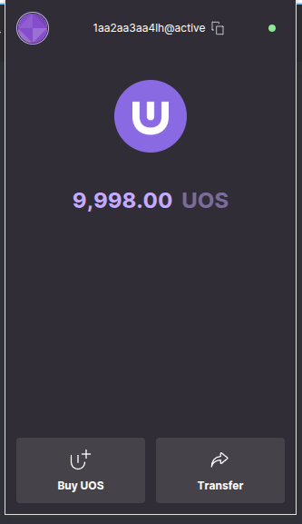

#### Step 2: Transfer UOS

After logging in, click the **Transfer** button. Fill Transfer Details
-  **Recipient**: `eosio.evmin`
-  **Amount**: Enter the UOS amount (e.g., `1.00000000 UOS`).
-  **Memo**: Specify the EVM address (e.g., `0x53b4dfAC2114B47C27e3303d221Ede257cb8b495`).

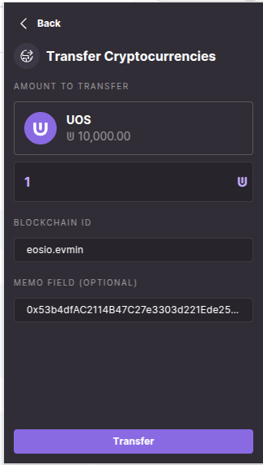

#### Step 3: Confirm Transfer

Review the details and confirm the transaction.

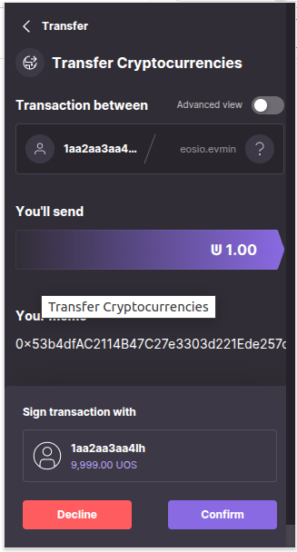

#### Step 4: Transaction Success

After the transaction completes, a success message will appear. That's it, you've bridged UOS into your evm address.

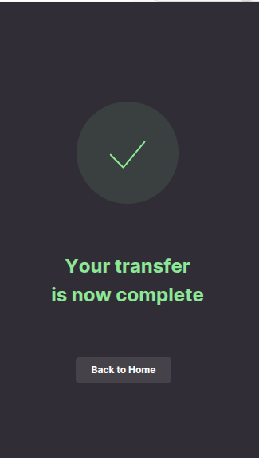

### Verifying the Bridge Transaction

#### Step 1: Check Ultra Blockchain Explorer

View the Ultra blockchain transaction on the Ultra Testnet Explorer: [https://explorer.testnet.ultra.io/tx/41ff40aa05ca8e6cb8837c374ebcfd29084df6eaa1fc9bebd5cee9d37ab8e31d](https://explorer.testnet.ultra.io/tx/41ff40aa05ca8e6cb8837c374ebcfd29084df6eaa1fc9bebd5cee9d37ab8e31d)

#### Step 2: Check EVM Transaction on Ultra EVM Explorer

View the EVM transaction on the Ultra EVM Testnet Explorer: [https://evmexplorer.testnet.ultra.io/tx/0xce3028b5cb846e85896233448eddd9ab6079039bd75afe2c63580e668011b031](https://evmexplorer.testnet.ultra.io/tx/0xce3028b5cb846e85896233448eddd9ab6079039bd75afe2c63580e668011b031)

### Checking EVM Balance

Use the `eth_getBalance` method via curl to check the UOS balance in your EVM address:

```bash
curl https://evm.test.ultra.eosusa.io \
-X POST \
-H "Content-Type: application/json" \
-d '{"jsonrpc": "2.0", "method": "eth_getBalance", "params": ["0x53b4dfAC2114B47C27e3303d221Ede257cb8b495", "latest"], "id": 1}' | jq .
```

**Example Response:**

```json
{
"id": 1,
"jsonrpc": "2.0",
"result": "0xa491c58c3fd14800"
}

```

### Checking Transaction Receipt

To verify the transaction receipt, use `eth_getTransactionReceipt`:

```bash
curl https://evm.test.ultra.eosusa.io \
-X POST \
-H "Content-Type: application/json" \
-d '[{"jsonrpc": "2.0", "method": "eth_getTransactionReceipt", "params": ["0x1f206e9205361706dacc1351b30570a01a5dac0776a16b101fce7fe4ed4be43e"], "id": 1}]' | jq .
```

---

## How to Send EVM Transactions in Ultra EVM: A Step-by-Step Guide

### Prerequisites
- MetaMask installed and configured
- Bridged UOS in your picked EVM address from your Metamask wallet (see [previous tutorial](#))

---

### Step 1: Connect MetaMask to Ultra Testnet

#### 1.1 Login to MetaMask
- Open your MetaMask extension
- Enter your password to unlock your wallet, pick a 

#### 1.2 Add Ultra Testnet via ChainList
1. Visit [ChainList](https://chainlist.org)
2. Search for "Ultra EVM" and toggle "include Testnets"  
   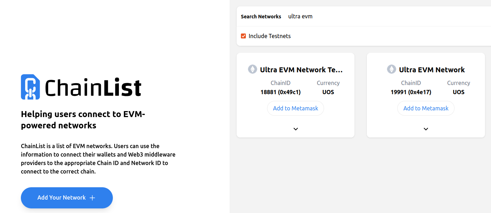  
3. Find **Ultra EVM Testnet**, click "Connect Wallet", and approve in Metamask  
   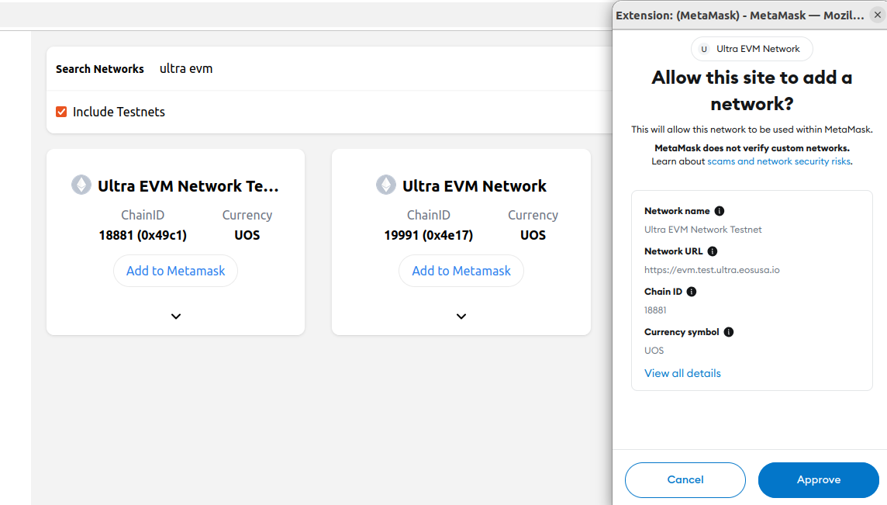  
4. Confirm network addition in MetaMask  
   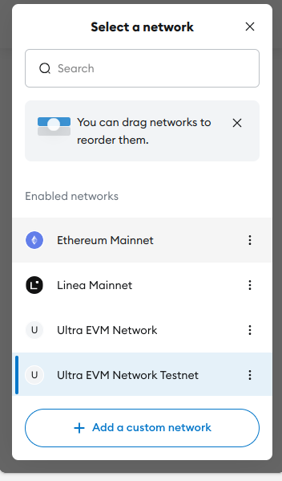  

---

### Step 2: Verify Network Connection
Your MetaMask should now show Ultra EVM Network Testnet and confirm you see your UOS balance in the wallet.
  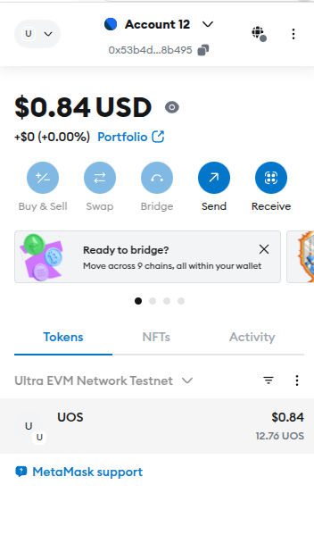  

---

### Step 3: Transfer UOS to Another Address

#### 3.1 Initiate Transfer
1. Click "Send" in MetaMask  
2. Fill in recipient address and amount  
   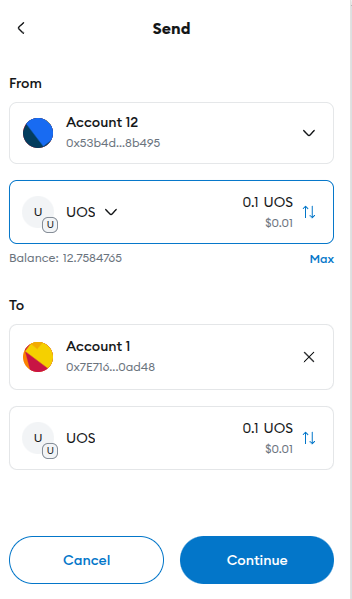  

#### 3.2 Confirm Transaction
1. Review gas fees and details  
2. Click "Confirm" to execute transfer
   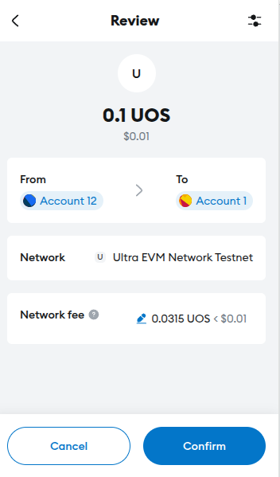  

---

### Step 4: Verify Transaction
1. Check transaction status in MetaMask activity tab
2. View details in [Ultra EVM Explorer](https://evmexplorer.testnet.ultra.io/tx/0xaa3188922503afb0e535ee07820202d39cfd580080ffaa17dd340f486452cd21)
3. You should also see the balance change of the receiving address

---

### Pro Tips
- Always double-check the network is **Ultra EVM Testnet** before transacting
- Save the Ultra EVM Explorer link for quick transaction checks
- Use small amounts for test transactions first

**Next Steps:** Explore dApps on Ultra EVM using your funded address!

---

## How to Bridge UOS Out of Ultra EVM: Step-by-Step Guide

### Prerequisites
- UOS in your EVM address
- MetaMask connected to Ultra EVM Testnet
- Ultra account (to receive bridged UOS)

---

### Step 1: Access the EVM Bridge DApp
1. Open the EVM Bridge interface:  
   [https://bridge.evm.test.ultra.eosusa.io/](https://bridge.evm.test.ultra.eosusa.io/)
2. Click 'Connect' in bridge dapp to connect your MetaMask wallet  
   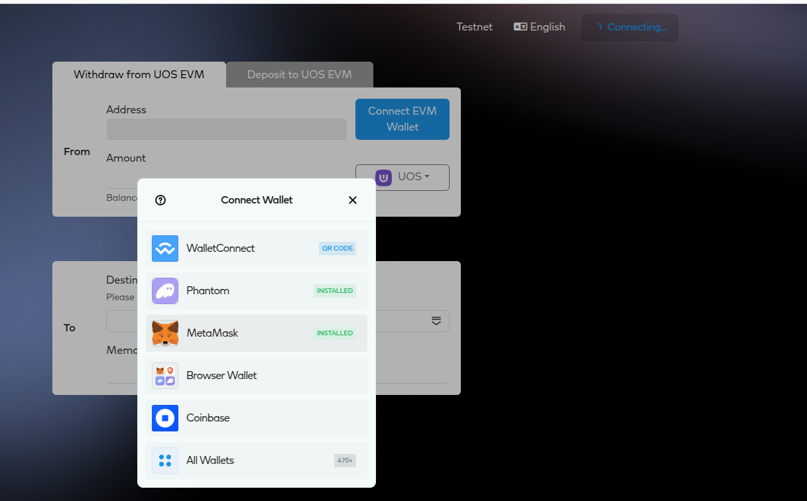
3. Click 'Connect' to confirm in your MetaMask wallet  
   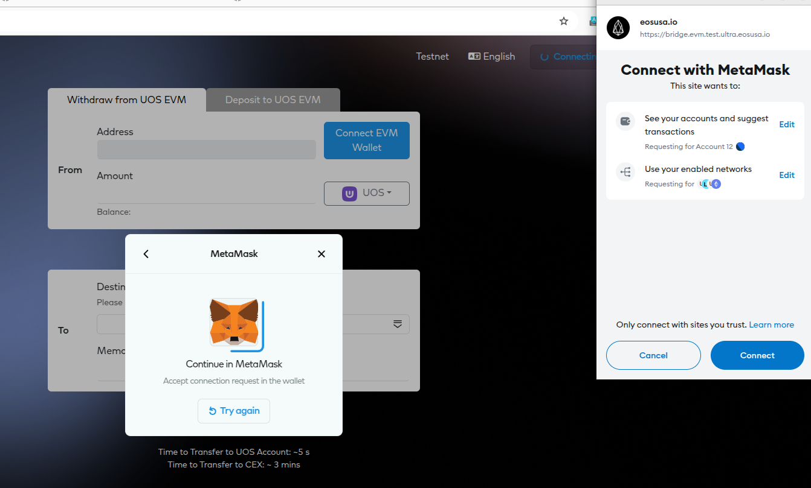
4. Now you should see your metamask connected with your chosen evm address, you can see your UOS balance too.  
   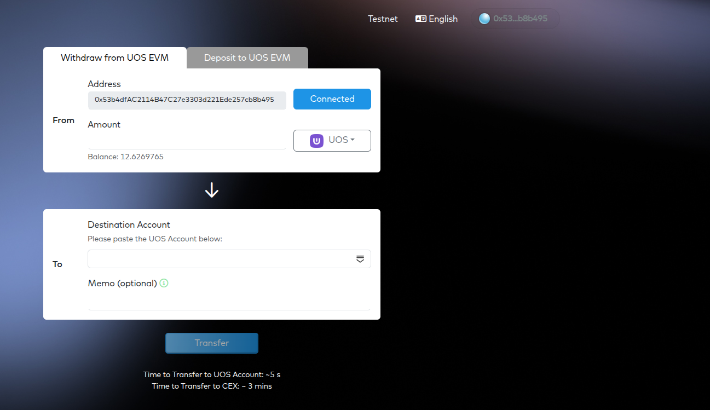

---

### Step 2: Initiate Withdrawal
1. Navigate to **"Withdraw from UOS EVM"** tab
2. Enter details:
   - **Amount**: UOS to bridge out
   - **Receiver**: Your Ultra account name (e.g., `1aa2aa3aa4lh`)  
   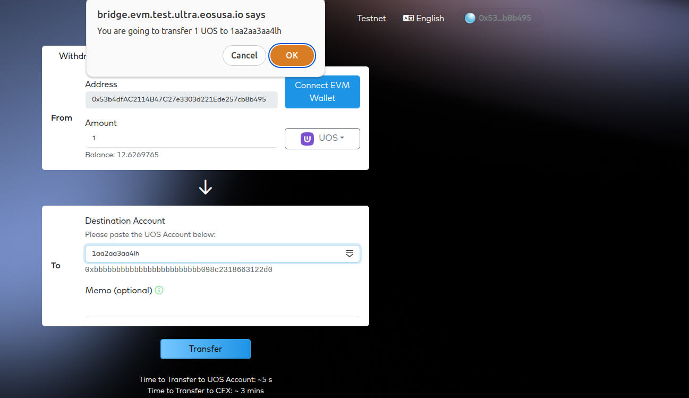

---

### Step 3: Confirm Transaction
1. Click **"Transfer"** to start the process
2. Review details in MetaMask popup
3. Confirm the transaction  
   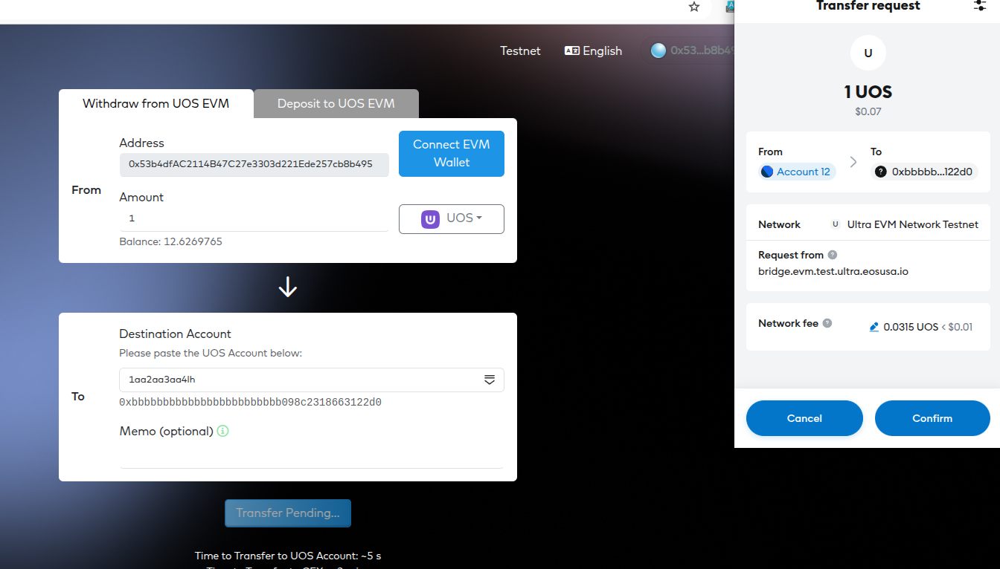

---

### Step 4: Verify Completion
1. Wait for transaction confirmation (typically about 5s), then block explorer links will appear below
   
2. Check transaction status in the [Ultra EVM Explorer](https://evmexplorer.testnet.ultra.io/tx/0x1bdc9a4d9c832baac64595b0482f1525f955449b8bf8affdfd783c6d187b35bd) using your transaction hash
3. Verify UOS balance in your Ultra account in ultra wallet or in [Ultra Blockchain Testnet Explorer](https://explorer.testnet.ultra.io/account/1aa2aa3aa4lh)

---

### Important Notes
- Bridging requires paying EVM gas fees in UOS
- Transactions are final - double-check recipient address
- Allow up to 5 minutes for cross-chain settlement

> **Tip**: Always test with small amounts first when bridging assets!