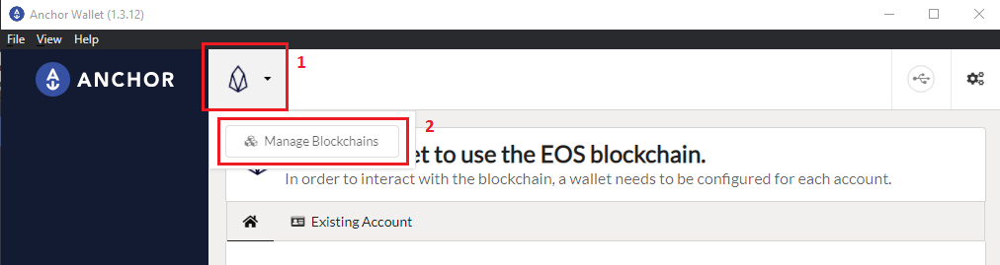
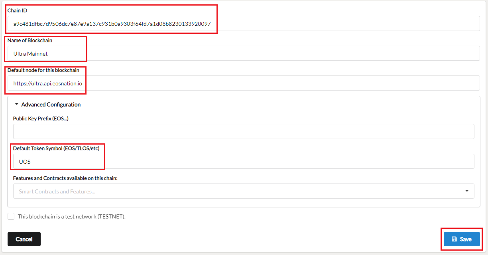
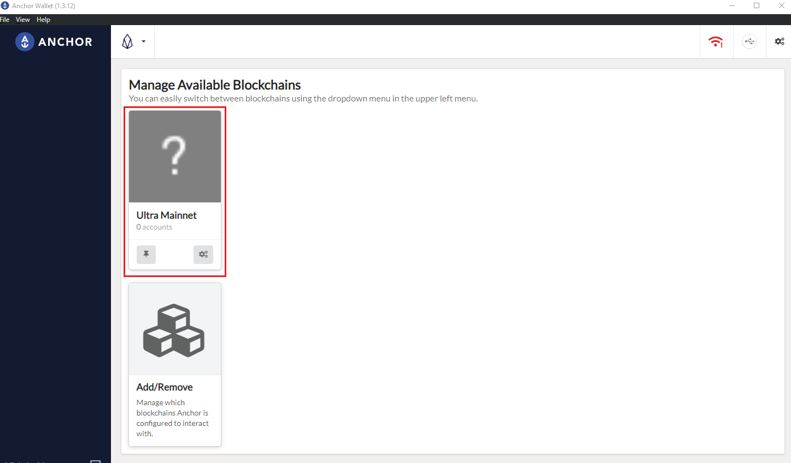
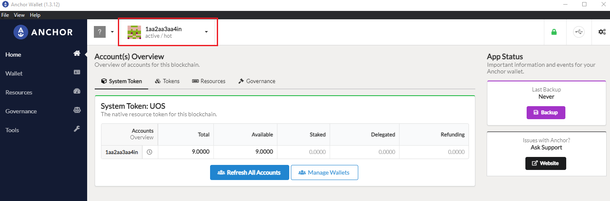
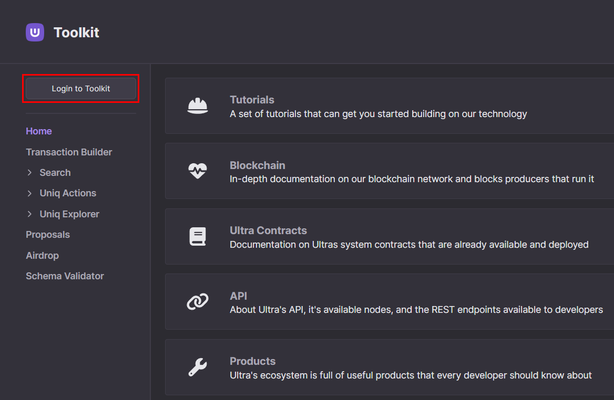

# How to log in to the Ultra Toolkit using Anchor Wallet

Ultra Toolkit is a decentralized application facilitating seamless interaction with the Ultra blockchain and its smart contracts. Designed for developers, it provides essential functionalities such as interacting with Ultra smart contracts, searching for Uniqs, Uniq Factories and Users.

This tutorial will cover the simplest process of logging in into the Ultra Toolkit using [Anchor Wallet](https://www.greymass.com/anchor).
Anchor is a security and privacy focused open-source digital wallet for all Antelope-based networks.

## Prerequisites

-   You must have created your Ultra Pro Wallet. If you need help creating your Ultra Pro Wallet, please refer to [How to create an Ultra Pro Wallet using Ultra Wallet Extension](../guides/how-to-create-ultra-pro-wallet-using-toolkit.md) tutorial.

## Goal

The goal of this tutorial is to login into the Ultra Toolkit using Anchor Wallet.

## Setting Up Anchor Wallet

1. Download Anchor (https://www.greymass.com/anchor#download) and follow the installation instructions.
2. Once installed, open Anchor Wallet and click on the `Setup an Account` button.
   
3. Enter a password for the Anchor Wallet, and click on `Set Password` button. Remember this password as this will be used every time you sign a transaction through Anchor.
   
4. Re-enter the password in the password confirmation screen and click `Set Password` again.
   
5. You will now see a list of different blockchains. From the list, click on `EOS`.
   
6. Click on the top left EOS icon and then click on `Manage Blockchains`.
   
7. On the manage blockchains page, click on `Add/Remove`.
   
8. You will see a list of available blockchain networks, from the list find `EOS` and uncheck the checkbox next to it, and then click on the `+ Custom Blockchain` button on the top right.
   
9. You will be prompted to add a new chain. Use the following details:

    - **For Mainnet:**
        - Chain ID: `a9c481dfbc7d9506dc7e87e9a137c931b0a9303f64fd7a1d08b8230133920097`
        - Name of Blockchain: `Ultra Mainnet`
        - Default Node: `https://ultra.api.eosnation.io`
        - Default Token Symbol: `UOS`

    
    For the sake of this tutorial, we are using `Mainnet` network, but you can follow the same steps to add Ultra `Testnet` network too.

    - **For Testnet:**
        - Chain ID: `7fc56be645bb76ab9d747b53089f132dcb7681db06f0852cfa03eaf6f7ac80e9`
        - Name of Blockchain: `Ultra Testnet`
        - Default Node: `https://ultratest.api.eosnation.io`
        - Default Token Symbol: `UOS`

    Click on the `Save` button to proceed.

10. You will now see `Ultra Mainnet` added to the list of available blockchain networks. Check the checkbox next to `Ultra Mainnet` and click on the `Enable 1 blockchains` button.
    
11. After enabling `Ultra Mainnet`, you'll be redirected to `Manage Available Blockchains` page. From this page, select `Ultra Mainnet`.
    
12. You will now see the `Setup a Wallet` page. Click on the `Import an existing Account` button, and then click on `Import Private Key`.
    
    

    Enter the private key associated with your Ultra Pro account, and it will load a list of all associated accounts for that private key. From the list of accounts, select the one that you want to use. This is usually the account with `@active` in its name.

    Once selected, click on the `Import Account(s)` button.
    

13. After importing your account, you will see the account home page. On this page you can see your account balance and your account name.
    

    You have now successfully added your Ultra Pro account to Anchor wallet.

## Accessing the Toolkit

To access the Ultra Toolkit, please visit: https://toolkit.ultra.io

## Network Selection

Once you're on the Toolkit homepage, click on the network selection component on the top right of your screen.

Clicking on the network selection component will open up a list of available networks that you can use the toolkit on. For the sake of this tutorial, we will be using the Ultra Mainnet. From the list of available networks, click on `Mainnet`.

## Login to Toolkit

Click on the `Login To Toolkit` button to open a list of all supported login methods, and then select the `Anchor` option.

Once you click on `Anchor` option, a login modal will be opened. This may automatically launch your Anchor wallet. If not, you can click on the `Launch Anchor` button to open Anchor wallet on your machine.

From your Anchor wallet window, you will see a prompt for signing request. Click on the `Unlock Wallet + Sign` button to continue.

Enter your Anchor password and click on `Authorize` button.

Once authorized, you will be logged in to the toolkit. You can verify this by checking for your account name in the top left corner of your screen.

You have now successfully logged in to the Ultra Toolkit using Anchor Wallet.

## What's next?

After logging in to the toolkit, you can utilize it to sign transactions with your Anchor Wallet. Explore the following tutorials which demonstrate the process with Ultra Wallet. However, you can seamlessly adapt these instructions to sign transactions with your Anchor Wallet.

-   [Tutorial - Token transfer and Uniq purchase transactions](../fundamentals/tutorial-token-transfer-and-nft-purchase.md)
