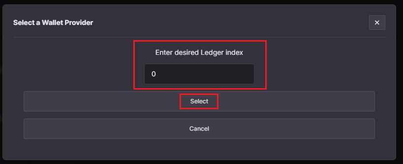
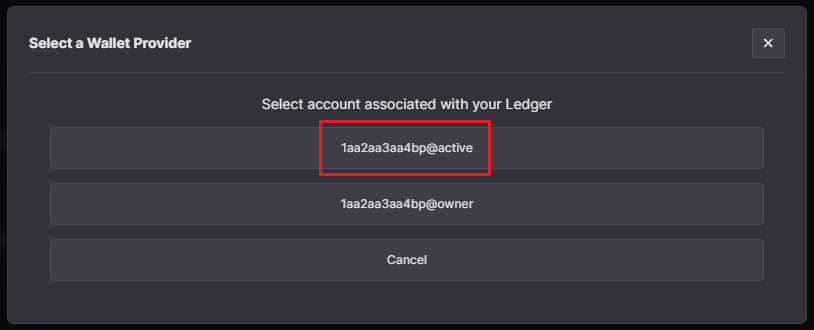

# Tutorial - Log in to the Ultra Toolkit using Ledger

Ultra Toolkit is a decentralized application facilitating seamless interaction with the Ultra blockchain and its smart contracts. Designed for developers, it provides essential functionalities such as interacting with Ultra smart contracts, searching for Uniqs, Uniq Factories and Users.

This tutorial will cover the simplest process of logging in into the Ultra Toolkit using a [Ledger Device](https://www.ledger.com).
Ledger devices are hardware crypto wallets that store your private keys offline.

## Prerequisites

-   You must have a [Ledger Device](https://www.ledger.com). For the sake of this tutorial, we are going to use a Ledger Nano X.
-   You must have already an account created via official [Ultra client](https://ultra.io/) or Ultra Wallet extension. Refer to the [How to create an Ultra Pro Wallet using Ultra Wallet Extension](../guides/how-to-create-ultra-pro-wallet.md) tutorial to create an account.
-   Your account must have sufficient UOS tokens for a new account creation transactions fees. Current Ultra Pro Wallet creation price is <OracleConversion :amount="2.0" scope="......2nf5.o4" :param="70000" />.

## Goal

The goal of this tutorial is to login into the Ultra Toolkit using Ledger.

## Setting Up Ledger for EOS

1. Follow instructions provided with your Ledger device and ensure you install the companion [Ledger Live](https://www.ledger.com/ledger-live) application.
2. Once installed, connect your Ledger and open Ledger Live application. Navigate to `My Ledger` section from the sidebar and search for `EOS` application in the `App Catalog` section.
   
3. Install the EOS application by clicking the `Install` button.
4. After you install the EOS application, you will need to go open the EOS application from your Ledger device and then go into it's settings, and set "Contract data" setting to be allowed.
   
   
   

## Getting Public Key from Ledger

Your ledger device comes with multiple public keys. Each public key is assigned an index value starting from `0`. For the sake of this tutorial, we will use the first public key (i.e; the public key at index `0`).

To obtain the public key of your Ledger, go to Ultra Toolkit (https://toolkit.ultra.io), and
click on the `Login To Toolkit` button to open a list of all supported login methods, and then select the `Ledger` option.

The new prompt will ask you to input your Ledger index. Enter `0` (or whatever index you want to use), and click `Select` button. It will load your public key associated with that specific index.

**Copy this public key and save it as you will need it in the proceeding steps.**

## Creating Ultra Pro Wallet for your Ledger

Once you have copied the public key associated with your Ledger device, it is not time to create a Ultra Pro Wallet for that public key. To do so, open your Ultra Wallet extension and select `Mainnet` network.

Now sign in with your existing Ultra Account, using the `Sign In` option. To be able to create an Ultra Pro Wallet you will need some UOS available on your Ultra Account. The current Ultra Pro Wallet creation price is 2 USD which is approximately <OracleConversion :amount="2.0" scope="......2nf5.o4" :param="70000" /> so you need to have at least this amount of UOS and, preferably, a bit more to account for UOS price fluctuations.

If you don't have the required amount yet then you can utilize the `Buy UOS` option of the Ultra Wallet extension.

When you have enough funds you can proceed with the creation of the Ultra Pro Wallet. For this you need to click on the profile icon and select the `Create an Ultra Pro Wallet` button.

This will open a new browser tab where you will have 2 options:

-   Generate a new private and public key pair
-   Use an existing pair to create an Ultra Pro Wallet

Since we already have the public key associated with our Ledger, we will simply paste the public key in the input.

Before finishing the Ultra Pro Wallet creation you need to specify the maximum amount of UOS your are willing to pay to create it. The price fluctuates over time due to USD to UOS conversion fluctuations and may be a bit different then the estimate shown on the page. Pick a value that is a bit over the estimated price or just put a large number there, we will charge only the current equivalent of 2 USD converted to UOS.

Now you can press the `Create Account` button to proceed. You will be prompted to approve the transaction with its details listed. Check it and click `Confirm`

If everything was done correctly you will get a successful transaction screen. You can click on `Block Explorer` button to view the transaction status.

Your new Ultra Pro Wallet name will be listed in the actions list. This Ultra Pro Wallet name is now associated with your Ledger device.

## Login to Toolkit

Return to Ultra Toolkit homepage (https://toolkit.ultra.io), and click on the network selection component on the top right of your screen.

Clicking on the network selection component will open up a list of available networks that you can use the toolkit on. From the list of available networks, click on `Mainnet`.

Click on the `Login To Toolkit` button to open a list of all supported login methods, and then select the `Ledger` option.

The new prompt will ask you to input your Ledger index. Enter the index number that you selected earlier and click `Select` button. It will load your Ultra Pro Wallet account associated with that specific index.

From the list of accounts, select the one that you want to use. This is usually the account with `@active` in its name. You will now be logged in to the toolkit. You can verify this by checking for your account name in the top left corner of your screen.

You have now successfully logged in to the Ultra Toolkit using Ledger.

## What's next?

After logging in to the toolkit, you can utilize it to sign transactions with your Ledger device. Explore the following tutorials which demonstrate the process with Ultra Wallet. However, you can seamlessly adapt these instructions to sign transactions with your Ledger device.

-   [Tutorial - Using the Faucet and Buying RAM on Ultra Testnet](../fundamentals/tutorial-obtain-token-and-purchase-ram.md)
-   [Tutorial - Token transfer and Uniq purchase transactions](../fundamentals/tutorial-token-transfer-and-nft-purchase.md)
