# Tutorial - Install Docker and get started with Developer Tools Docker image

The goal of this tutorial it to help you get Docker installed on your machine

## Prerequisites

- No prerequisites

## Install Docker on your current operating system

Please follow _one_ of the provided installation instructions below, appropriate to your operating system:

::: details Windows

**Install Docker on Windows**

1. Navigate to the [official Docker Desktop download page](https://www.docker.com/products/docker-desktop/) and click on the `Download for Windows` button.

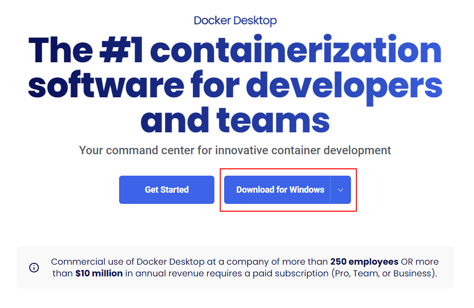

2. Open the downloaded installer. You don't need to adjust any of the default settings, unless you want to. So can simply click on `Ok` and continue

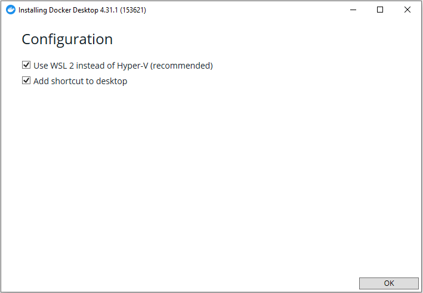

3. After a successful installation and, possibly, a restart, you should be able to open the Docker application. When asked for agreement, you can review the agreement and click on `Accept`

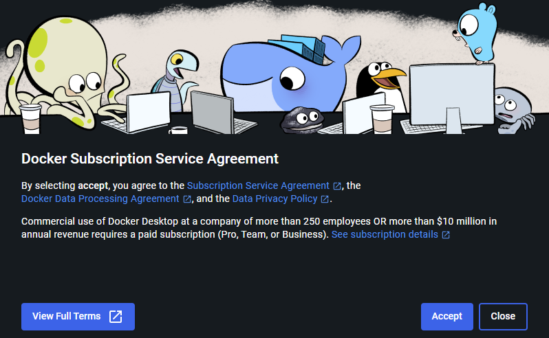

4. You don't need to create an account to use Docker, so can skip the sign in step

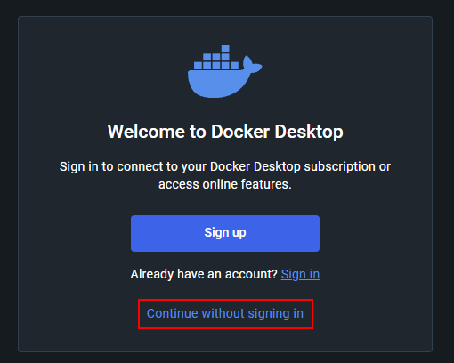

5. Welcome Survey is also optional, you can skip it

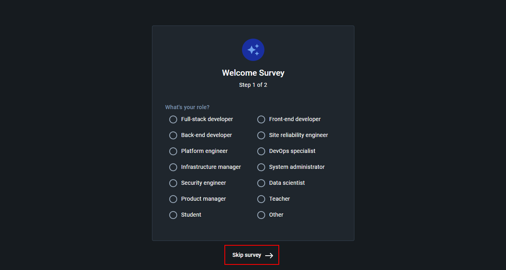

6. Finally, make sure the `Engine running` is visible in the bottom left of the window and there is no error shown after reaching this window

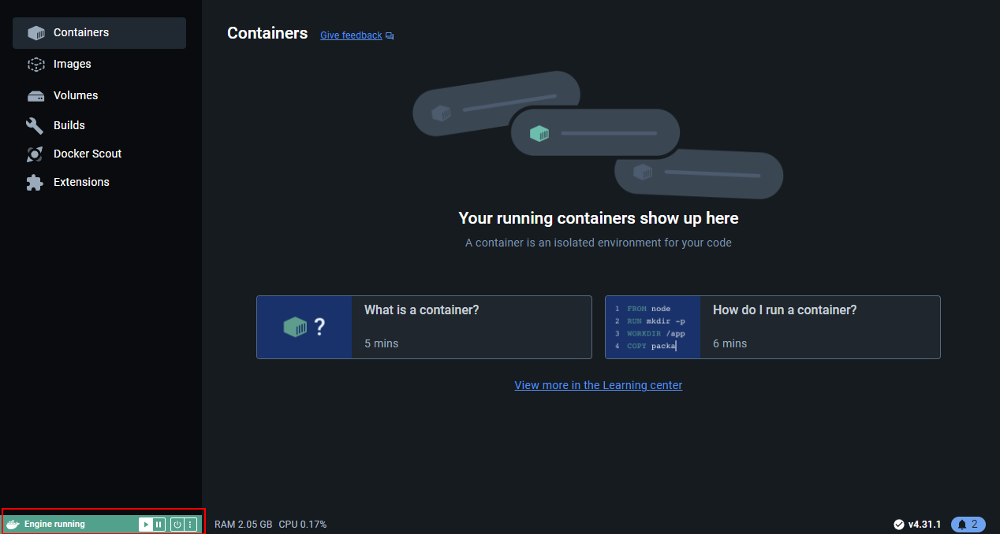

**Validating Docker installation**

After installing and opening the Docker, open standard Windows Command Prompt. Enter the `docker run hello-world` command there and you should get the expected output:

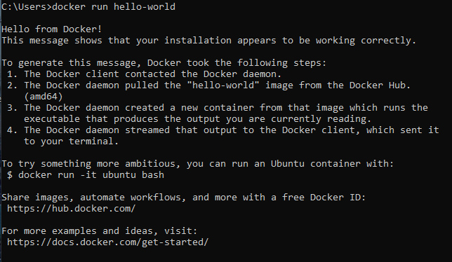

You likely want to clean up the created container, you will have no use for it and it will just clog the container list. To delete it, simply click on the garbage can icon next to the `hello-world` container:


:::

::: details Linux

**Install Docker on Linux**

Here we provide you with a list of commands that should get Docker installed and running on Ubuntu Linux version and its variants (e.g. Mint). If the provided commands do not work for you, we strongly suggest following the [official Docker documentation](https://docs.docker.com/engine/install/).

You can copy the whole code block section below and paste it into the terminal:

```sh
# Add Docker's official GPG key:
sudo apt-get update
sudo apt-get install ca-certificates curl
sudo install -m 0755 -d /etc/apt/keyrings
sudo curl -fsSL https://download.docker.com/linux/ubuntu/gpg -o /etc/apt/keyrings/docker.asc
sudo chmod a+r /etc/apt/keyrings/docker.asc

# Add the repository to Apt sources:
echo \
  "deb [arch=$(dpkg --print-architecture) signed-by=/etc/apt/keyrings/docker.asc] https://download.docker.com/linux/ubuntu \
  $(. /etc/os-release && echo "$VERSION_CODENAME") stable" | \
  sudo tee /etc/apt/sources.list.d/docker.list > /dev/null
sudo apt-get update
```

After running the previous set of commands, you should be able to install the actual Docker binaries and some of their dependencies. Use the following command to install them:

```sh
sudo apt-get install docker-ce docker-ce-cli containerd.io docker-buildx-plugin docker-compose-plugin
```

**Validating Docker installation**

To make sure Docker was installed correctly, try running the following command:

```sh
sudo docker run hello-world
```

If Docker was installed correctly, you should see the following output. Otherwise, please refer to [official Docker documentation](https://docs.docker.com/engine/install/) for installation assistance.

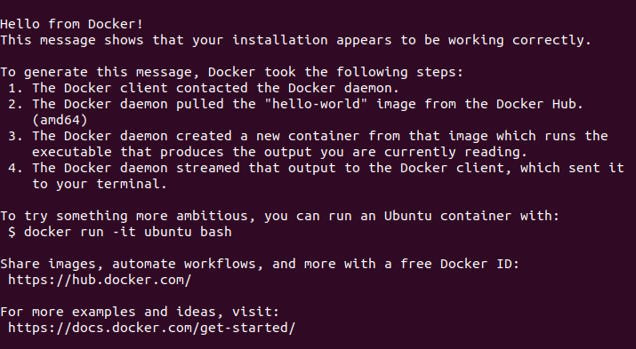

:::

:::: details macOS

**Install Docker on macOS**

::: warning

We don't officially support or provide assistance to Mac users at the moment, but the Docker image itself should function the same way regardless of the operating system and it should be possible to use it develop smart contracts and interact with the Ultra Blockchain on Mac.

:::

1. Navigate to the [official Docker Desktop download page](https://www.docker.com/products/docker-desktop/) and click on the `Download for Mac` button.


::: warning

Docker website may not properly detect the type of processor your Mac has, in case the version you've downloaded does not work stating that the `You can't open the application "Docker" because this application is not supported on this Mac`, try hovering over the arrow next to the `Download for Mac` button and select the other option for Mac (e.g. Intel Chip).

:::

2. Open the downloaded `.dmg` package

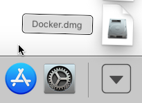

3. Do the standard drag and drop procedure

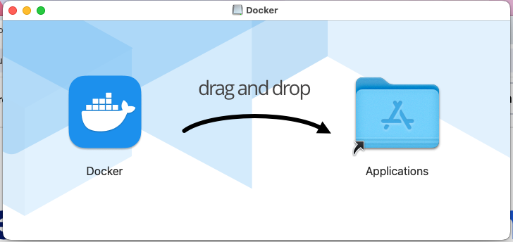

4. Now you should be able to simply open the Docker application from the Launchpad

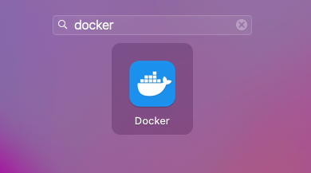

5. You will be likely asked if you want to open Docker. Simply agree to open it

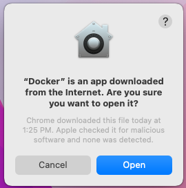

6. After a successful installation you should be able to open the Docker application. When asked for agreement, you can review the agreement and click on `Accept`


7. When asked for configuration settings, you can just leave the recommended ones


8. Finally, make sure the `Engine running` is visible in the bottom left of the window and there is no error shown after reaching this window


**Validating Docker installation**

After installing and opening the Docker, open the standard Terminal window (search for `Terminal` in the Launchpad). Enter the `docker run hello-world` command there and you should get the expected output:

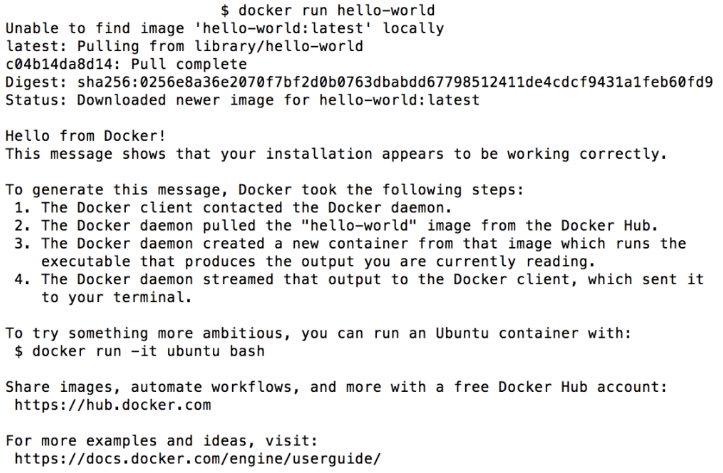

You likely want to clean up the created container, you will have no use for it and it will just clog the container list. To delete it, simply click on the garbage can icon next to the `hello-world` container:


::: info
After installing and opening the docker application, you should be able to follow the same usage instructions as for Linux.
:::

::::

## Obtaining the Docker image

Pull the docker image down from quay.io:

```sh
docker pull quay.io/ultra.io/3rdparty-devtools:latest
```

You will also want to use this command to update the Docker image you have locally.

The Docker image provided is located at [our official quay.io repository](https://quay.io/ultra.io/3rdparty-devtools). If you are interested, you can check there to see if there is a new version of the image available, or use an older version if needed.

## Running the Developer Tools Docker image

To start the Docker container with the Developer Tools Docker image use _one_ of the following commands appropriate for your operating system:

::: details Windows
```sh
docker run -dit --name ultra -p 8888:8888 -p 9876:9876 -v %cd%/ultra_workdir:/opt/ultra_workdir --name ultra quay.io/ultra.io/3rdparty-devtools:latest
```

You will be asked if you are okay with sharing the working directory with the Docker container. Only the content of the directory specified will be shared, and not any other content of your drive.


:::

::: details Linux
```sh
docker run -dit --name ultra -p 8888:8888 -p 9876:9876 -v ~/ultra_workdir:/opt/ultra_workdir --name ultra quay.io/ultra.io/3rdparty-devtools:latest
```
:::

After you created the container you realistically won't need to create it again. Existing container will be accessible under the name of `ultra`.

::: info
If you encounter an error: `Error response from daemon: Conflict. The container name "/ultra" is already in use`, then it means you already have the container running and don't need to do anything.
:::

::: warning
The above command will utilize ports 8888 and 9876. If those ports are occupied the docker will fail to create the container. In case you encounter this issue, make sure you don't already have a container running with those ports in use. Otherwise, you can adjust the first number in port publishing (e.g. `8889:8888` instead of `8888:8888`) or remove the port publishing arguments completely (e.g. `-p 8888:8888 -p 9876:9876`).
:::

To stop the container without destroying it you can use the following command:

```sh
docker stop ultra
```

## Accessing the image

After you created the container you will be able to attach to it using the following command. It will also start the container if it is currently stopped.

```sh
docker start ultra && docker attach ultra
```

## What is included in the Docker image

- `cleos` - Basic utility for interacting with the Blockchain: reading table data, pushing transactions, generating keys. More details are available [here](../../blockchain/general/tools/cleos.md)
- `keosd` - Encrypted local-storage wallet. Used by `cleos` in case you sign or push transactions. More details are available [here](../../blockchain/general/tools/keosd.md)
- `nodeos` - Application that runs a Blockchain node: either a local node with a new chain, or connecting to an existing chain. More details are available [here](../../blockchain/general/tools/nodeos.md)
- `cdt-cpp` - Compiler for C++ EOS smart contracts. More details are available [here](../../blockchain/general/tools/cdt/index.md)
- `ultratest` - Testing utility for running JavaScript tests. More details are available [here](../../products/ultratest/index.md)
- Licenses - You can review the license for Docker image usage and accompanying tools at `/opt/license` inside the Docker image.

## Checking the versions of the provided tools

You can use the following commands to quickly find out the versions of various tools provided and to ensure they are present and can start without errors:

```sh
cleos version client
```

```sh
keosd --version
```

```sh
nodeos --version
```

```sh
cdt-cpp --version
```

```sh
ultratest --version
```

All commands provided will simply print their respective versions.

## Accessing Docker volume

The docker container has a shared directory located somewhere in your operating system:

-   Windows: `C:\Users\<Username>\ultra_workdir`

-   Linux / macOS : `~/ultra_workdir`

-   Docker Container: `/opt/ultra_workdir`

You can make sure it is working correctly by running the following command in the terminal that is attached to the Docker container:

```sh
touch /opt/ultra_workdir/hello_world.txt
```

After running the command, you should see the `hello_world.txt` in the directory appropriate for your operating system in the list above.

## Deleting a Docker container

If you want to update the version of the docker image used, or simply no longer need this Docker container, you can always delete it:

::: warning
This command deletes all the content of the Docker container. Only the files in `ultra_workdir` will be preserved
:::

```sh
docker stop ultra && docker rm /ultra
```

You can also use the Docker Desktop application to do so.

## What's next?

TBA