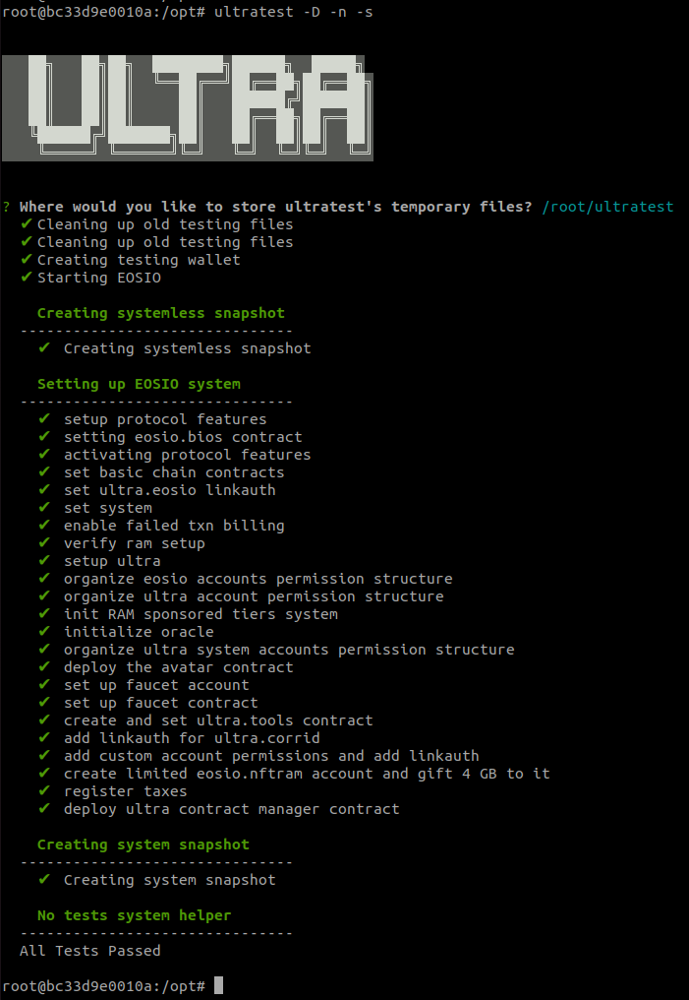
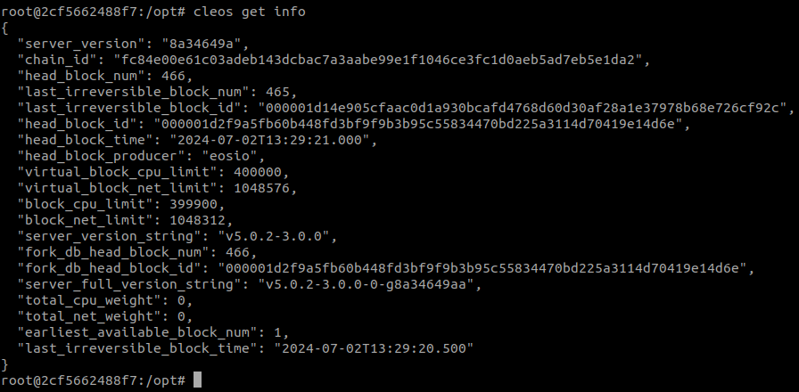
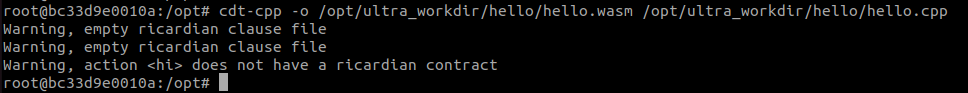
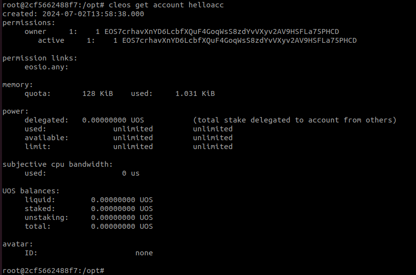

# Creating and Compiling Smart Contracts with Docker
This document guides you on how to create, compile, and deploy smart contracts using Ultra's 3rd party Docker image.

## Prerequisites
Before you begin, ensure that Docker is installed on your computer and you can use the Developer Tools Docker image. For guidance, refer to the [Tutorial - Install Docker and get started with Developer Tools Docker image](getting-started.md) tutorial.

## Goal
The goal of this tutorial is to guide developers through the process of creating, compiling, and deploying smart contracts using Development Tools Docker image. By following this step-by-step guide, you will learn how to set up the development environment, create and compile a smart contract, deploy it to the Ultra Blockchain, and interact with it.

## Step 1: Start the Docker Container and Log In
Start the Docker container, which contains the smart contract developer tools and a local Ultra Blockchain, using the following command:

```sh
docker start ultra
```

Log in to your container with the following command:

```sh
docker exec -it ultra /bin/bash
```

## Step 2: Start the Local Chain in the Docker Container
Start the local Ultra Blockchain with:

```sh
ultratest -D -n -s
```
Accept the default recommendation for the temporary files location by pressing enter.



### Step 2a: Verify the Local Chain is Running
Execute the following command inside the container:

```sh
cleos get info
```



## Step 3: Create and Compile the Smart Contract
Create a directory on your **host** machine at `ultra_workdir/hello` and create a file named `hello.cpp` with the following content:

```cpp
#include <eosio/eosio.hpp>

class [[eosio::contract]] hello : public eosio::contract {
public:
using contract::contract;

[[eosio::action]]
void hi(eosio::name user) {
    eosio::print("Hello, ", user);
}
};
```

Save it, then compile it with the following command in your Docker session:

```sh
cdt-cpp -o /opt/ultra_workdir/hello/hello.wasm /opt/ultra_workdir/hello/hello.cpp
```


Verify that two new files, hello.abi and hello.wasm, were created in the hello directory with the following command:

```sh
ls -lsa /opt/ultra_workdir/hello/
```


## Step 4: Create an Account for Deployment
Inside the Docker container, create a private and public key pair:

```sh
cleos create key --to-console
```

You will see a generated key pair:

```sh
Private key: 5KPNRT7C4CJs9ddNTieC5fL92NQNk82Nxb1EQ5sL4siGhU4oxcV
Public key: EOS7crhavXnYD6LcbfXQuF4GoqWsS8zdYvVXyv2AV9HSFLa75PHCD
```
Import the key into your local wallet:

```sh
cleos wallet import --private-key 5KPNRT7C4CJs9ddNTieC5fL92NQNk82Nxb1EQ5sL4siGhU4oxcV
```

Create an account named helloacc using your public key:
```sh
cleos system newaccount --gift-ram-kbytes 128 eosio helloacc EOS7crhavXnYD6LcbfXQuF4GoqWsS8zdYvVXyv2AV9HSFLa75PHCD EOS7crhavXnYD6LcbfXQuF4GoqWsS8zdYvVXyv2AV9HSFLa75PHCD
```

Verify the account:

```sh
cleos get account helloacc
```



## Step 5: Deploy the Smart Contract
Deploy the smart contract to helloacc:

```sh
cleos set contract helloacc /opt/ultra_workdir/hello hello.wasm hello.abi
```
::: warning
If you encounter the error account helloacc does not have KYC info, execute:

```sh
cleos push action eosio.kyc togglekyc '[]' -p ultra.kyc
```

Then retry the deployment command.
:::

Verify the deployment:

```sh
cleos get code helloacc
```

If the code hash is not zero, the contract has been successfully deployed.

## Step 6: Interact with Your Smart Contract
Call the hi action of the hello smart contract:

```sh
cleos push action helloacc hi '["alice"]' -p helloacc@active
```
The output will be "Hello, alice".


Note: The hi action uses eosio::name parameter, so using capital letters will result in an Invalid name error:

```sh
cleos push action helloacc hi '["Alice"]' -p helloacc@active
```
Always use names that conform to the EOSIO naming rules: lowercase letters, digits, and periods, with a maximum length of 12 characters.


## Step 7: Log Out from Docker Container
To log out from the Docker container, you can type `exit` or simply press the `CTRL+D` shortcut combination.

## What's next?
TBA

