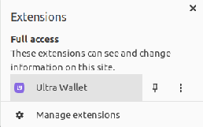

# Tutorial - How to Buy UOS Tokens on Ultra Mainnet Using the Ultra Wallet

This tutorial will guide you through the process of purchasing UOS tokens on Ultra Mainnet using the Ultra Wallet extension. UOS is the native token of the Ultra Network, and having it enables you to participate in various activities within the Ultra ecosystem.

## Prerequisites

Before you begin, ensure that you have completed the following steps:
- **Wallet Setup**: You must have the Ultra Wallet extension installed and set up in your browser. If you haven't done this yet, please refer to our tutorial on [Setting Up the Ultra Wallet](./tutorial-setup-the-wallet.md).
- **Account Creation**: You need to have an Ultra account linked to your wallet. If you need to create an account, follow the instructions in our [Account Creation Guide](./tutorial-generate-key-and-create-testnet-account.md).

## Step 1: Open the Ultra Wallet Extension

Begin by opening the Ultra Wallet extension in your browser. This is where all your transactions for buying UOS will initiate.

## Step 2: Initiate Purchase

Click on the 'Buy UOS' button within the Ultra Wallet interface to start the purchasing process.

### Step 2a: Alternative Method - Purchasing UOS via the Ultra Client

Alternatively, you can also purchase UOS tokens directly through the Ultra Client. Simply navigate to your wallet screen within the Ultra Client and click on the `Buy UOS coins` button. This method provides another convenient option for acquiring UOS tokens.

## Step 3: Acknowledge the Disclaimer

Upon clicking `Buy UOS`, you will be presented with a disclaimer page. It's important to read and understand this as it informs you that you are leaving the site managed by Ultra to a third-party website. Ultra does not control the quality, content, reliability, or security of the third-party website.

## Step 4: Specify Purchase Amount

On the wallet application page, you need to specify how much UOS you want to buy. Note: The minimum transaction amount must be equivalent to at least $50, and the maximum is $20,000. For example, if you decide to buy 500 UOS, it might cost approximately $86.14 USD. Click `Continue` after entering your desired amount.

## Step 5: Choose Payment Method

Next, choose your preferred payment method from the options available, which could include credit cards, bank transfers, or other payment services. Select your option, then click `Continue`.

## Step 6: Enter Payment Details

Enter your payment details on the provided form. This usually requires entering your credit card information. Double-check all details for accuracy before clicking the `Next` button to complete your purchase.

## Conclusion

Once you have completed these steps, your transaction will be processed, and the UOS tokens will be credited to your wallet. Always verify the transaction within your wallet and check your new UOS balance to ensure the purchase was successful.

