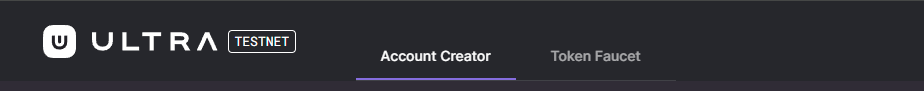
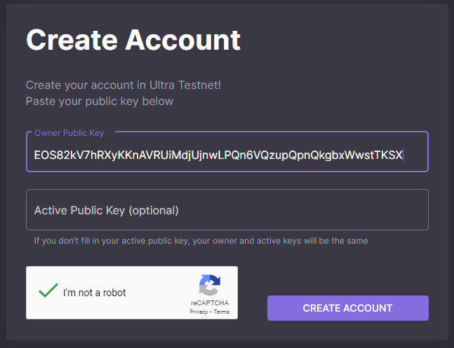
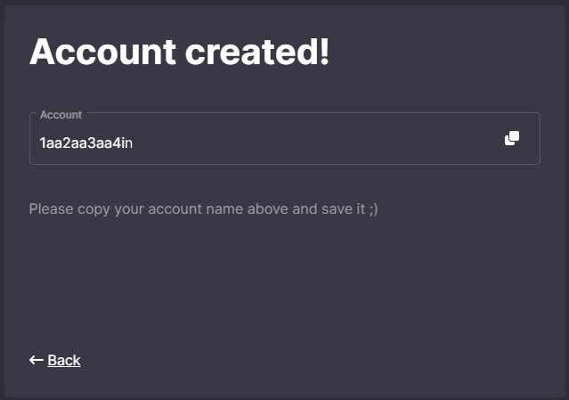
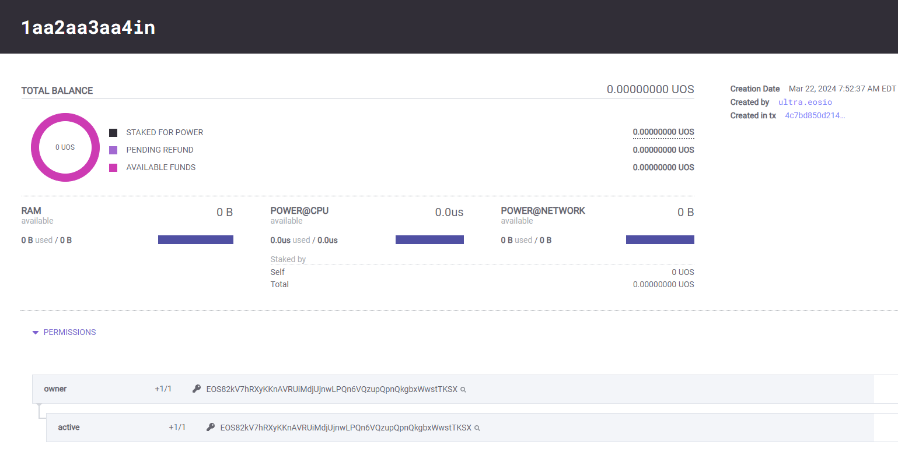

# Tutorial - Generate a key and create a developer Testnet account

This tutorial will cover the simplest process of creating a developer account on Testnet to be used to interact with the blockchain.

## Prerequisites

- No prerequisites

## Goal

The goal of this tutorial is to generate a unique key pair that will be used to create a new developer Testnet blockchain account. The account will later be used in later tutorials to demonstrate interaction with the blockchain.

## Generate a Key Pair

First we will generate a [private and public key](../../blockchain/general/antelope-ultra/public-and-private-keys.md). To do so use the form below and press the `Generate Key` button.

<KeyGenerator />

## Keep the keys safe

You will need both public and private key you've just generated in later tutorials. The public key (the one that starts with `EOS`) can be shared publicly with anyone. But the private key (begins with `5`) should be kept secret and not shared with anyone.

::: info

The simplest approach for now to keep your private key for later use would be to write it down on a piece of paper. It is not a good practice to store your private key openly in a text file on your machine.

:::

## Create Testnet account using Testnet Faucet

Please note that the images are for reference only. The key you generate and the account name you get will be different.

1. Visit this link to open our faucet application: https://faucet.testnet.app.ultra.io
2. Select `Account Creator` tab

3. Paste your `Public Key` (the one that starts with `EOS`) in the `Owner Public Key` field

4. Fill the Captcha
5. Click `Create Account`
6. Write down the **Account Name** that was returned

## Lookup Your Account

Use the form below to lookup your account on our [Testnet Explorer](https://explorer.testnet.ultra.io/)

Verify that the public key listed under `Permissions` and the `Creation Date` are correct:

<LastPublicKey />

<TodaysDate />

&nbsp;

<AccountLookupTestnet />

## What's next?

The next tutorial will cover adding your account to the Ultra Wallet - [Tutorial - Setup Ultra Wallet](./how-to-setup-the-wallet.md)