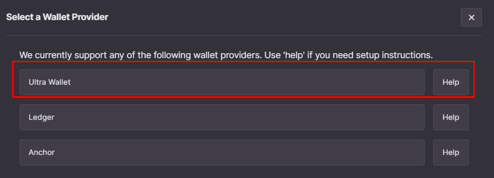
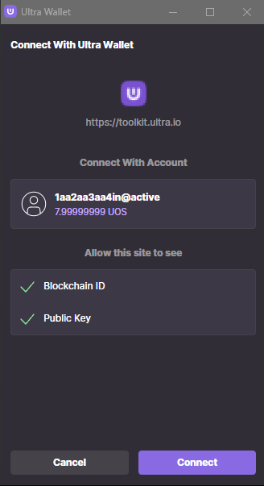
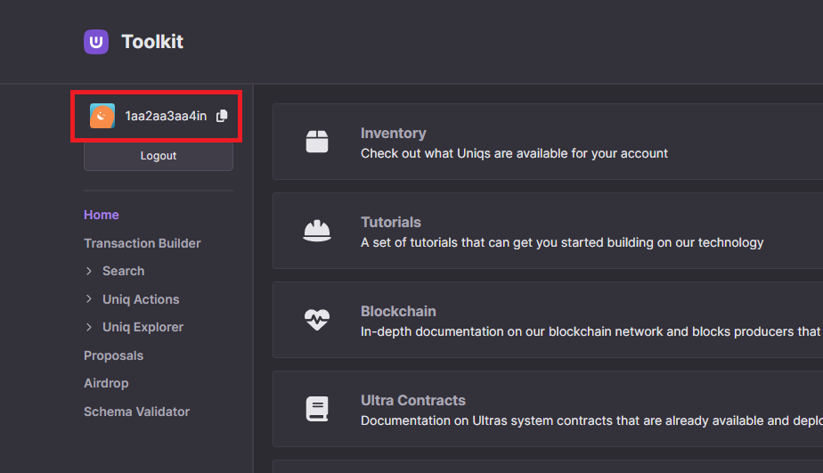

# Tutorial - Log in to the Ultra Tool Kit

Ultra Tool Kit is a decentralized application facilitating seamless interaction with the Ultra blockchain and its smart contracts. Designed for developers, it provides essential functionalities such as interacting with Ultra smart contracts, searching for Uniqs, Uniq Factories and Users.

This tutorial will cover the simplest process of logging in into the Ultra Tool Kit using the Ultra Wallet.

## Prerequisites

-   Have setup your Ultra Wallet with your developer account. Refer to the [Setup the Ultra Wallet Tutorial](./tutorial-setup-the-wallet.md) if you need to setup your Ultra Wallet.

## Goal

The goal of this tutorial is to login into the Ultra Tool Kit using the Ultra Wallet.

## Accessing the Tool Kit

To access the Ultra Tool Kit, please visit: https://toolkit.ultra.io

## Network Selection

Once you're on the Tool Kit homepage, click on the network selection component on the top right of your screen.

Clicking on the network selection component will open up a list of available networks that you can use the tool kit on. For the sake of this tutorial, we will be using the Ultra Testnet. From the list of available networks, click on `Testnet`.

## Unlock Ultra Wallet

Unlock your Ultra Wallet as described in the [Setup the Ultra Wallet Tutorial](./tutorial-setup-the-wallet.md#unlocking-ultra-wallet).
Ensure you have selected the `Testnet` environment in your Ultra Wallet.

## Login to Tool Kit

Click on the `Login To Tool Kit` button to open a list of all supported login methods, and then select the `Ultra Wallet` option

Once you click on `Ultra Wallet` option, your Ultra Wallet will open and ask for authorization to connect to the Tool Kit. Click on `Connect` button to proceed.

Once connected, you will be logged in to the tool kit. You can verify this by checking for your account name in the top left corner of your screen.

You have now successfully logged in to the Ultra Tool Kit using Ultra Wallet.

## What's next?

The next tutorial will cover obtaining some UOS from the Ultra Faucet and buying RAM using the tool kit which will be needed for future tutorials - [Tutorial - Using the Faucet and Buying RAM on Ultra Testnet](./tutorial-obtain-token-and-purchase-ram.md)
