# Tutorial - Using the Faucet and Buying RAM on Ultra Testnet

This tutorial will guide you through the process of obtaining UOS tokens using the faucet and purchasing RAM on the Ultra blockchain testnet. These actions are crucial for participating in blockchain activities, such as deploying contracts or storing unique digital assets (Uniqs).

## Prerequisites

Before starting this tutorial, ensure you have the following:

- **A Developer Testnet Account**: You need an account on the Ultra testnet. If you don't have one, please refer to our previous tutorial on [how to create a testnet account](./tutorial-generate-key-and-create-testnet-account.md).

## Goal

The goal of this tutorial is two-fold:
1. **To add UOS tokens to your testnet account using the faucet**: The faucet is a tool that distributes free UOS tokens on the testnet, allowing you to perform transactions and interact with the blockchain without real financial cost.
2. **To purchase RAM for your account using `eosio.buyram`**: RAM in the EOSIO ecosystem is needed to store data on the blockchain. For example, if you want to store or manage digital assets like Uniqs, you need sufficient RAM. This tutorial will show you how to increase your RAM quota based on current prices and the amount of UOS you are willing to spend.

By the end of this tutorial, you should be able to comfortably manage your resources on the Ultra blockchain, paving the way for more complex interactions such as deploying smart contracts or trading digital assets.

## Obtaining UOS Tokens Using the Faucet

This section will guide you through the process of obtaining UOS tokens on the Ultra testnet. This is crucial for performing transactions and interacting with various blockchain functionalities.

### Step 1: Check Initial Balance

Before obtaining additional UOS tokens, first check your current balance to verify the amount of UOS you have available. Visit the Ultra Blockchain Explorer at [https://explorer.testnet.ultra.io](https://explorer.testnet.ultra.io) and search for your account (`1aa2aa3aa4in`). In this example, the initial balance (8.99999999 UOS) will be displayed. However, if you are accessing your account for the first time, the balance may be different, most likely 0 UOS.

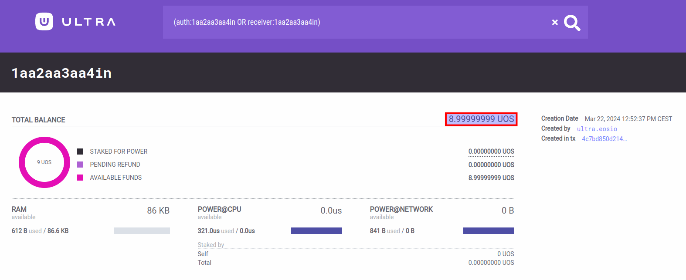

### Step 2: Open UOS Token Faucet Page

1. Open the faucet page at [https://faucet.testnet.app.ultra.io](https://faucet.testnet.app.ultra.io).
2. Select the `Token Faucet` tab on the page, as shown in the picture.

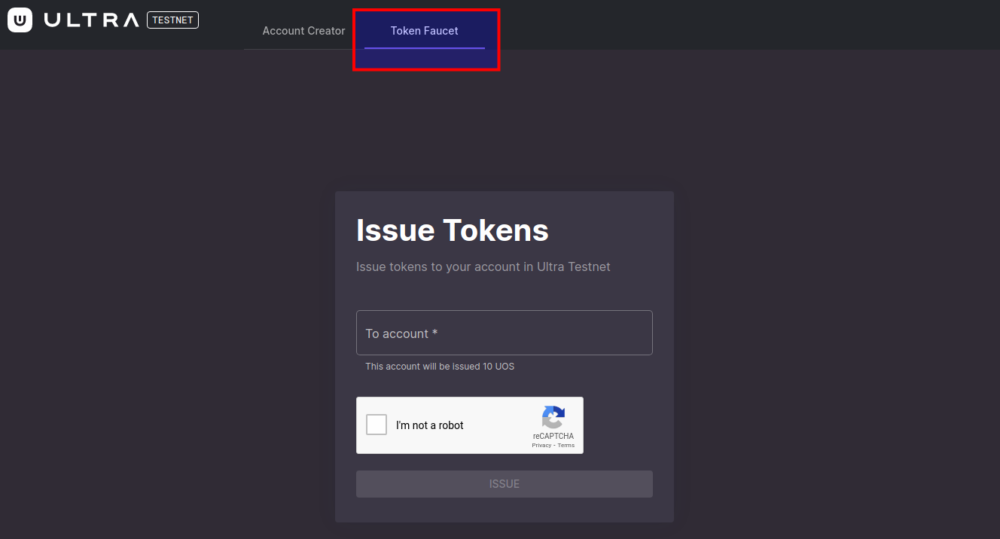

### Step 3: Request UOS Tokens from the Faucet

1. In the `To account` field, enter your account name (`1aa2aa3aa4in`).
2. Click the `Issue` button to request the tokens. This interface may also show your initial balance as a reference, confirming the account to which the tokens will be issued.

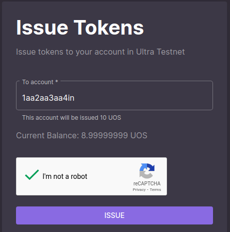

### Step 4: Confirm Token Issuance

After requesting the tokens:
1. You will be directed to a confirmation screen showing that 10 UOS tokens have been issued to your account.
2. Your new balance, combining previous funds with the newly issued tokens, should now read 18.99999999 UOS.

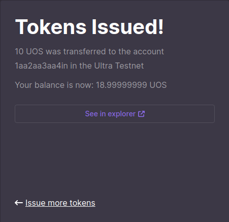

### Step 5: Verify the Transaction

To ensure that the tokens were correctly added to your account:
1. Click on the `See in explorer` link provided on the confirmation page, or revisit the Ultra Blockchain Explorer.
2. Search for your account again to view the updated balance and confirm the transaction details, showing an increment of 10 UOS.

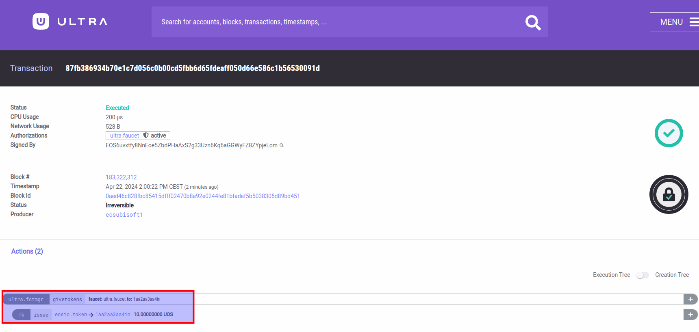

### Step 6: Check Account Balance

Finally, revisit the Ultra Blockchain Explorer to check your new account balance (18.99999999 UOS).

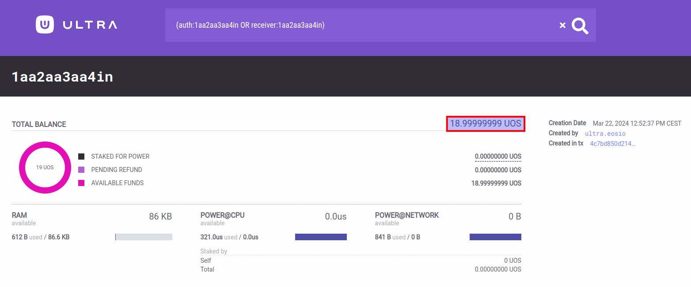

By following these steps, you have successfully added UOS tokens to your account using the faucet, enabling you to engage in further blockchain activities on the Ultra testnet.

## Buying RAM on the Ultra Testnet

This section explains how to use your UOS tokens to purchase RAM on the Ultra blockchain, which is necessary for storing objects and managing resources for your account.

### Step 1: Check Initial RAM Balance

Start by checking the initial RAM balance of your account to understand how much RAM you currently have. Navigate to the Ultra Blockchain Explorer at [https://explorer.testnet.ultra.io](https://explorer.testnet.ultra.io) and enter your account name (`1aa2aa3aa4in`) to view your RAM usage (86 KB).

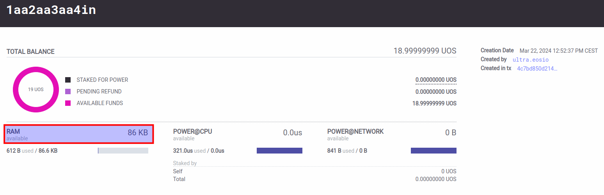

### Step 2: Initiate RAM Purchase

1. Open the Ultra toolkit and select `Transaction Builder` from the left-hand menu.
2. Choose the `buyram` action under the `eosio` contracts to start the purchase process.

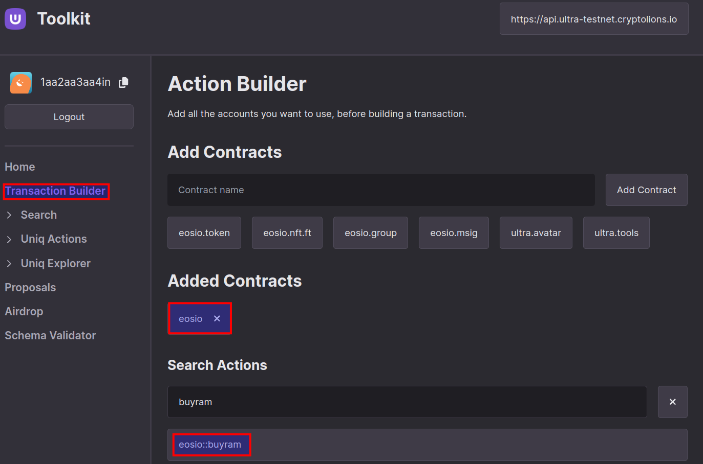

### Step 3: Configure Buyram Action

Fill in the required fields for the buyram action:
- **Payer**: `1aa2aa3aa4in` (your account, who will pay for the RAM)
- **Receiver**: `1aa2aa3aa4in` (your account, who will receive the RAM)
- **Quantity**: `10 UOS` (the amount of UOS you want to spend on RAM)
- **Authorizer**: `1aa2aa3aa4in` (your account, authorizing the transaction)

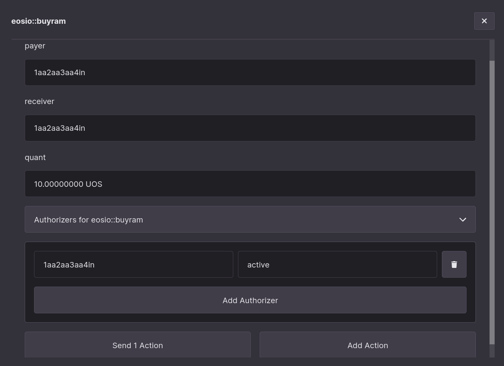

### Step 4: Confirm the Transaction

Review the transaction details on the next screen. Ensure that all the information is correct before proceeding to confirm the transaction within the toolkit.

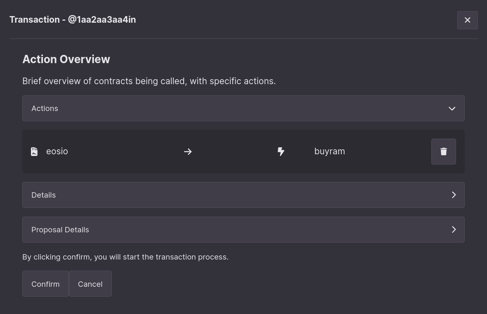

### Step 5: Confirm Transaction in Ultra Wallet

Next, confirm and authorize the transaction using the Ultra Wallet. This step is crucial as it secures the transaction on the blockchain.

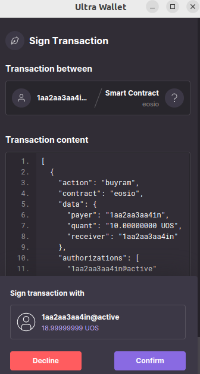

### Step 6: Transaction Completion

Once the transaction is executed, a confirmation message stating `Transaction was completed successfully...` will appear. You can then verify the transaction details by clicking on `View in Explorer`.

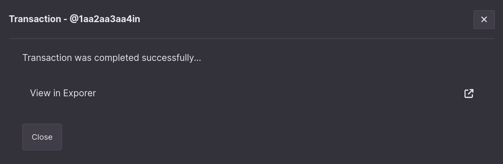

### Step 7: Verify the Transaction in Explorer

Check the blockchain explorer to confirm that 10 UOS was indeed spent from your account to purchase RAM. This verification ensures that the transaction was processed correctly.

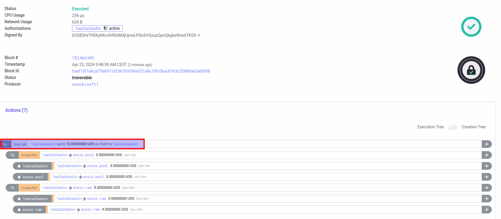

### Step 8: Check New RAM Balance

Finally, revisit the Ultra Blockchain Explorer to check your new RAM balance (952 KB). You should see an increase in RAM, reflecting the purchase.

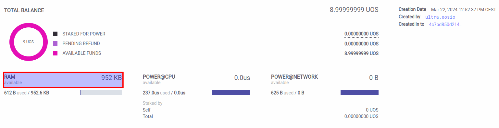

By following these steps, you have successfully used UOS tokens to purchase RAM for your account on the Ultra blockchain. This RAM is essential for activities such as deploying smart contracts or managing digital assets.
