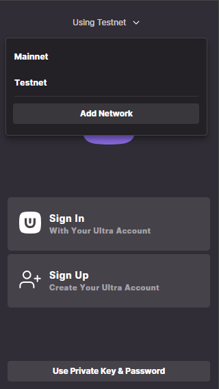
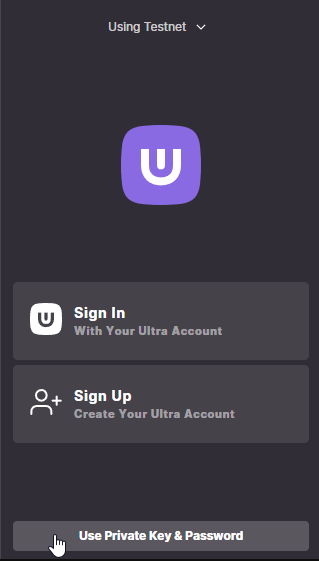
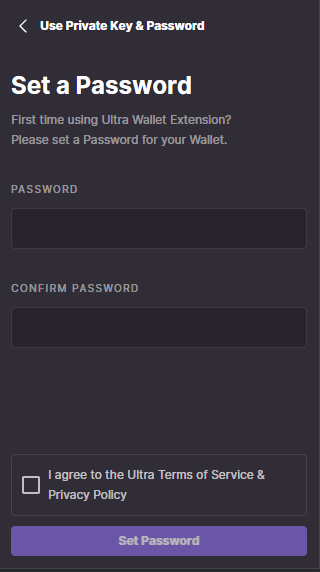
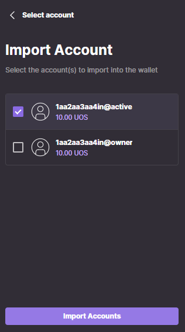
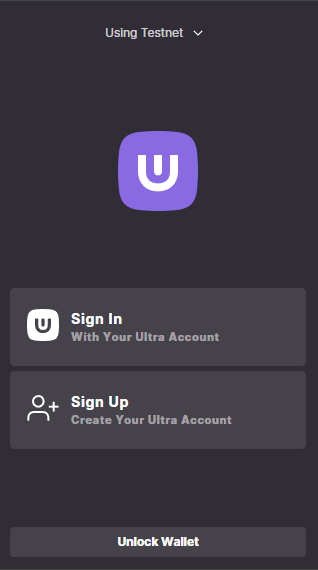
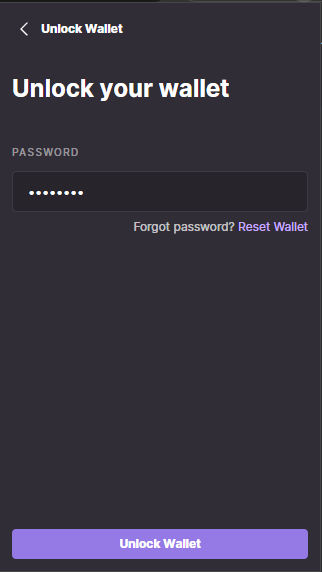
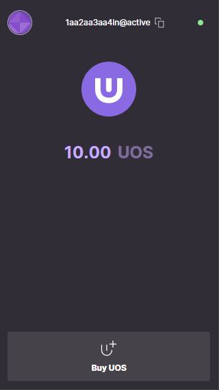

# Tutorial - Setup the Ultra Wallet

Ultra Wallet browser extension is a crypto wallet that helps you access decentralized applications on Ultra blockchain and securely manage digital assets. This tutorial will cover the simplest process of setting up the Ultra Wallet and adding your keys to the wallet.

## Prerequisites

-   Have a [private and public key pair](../../blockchain/general/antelope-ultra/public-and-private-keys.md). To generate a key pair, please follow the [Generate a key and create a developer Testnet account](./tutorial-generate-key-and-create-testnet-account.md) tutorial.
-   Have a chromium based browser since Ultra Wallet only supports chromium based browsers.

## Goal

The goal of this tutorial is to add your developer account to the Ultra Wallet. The Ultra Wallet will be used in later tutorials to demonstrate interaction with the blockchain.

## Setup

1. Download or use Chrome, Brave, or Chromium Equivalent
2. Install the [Ultra Wallet Chrome Extension](https://chromewebstore.google.com/detail/ultra-wallet/kjjebdkfeagdoogagbhepmbimaphnfln). Simply click `Add to` on the extension page

## Open Ultra Wallet

Open your `Ultra Wallet` by clicking it inside of the extensions panel.

## Set the Network

Set your network to `Testnet` since we created our account on testnet in the previous tutorial.

## Add Account to Ultra Wallet

1. Click on `Use Private Key & Password`.

2. Set a password, read and agree to the [Terms of Service](https://ultra.io/terms) and [Privacy Policy](https://ultra.io/privacy) and then click on the `Set Password` button.

3. Paste your private key that you generated in the [Generate a key and create a developer Testnet account Tutorial](./tutorial-generate-key-and-create-testnet-account.md), and click on the `Import Account` button.

4. You will see a list of accounts along with their permissions that are controlled by your private key. Select the account with `@active` permission in it, and click the `Import Accounts` button.

5. Once done, you will see a success message. You have now successfully imported your private key into your Ultra Wallet.

## Unlocking Ultra Wallet

1. Open the wallet extension and click on the `Unlock Wallet` button.

2. Enter the password that you set in the previous steps, and click the `Unlock Wallet` button.

3. Once unlocked, you will be able to see your account name and your UOS balance.

## What's next?

The next tutorial will cover using the Ultra Wallet to login into Ultra Tool Kit - [Tutorial - Log in to the Ultra Tool Kit](./tutorial-login-to-toolkit.md)
