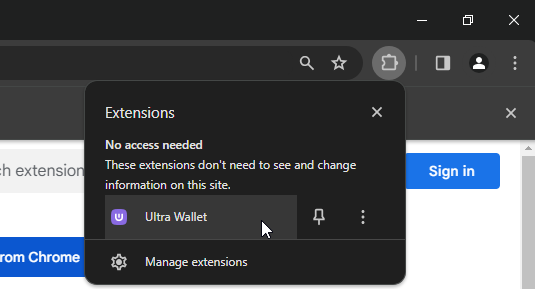
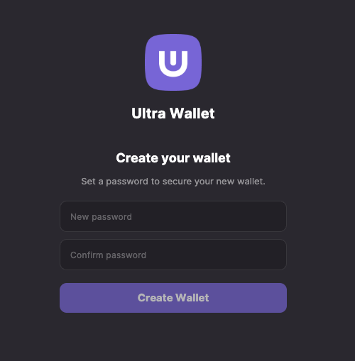
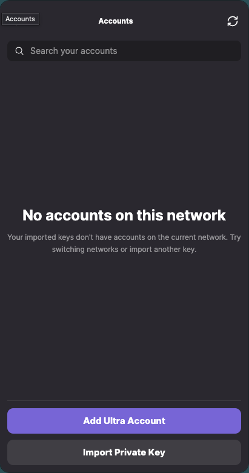
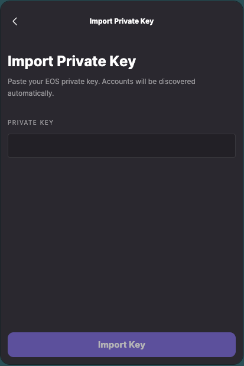
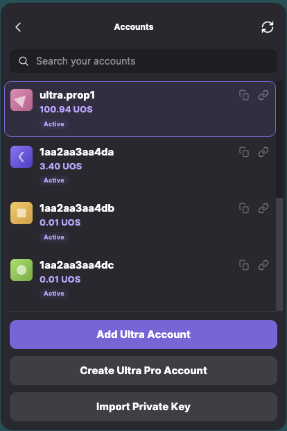
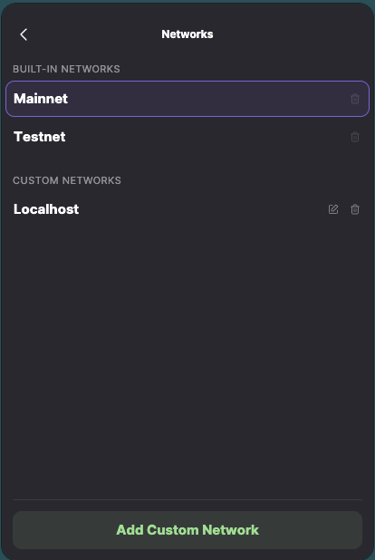
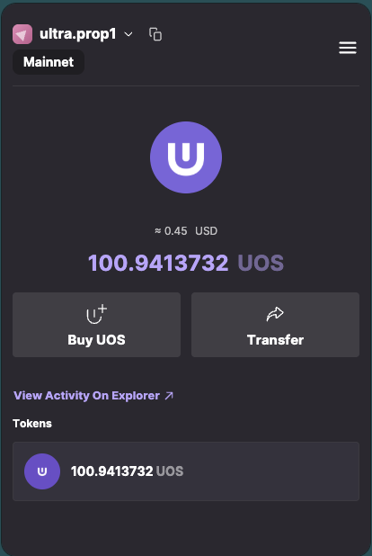
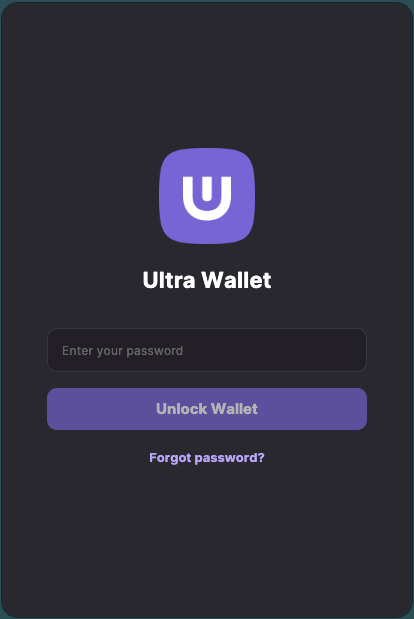

# Tutorial - Setup the Ultra Wallet

The Ultra Wallet browser extension is a self-custody crypto wallet that helps you access decentralized applications on the Ultra blockchain and securely manage your digital assets. This tutorial covers setting up the Ultra Wallet (version 2.x) and adding your developer account so it can be used in later tutorials.

> **What's new in 2.x:** The wallet now stores all of your keys in a single, on-device encrypted **vault** protected by one password. From that vault you can manage multiple accounts and keys, create new blockchain accounts on-device, switch networks, and connect to dApps. See [Managing accounts and keys](../../products/ultra-wallet/managing-accounts-and-keys.md) and [Networks and settings](../../products/ultra-wallet/networks-and-settings.md) for the full feature set.

## Prerequisites

-   Have a [private and public key pair](../../blockchain/general/antelope-ultra/public-and-private-keys.md). To generate a key pair, please follow the [Generate a key and create a developer Testnet account](./tutorial-generate-key-and-create-testnet-account.md) tutorial.
-   Have a chromium based browser since Ultra Wallet only supports chromium based browsers.

## Goal

The goal of this tutorial is to create your wallet vault and add your developer account to the Ultra Wallet. The Ultra Wallet will be used in later tutorials to demonstrate interaction with the blockchain.

## Install the extension

1. Download or use Chrome, Brave, or a Chromium equivalent.
2. Install the [Ultra Wallet Chrome Extension](https://chromewebstore.google.com/detail/ultra-wallet/kjjebdkfeagdoogagbhepmbimaphnfln). Simply click `Add to` on the extension page.

## Open Ultra Wallet

Open your `Ultra Wallet` by clicking it inside of the extensions panel.

## Create your wallet password

On first run, the wallet asks you to create a password for your vault. This password encrypts every key you store in the wallet and is **never sent anywhere** — if you lose it you will not be able to unlock your wallet again, so store it securely.

1. Enter a strong password, confirm it, and select `Create Wallet`.

## Add an account

Once your vault is ready, the wallet opens on the **Accounts** screen. From here you can add an account in a few ways:

-   **Add Ultra Account** — log in with an existing [Ultra account](https://ultra.io/). This links the account's key into your vault. Best for everyday users.
-   **Import Private Key** — paste an existing private key. The wallet automatically discovers every blockchain account that key controls. Best for developers and advanced users.
-   **Create Ultra Pro Account** — create a brand-new blockchain account on-chain by paying a small amount of UOS from an account you already have (available once you have at least one account).

For this tutorial we will **import the private key** generated in the [previous tutorial](./tutorial-generate-key-and-create-testnet-account.md).

1. Select `Import Private Key`, paste your private key, and select `Import Key`.

2. The wallet automatically discovers every account your key controls and lists them on the **Accounts** screen along with their permissions.

3. Your account is now stored in the vault, controlled by your password.

## Switch to Testnet

The wallet connects to Mainnet by default. Because our developer account lives on Testnet, switch networks:

1. Open the menu, choose `Networks`, and select `Testnet`.

Your home screen now reflects your Testnet account and its UOS balance.

## Unlocking Ultra Wallet

The wallet locks itself after a period of inactivity (configurable in the menu).

1. Open the wallet extension and enter the password you set earlier.

2. Once unlocked, you will see your account name, your UOS balance, and your token list.

## What's next?

-   Learn how to [manage accounts and keys](../../products/ultra-wallet/managing-accounts-and-keys.md) in your vault.
-   Configure [networks and settings](../../products/ultra-wallet/networks-and-settings.md), including custom networks and the side panel.
-   The next tutorial covers using the Ultra Wallet to log in to the Ultra Tool Kit - [Tutorial - Log in to the Ultra Tool Kit](./tutorial-login-to-toolkit.md).
