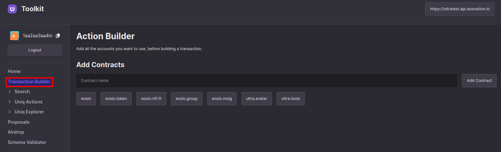
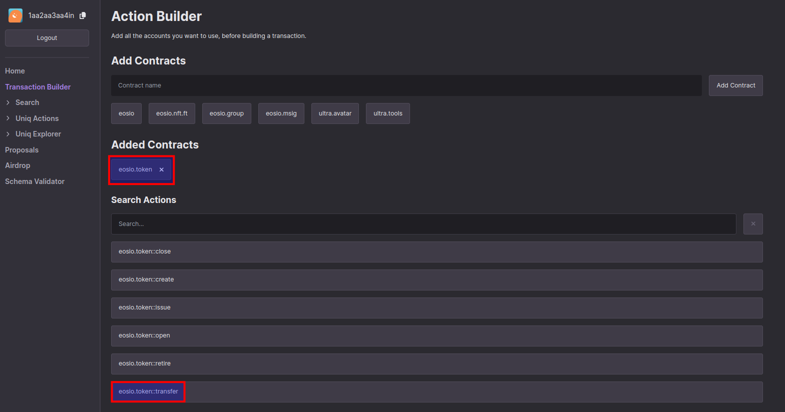
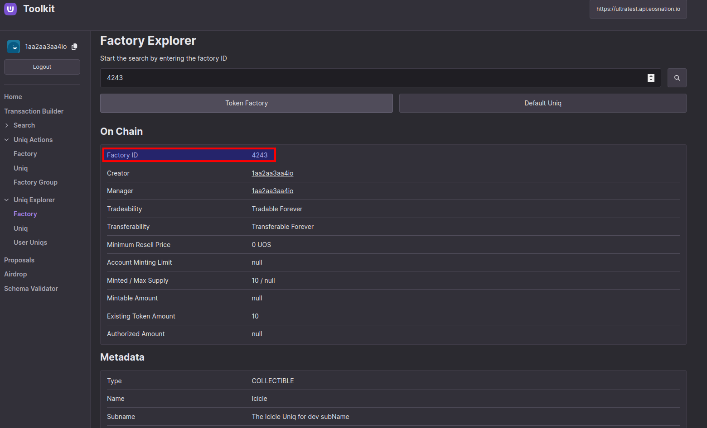
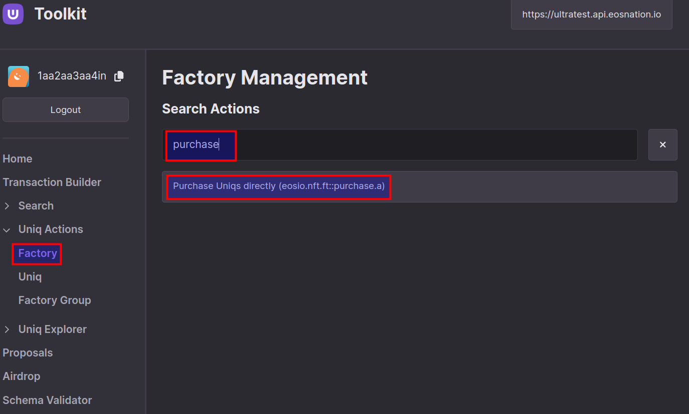
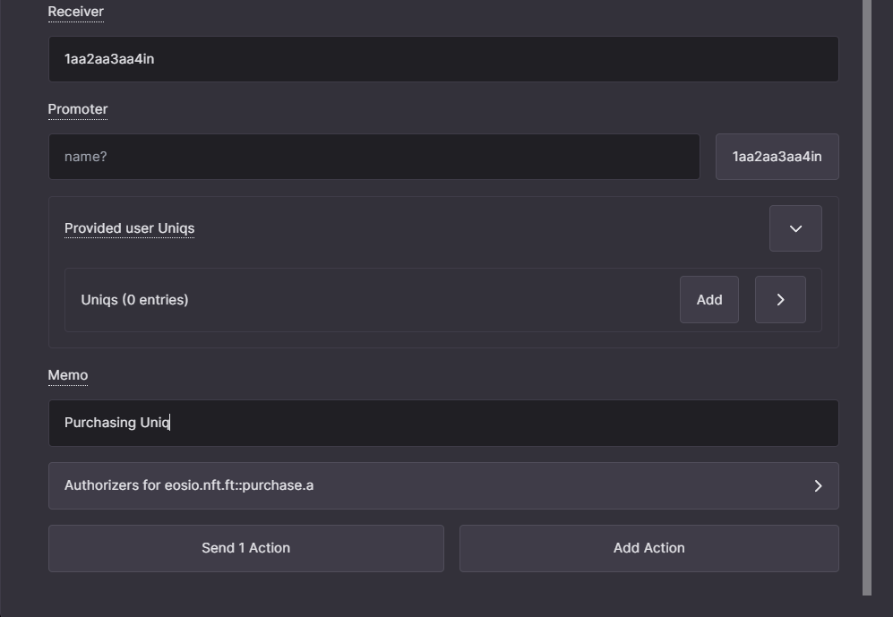

# Tutorial - Token transfer and Uniq purchase transactions

This tutorial will demonstrate how to use the Ultra tool kit for sending asset (transfer) and purchasing Uniq interact with Ultra the blockchain.

## Prerequisites

Before starting this tutorial, you will need:

- A developer account on the Ultra Testnet and to be logged into the Ultra Tool Kit. If you don't have it, please follow our previous tutorial: [Tutorial - Log in to the Ultra Tool Kit](./tutorial-login-to-toolkit.md).
- Your account must have sufficient UOS tokens for transactions and fees. If you don't have tokens, see [how to use Faucet](./tutorial-obtain-token-and-purchase-ram.md).

## Goal

The goal of this tutorial is to show you how to:

1. Transfer UOS tokens between accounts using the `eosio.token::transfer` action.
2. Purchase digital assets (Uniqs) using the `eosio.nft.ft::purchase.a` action within the Ultra ecosystem.

## Transferring Tokens

To transfer tokens using the Ultra tool kit, follow these steps closely:

### Step 1: Access the Transaction Builder

Open the Ultra tool kit and log in with your developer account. Click on the 'Transaction Builder' tab to begin creating a new transaction.

### Step 2: Select the eosio.token Contract

Find the `eosio.token` contract from the list of available contracts in Add Contracts section. Once you add the contract, search for `eosio.token::transfer` action to initiate a token transfer.

### Step 3: Fill in the Transfer Details

In the token transfer fields, enter the details of the transaction:
- **From**: `1aa2aa3aa4in` (your account)
- **To**: `1aa2aa3aa4io` (recipient's account)
- **Quantity**: `0.00000001 UOS` (amount to be transferred)
- **Memo**: `Test transaction` (a note about the transaction)

Ensure all details are correct to avoid any errors in the transaction.

Finally press the `Send 1 Action` button.

### Step 4: Preview and Confirm the Transaction

Review all the transaction details on the preview screen. Make sure that everything is accurate before you proceed.

### Step 5: Confirm and Sign with Ultra Wallet

Confirm and sign the transaction using the Ultra Wallet extension. This step is crucial as it authorizes the blockchain to execute the transfer under your account.

### Step 6: Transaction Completion

After signing the transaction, you will see a confirmation screen indicating that the transaction was successfully completed.

### Step 7: Verify the Transaction

To ensure the transaction was successfully processed, visit the Ultra Testnet Explorer at `https://explorer.testnet.ultra.io/`. Search for your account (e.g. `1aa2aa3aa4in`) to view the transaction details and confirm that the transfer went through as intended.

## Purchasing Digital Assets (Uniqs)

To purchase a Uniq from the Uniq Factory using the Ultra tool kit, follow these steps carefully:

### Step 1: Verify Factory Details

Begin by checking the Factory Explorer in the Uniq Explorer. Confirm the on-chain data for the Uniq Factory you are interested in, which in this case is Factory ID 4243, owned by account `1aa2aa3aa4io`.

### Step 2: Initiate Purchase Action

Navigate to the `Factory` page under the `Uniq Actions` section of the tool kit and then start typing `purchase` into the search bar. Then select the `Purchase Uniqs directly` action.

### Step 3: Enter Purchase Details

On the purchase action screen, fill out the attributes necessary for the transaction:
- **Factory ID**: `4243` (ID of the Uniq Factory)
- **Maximum Price**: `1.00000000 UOS` (maximum amount you are willing to pay)
- **Buyer**: `1aa2aa3aa4in` (your account)
- **Receiver**: `1aa2aa3aa4in` (your account, receiving the Uniq)

Scroll down to complete any additional required attributes for the purchase.

After filling the indicated fields press the `Send 1 Action` button.

### Step 4: Review and Confirm Transaction

Carefully review all the transaction details on the confirmation screen to ensure they are correct before proceeding.

### Step 5: Confirm and Sign with Ultra Wallet

Confirm and sign the transaction using the Ultra Wallet extension. This step is essential to authorize the transaction on the blockchain.

### Step 6: Transaction Completion

Once the transaction is signed, a confirmation screen will display indicating that the purchase was successfully completed.

### Step 7: Verify Ownership of New Uniq

#### Step 7a: Access Your User Inventory Page

To confirm the purchase of your new Uniq, navigate to the Ultra tool kit page ([https://toolkit.ultra.io/user](https://toolkit.ultra.io/user)). Once there, enter your account name (e.g. `1aa2aa3aa4in`) in the `Start the search by entering a username` field. Make sure to set your endpoint to the test network at the top right corner, which for this example is [https://ultratest.api.eosnation.io](https://ultratest.api.eosnation.io).

#### Step 7b: Verify the Newly Purchased Uniq

After entering your account name and setting the correct network endpoint, scroll down to view your Uniqs. Here, you should see the newly purchased Uniq from Uniq Factory 4243.

## What's next?

TBA
