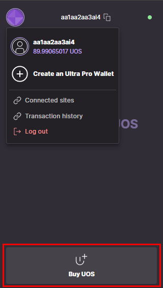

# How to create an Ultra Pro Wallet using Ultra Tool Kit

This tutorial will cover the simplest process of creating a developer account on Mainnet to be used to interact with the blockchain using the Ultra Tool Kit.

## Prerequisites

-   Account created using official [Ultra client](https://ultra.io/) or you can create it later during the tutorial using the Wallet Extension
-   Installed the [Ultra Wallet Chrome Extension](https://chromewebstore.google.com/detail/ultra-wallet/kjjebdkfeagdoogagbhepmbimaphnfln). Simply click `Add to` on the extension page
-   Your account must have sufficient UOS tokens for transactions and fees. Current Ultra Pro Wallet creation price is <OracleConversion :amount="2.0" scope="......2nf5.o4" :param="70000" />. This tutorial will briefly cover how to get UOS on Mainnet but if you already have some then you will be able to skip that step

## Goal

The goal of this tutorial is to create a new developer Ultra Pro Wallet on Mainnet, using the Ultra Tool Kit. You can use your Ultra Pro Wallet to directly interact with the blockchain. It is desireable for developers as it provides a more granular control over your account and allows it to be easily used for other tools and libraries like `cleos` or `Wharfkit`.

## Open and log in to the Ultra Wallet

To be able to create an Ultra Pro Wallet on Mainnet you will need to open your Wallet Extension and make sure you are switched to Mainnet. (You may need to log out from your Testnet account if it is currently logged in by clicking on the circular icon and clicking `Log out`).

Now if you already have an Ultra Account (created using the Ultra client) then you can simply use the `Sign In` option. If you don't have an account yet and need to create an account then proceed with `Sign Up` option, after signing up return back to this step and now use the `Sign In` option.

## Buy UOS tokens

To be able to create an Ultra Pro Wallet you will need some UOS available on your Ultra Account. The current Ultra Pro Wallet creation price is 2 USD which is approximately <OracleConversion :amount="2.0" scope="......2nf5.o4" :param="70000" /> so you need to have at least this amount of UOS and, preferably, a bit more to account for UOS price fluctuations.

If you don't have the required amount yet then you can utilize the `Buy UOS` option of the Ultra Wallet extension.

When you have enough funds you can proceed with the creation of the Ultra Pro Wallet.

## Generate a Key Pair

You will need a [private and public key pair](../../blockchain/general/antelope-ultra/public-and-private-keys.md) in order to create your Ultra Pro Wallet. If you already have a key pair, you can skip this step, or you can generate a new one using the form below by pressing the `Generate Key` button.

::: warning

In most cases we don't recommend generating private keys online. Please seek out some of the [alternative ways](../../blockchain/general/antelope-ultra/public-and-private-keys.md#alternative-ways-to-generate-keypairs) to generate a key pair safely.

It is up to you to properly secure your private key and not to lose it. If you lose the original copy of the private key you may eventually lose access to your new Ultra Pro Wallet account completely.

:::

<KeyGenerator />
\
\
Once you have your key pair, you can proceed with the creation of the Ultra Pro Wallet.

## Log in to the Ultra Tool Kit

Log in to the Ultra Tool Kit (https://toolkit.ultra.io) using your Ultra Wallet extension. Refer to [Log in to the Ultra Tool Kit Tutorial](../fundamentals/tutorial-login-to-toolkit.md) if you need help logging into the Ultra Tool Kit.

Once logged in, make sure you have selected `Mainnet` endpoint in the Ultra Tool Kit.

## Create an Ultra Pro Wallet

1. Once logged in to the tool kit, click on `Transaction Builder` from the Ultra Tool Kit sidebar menu to open the transaction builder page.

2. On the transaction builder page, click on the `eosio` contract button to load all related actions.

3. From the list of actions, search for `newnonebact` and click on `eosio::newnonebact` option.

4. Clicking on the `eosio::newnonebact` option will open up the transaction modal.

5. Fill the required fields for the `newnonebact` action.
    1. **creator**: `aa1aa2aa3ai4` (your existing Ultra Account, who will pay the account creation fee)
    2. Under `owner` section:
        1. **threshold**: Input `1` as the threshold for owner authority.
        2. Click on the `Add` button for `keys` section and enter your public key in the **key** input, and `1` in the **weight** input.
    3. Under `active` section:
        1. **threshold**: Input `1` as the threshold for active authority.
        2. Click on the `Add` button for `keys` section and enter your public key in the **key** input, and `1` in the **weight** input.
    4. **max_payment**: You need to specify the maximum amount of UOS you are willing to pay to create the Ultra Pro Wallet. The current Ultra Pro Wallet creation price is 2 USD which is approximately <OracleConversion :amount="2.0" scope="......2nf5.o4" :param="70000" /> so you need to input at least this amount of UOS and, preferably, a bit more to account for UOS price fluctuations (e.g. increase the current price by 1 UOS).
    5. Once you have inputted all the values, click on the `Send 1 Action` button.

6. Clicking on the `Send 1 Action` button will open up the transaction confirmation modal. You can click on the `Details` button to view the transaction in JSON form. Click on the `Confirm` button to submit your transaction.

7. Confirm and sign the transaction using the Ultra Wallet extension. This step is crucial as it authorizes the blockchain to execute the transfer under your account.

8. After signing the transaction, you will see a confirmation screen indicating that the transaction was successfully completed. To check the transaction on the block explorer, click on the `View in Explorer` text. Your new Ultra Pro Wallet name will be listed in the actions list.

For more information on the action, please refer to the [`newnonebact` action documentation](../../blockchain/contracts/system-contract/system-actions/newnonebact.md).

## Sign In to the Ultra Wallet using Ultra Pro Wallet

The process of using your new Ultra Pro Wallet through the Ultra Wallet extension is identical to the [Tutorial - Setup Ultra Wallet](../fundamentals/tutorial-setup-the-wallet.md). The only exception is if you wish to continue using the `Mainnet` network when logging into the Wallet, as the Ultra Pro Wallet you've just made is exclusively for Mainnet.
