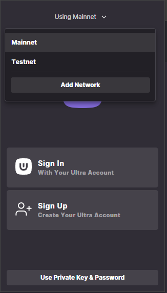
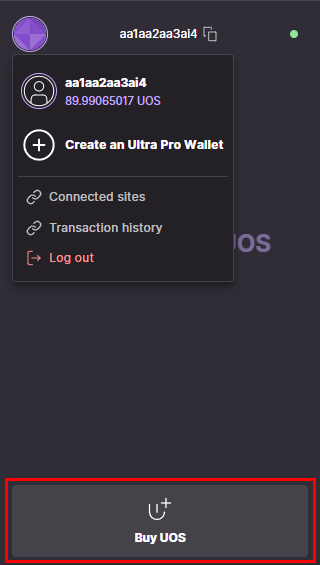
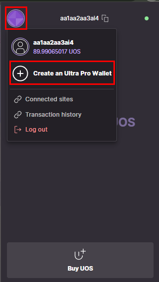
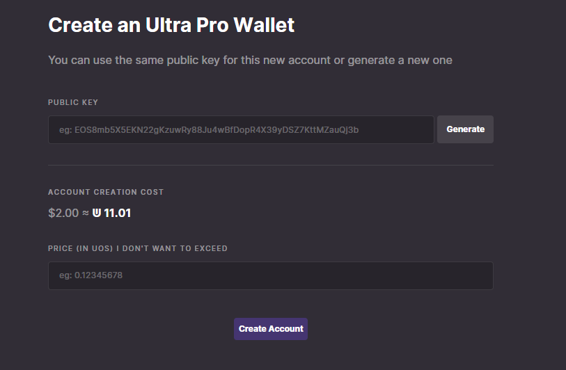
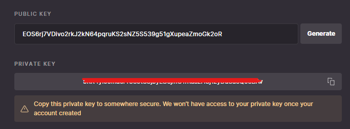
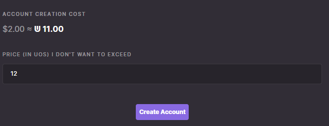
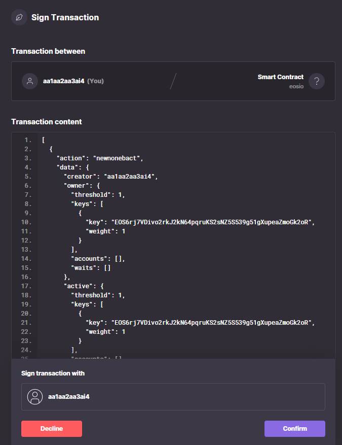
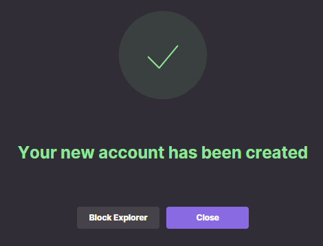
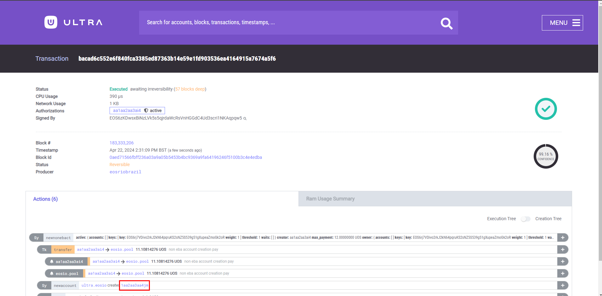

# How to create an Ultra Pro Wallet using Ultra Wallet Extension

This tutorial will cover the simplest process of creating a developer account on Mainnet to be used to interact with the blockchain using the Ultra Wallet extension.

## Prerequisites

-   Account created using official [Ultra client](https://ultra.io/) or you can create it later during the tutorial using the Wallet Extension
-   Installed the [Ultra Wallet Chrome Extension](https://chromewebstore.google.com/detail/ultra-wallet/kjjebdkfeagdoogagbhepmbimaphnfln). Simply click `Add to` on the extension page
-   Your account must have sufficient UOS tokens for transactions and fees. Current Ultra Pro Wallet creation price is <OracleConversion :amount="2.0" scope="......2nf5.o4" :param="70000" />. This tutorial will briefly cover how to get UOS on Mainnet but if you already have some then you will be able to skip that step

## Goal

The goal of this tutorial is to create a new developer Ultra Pro Wallet on Mainnet which you can later use to directly interact with the blockchain. It is desireable for developers as it provides a more granular control over your account and allows it to be easily used for other tools and libraries like `cleos` or `Wharfkit`.

## Open and log in to the Ultra Wallet

To be able to create an Ultra Pro Wallet on Mainnet you will need to open your Wallet Extension and make sure you are switched to Mainnet. (You may need to log out from your Testnet account if it is currently logged in by clicking on the circular icon and clicking `Log out`).

Now if you already have an Ultra Account (created using the Ultra client) then you can simply use the `Sign In` option. If you don't have an account yet and need to create an account then proceed with `Sign Up` option, after signing up return back to this step and now use the `Sign In` option.

## Create an Ultra Pro Wallet

To be able to create an Ultra Pro Wallet you will need some UOS available on your Ultra Account. The current Ultra Pro Wallet creation price is 2 USD which is approximately <OracleConversion :amount="2.0" scope="......2nf5.o4" :param="70000" /> so you need to have at least this amount of UOS and, preferably, a bit more to account for UOS price fluctuations.

If you don't have the required amount yet then you can utilize the `Buy UOS` option of the Ultra Wallet extension.

When you have enough funds you can proceed with the creation of the Ultra Pro Wallet. For this you need to click on the profile icon and select the `Create an Ultra Pro Wallet` button.

This will open a new browser tab where you will have 2 options:

-   Generate a new private and public key pair
-   Use an existing pair to create an Ultra Pro Wallet

The simplest option is to generate a new key pair using the `Generate` button. Pressing it will automatically fill out the `Public key` field and will show you the associated private key

::: warning

It is up to you to properly secure your private key and not to lose it. If you lose the original copy of the private key you may eventually lose access to your new Ultra Pro Wallet account completely.

:::

Before finishing the Ultra Pro Wallet creation you need to specify the maximum amount of UOS your are willing to pay to create it. The price fluctuates over time due to USD to UOS conversion fluctuations and may be a bit different then the estimate shown on the page. Pick a value that is a bit over the estimated price or just put a large number there, we will charge only the current equivalent of 2 USD converted to UOS.

Now you can press the `Create Account` button to proceed. You will be prompted to approve the transaction with its details listed. Check it and click `Confirm`

If everything was done correctly you will get a successful transaction screen. You can click on `Block Explorer` button to view the transaction status.

Your new Ultra Pro Wallet name will be listed in the actions list. You cannot chose a name directly.

## Sign In to the Ultra Wallet using Ultra Pro Wallet

The process of using your new Ultra Pro Wallet through the Ultra Wallet extension is identical to the [Tutorial - Setup Ultra Wallet](../fundamentals/tutorial-setup-the-wallet.md). The only exception is if you wish to continue using the `Mainnet` network when logging into the Wallet, as the Ultra Pro Wallet you've just made is exclusively for Mainnet.
