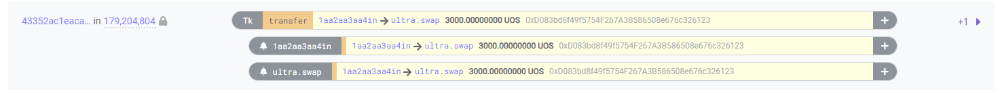
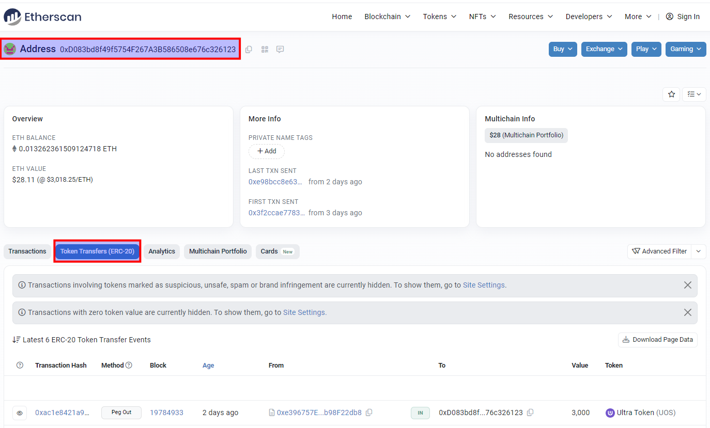
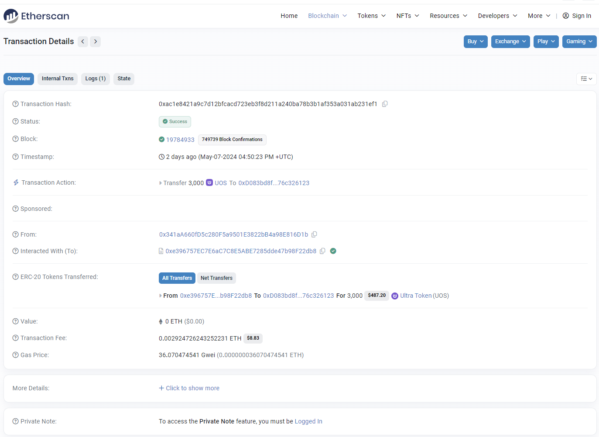

# How to swap UOS from Ultra Mainnet to Ethereum

This document guides you through the process of swapping UOS tokens from the Ultra Mainnet to UOS ERC-20 tokens on the Ethereum network using the Ultra Client. This process is designed for users who already have an Ethereum account and are familiar with cryptocurrency transactions.

## Prerequisites

Before you begin the swapping process, ensure that you meet the following requirements:
- **Ultra Account**: You must have an active account on the Ultra Mainnet with UOS tokens available for swapping.
- **Ethereum Account**: You should already have an Ethereum account set up to receive the UOS ERC-20 tokens. This account should be able to interact with ERC-20 tokens and possibly have some ETH for transaction fees on the Ethereum network.

Make sure both accounts are secure and that you have access to all necessary credentials.

## Step 1: Prepare the Swap in the Ultra Client

Start the swap process by opening the Ultra Client. Navigate to the Token Swap section.

1. Enter the amount of UOS you want to swap. In this example, we will swap 3000 UOS.
2. Enter your Ethereum address where you want to receive the UOS ERC-20 tokens. Make sure this is an address you control.

Once you have entered the UOS amount and your Ethereum address, confirm the details and initiate the swap. This process will interact with the blockchain to transfer your UOS tokens and issue the equivalent amount in UOS ERC-20 on the Ethereum network.

## Step 2: Verify the Transaction on the Ultra Network

To ensure that everything went smoothly on the Ultra side:
1. Visit the Ultra blockchain explorer at [https://explorer.mainnet.ultra.io/](https://explorer.mainnet.ultra.io/).
2. Search for the transaction using the transaction ID provided by the Ultra Client.

This step will help you confirm that the tokens were correctly deducted from your Ultra account.

## Step 3: Verify the Swap on Ethereum

After executing the swap transaction, you can verify your ERC-20 UOS tokens on the Ethereum network using Etherscan.

1. Go to [https://etherscan.io](https://etherscan.io).
2. Search for your Ethereum address to view the updated balance and incoming transactions under `Token Transfer (ERC-20)` tab.

### Check Transaction Details

To see the details of the transaction, including the amount of UOS ERC-20 received and the transaction hash, click on the specific transaction listed in your transaction history.

## Conclusion

Following these steps ensures that you successfully swap your UOS tokens from the Ultra network to ERC-20 tokens on the Ethereum network. Remember to double-check all addresses and transaction details during the process to avoid any errors.
