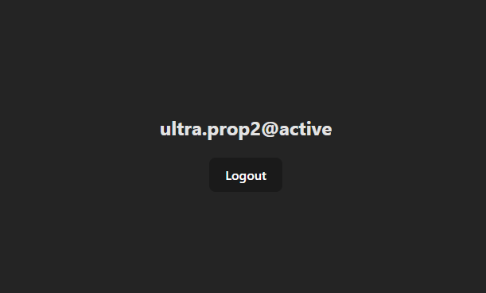

# Wallet Connection

In our previous step we ensured that the wallet is connecting to our browser instance. Now let's connect to the extension.

## Begin Connection

What we are going to do now is add in some boilerplate code to get the wallet application to work with Ultra.

This code performs the following functions:

1. They click login and the ultra wallet prompts them to login.
2. After connecting, their `blockchainid` is stored.
3. Their `username` is then updated in the main window and shown to the user.
4. They may now click `logout` at any time to disconnect the wallet.

```html
<script setup>
import { ref } from 'vue';

// Stores the username instance
let username = ref(undefined);

// Toggles to true when the login failed
let failedLogin = ref(false);

// Handles when the user clicks login
async function beginLogin() {
    try {
        const response = await ultra.connect();
        username.value = response.data.blockchainid;
    } catch (err) {
        console.error(err);
        failedLogin.value = true;
    }
}

// Handles when the user clicks logout
async function logout() {
    try {
        await ultra.disconnect();
        username.value = undefined;
        failedLogin.value = false;
    } catch (err) {}
}
</script>

<template>
    <div>
        <h2 v-if="!failedLogin">{{ username ? username : 'Please Login...' }}</h2>
        <h2 v-else>Failed to Login...</h2>
        <br />
        <button v-if="!username" @click="beginLogin">Login</button>
        <button v-else @click="logout">Logout</button>
    </div>
</template>

<style scoped></style>
```

## Final Product

Below are some basic images of what you should expect as a final product from this tutorial. If you wish to expand further and perform transactions, check out the [Ultra Wallet Product Documentation](../../../products/ultra-wallet/index.md).


