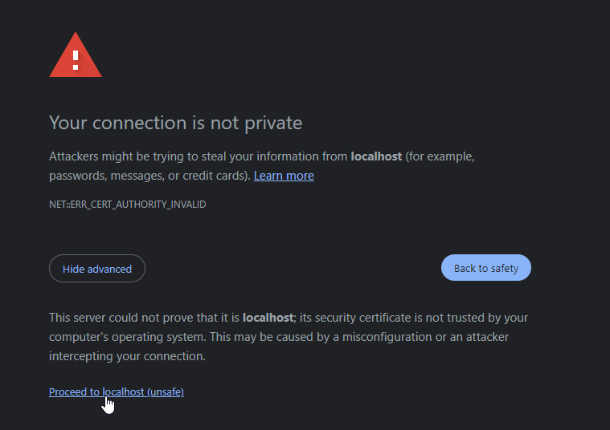

# Wallet Setup

Setting up the ultra wallet for your application is as simple as reading `window.ultra`. However, we have a few modifications we need to do to `Vite` so we can connect to the Ultra Extension in our browser.

## Open Your Project

In the previous steps we created a project called `ultra-project`.

We are now going to open that project in an IDE of our choice, we'll be using `VSCode` for this tutorial.


As you can see we have everything we need here.

- Project files on the left
- Terminal for running commands on the bottom
    - If this isn't opened just click Terminal in the menu at the top. Sometimes it's under the `...` menu.
- Editor where the larger `VSCode` logo is.

## Basic SSL Installation

We need to install an HTTPs server for Vite in order to properly preview and work with the ultra wallet. Let's do that right away.

Run the following command in terminal:

```
npm i -D @vitejs/plugin-basic-ssl
```


This will add a new development package dependency.

### Edit `vite.config.js`

Modify your configuration to instantiate the `basicSSL` plugin inside of the `plugins` array.

```js
import { defineConfig } from 'vite'
import vue from '@vitejs/plugin-vue'
import BasicSSL from '@vitejs/plugin-basic-ssl'

// https://vitejs.dev/config/
export default defineConfig({
  plugins: [vue(), BasicSSL()],
})
```

### Run `npm run dev`

Open your browser to the `URL` that is printed in your terminal, **while you are editing files the browser will automatically refresh**.

You should see your browser complaining about it not being private, this will not matter as we are developing locally.

::: warning
When you deploy your website to the world, you should secure it with HTTP(s) by utilizing a certificate provider.
:::

You can move past this by going to `advanced` and proceeding even though it is not safe.



## Edit `src/App.vue`

We are going to modify this main file and remove all the extras tags and data inside, and apply a simple boilerplate so we can see the changes directly.

**App.vue**
```tsx
<script setup>
import { ref } from 'vue';

const greetingMessage = ref('My Ultra App');
</script>

<template>
  <div>
    <h2>{{ greetingMessage }}</h2>
  </div>
</template>

<style scoped>
/** Leave this if you want to add some style later */
</style>

```

### Checking Wallet Instance

One of the first things we are going to do is check if the `ultra` variable is available inside of `window`.

What better way than to simply log `window.ultra` to console.

In **App.vue** `script` section add the following:

```tsx
<script setup>
import { ref } from 'vue';

const greetingMessage = ref('My Ultra App');

console.log(window.ultra);
</script>
```

Check your browser's console (F12) and see if an `object` prints out.


Looks good, let's move on to the next section.