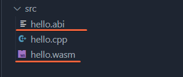

# Smart Contract Compiling

Compiling smart contracts is very simple with the [Ultra.io Smart Contract Toolkit](https://marketplace.visualstudio.com/items?itemName=ultraio.ultra-cpp).

If docker is installed correctly it will automatically download our development image, and use the image to compile your contracts.

Make sure you're not connected to any vm or docker container with remote explorer otherwise the plugin won't work correctly.
## How to Compile

There are **two ways** to compile your smart contract.

1. Make sure you have the `.cpp` file open and selected and click `Compile` at the bottom of VSCode.

1. Use the `Command Palette (F1)` under `Ultra: Build Contract`

## Successful Compilation

If successful you won't see any `errors` in the output window for `ultra-cpp`.

## Bad Compilation

If unsuccessful you will see various errors such as the ones below.

## Compiled Files

Once the files are compiled you should see an `abi` and a `wasm` file next to your compiled smart contract.

