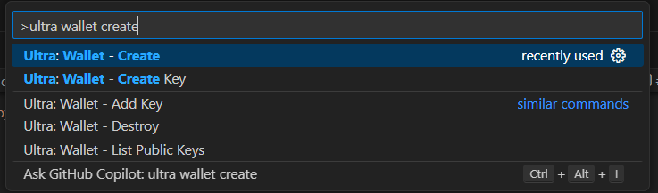
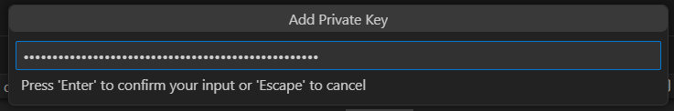

# Tutorial - Deploy Smart Contracts using the Ultra Smart Contract Toolkit Extension

Once you have an `abi` and `wasm` file for your contract, you are ready for deployment.

## Goal

The goal of this tutorial is to guide you through deploying a smart contract using the Ultra Smart Contract Toolkit Extension.

## Prerequisites

-   A compiled smart contract (`.wasm` and `.abi` files). Refer to the [Tutorial - Compile Smart Contracts using the Ultra Smart Contract Toolkit Extension](./compile.md) for more information.
-   A public-private key pair for your developer Testnet account. If you haven't generated a key pair yet, refer to [Tutorial - Generate a key and create a developer Testnet account](../fundamentals/tutorial-generate-key-and-create-testnet-account.md)
-   Your account must have sufficient UOS tokens for transactions and fees. Refer to [Tutorial - Using the Faucet and Buying RAM on Ultra Testnet](../fundamentals/tutorial-obtain-token-and-purchase-ram.md#obtaining-uos-tokens-using-the-faucet) for more information.

::: info
The tutorial is up-to-date with version 1.4.2 of the VSCode extension
:::

## Add Developer Testnet Account

Before you can deploy a smart contract, you will need to add your developer Testnet account to the Ultra Smart Contract Toolkit Extension. To do so, follow these steps:

1. Using the Command Palette (F1), type and select `Ultra: Wallet - Create`.
   
2. Enter a password for your wallet and re-enter the password to confirm it. Please make a note of this as it will be needed later to unlock the wallet.
   
3. Enter the private key for your developer Testnet account.
   
4. You will see a prompt on the bottom right that says `Added Public Key`.
   

You have now added your developer testnet account to the Ultra Smart Contract Toolkit Extension.

## Deploy Contract

1. Using the Command Palette (F1), type and select `Ultra: Deploy Contract`.
   

2. Select the contract you want to deploy.
   

3. Select the `Ultra Testnet` endpoint.
   

4. Unlock your wallet by entering your wallet password.
   

5. Enter the account you want to deploy this contract to. For the sake of this contract, you should deploy to your own developer Testnet account.
   

6. If successful you will see the smart contract has been deployed in the output window.
   

## Redeploy Smart Contract

After you've made some changes to your contract, you will need to build it again and redeploy.

Redeploying the contract is identical to the first time you've deployed the contract. Just follow the above instructions and use the same account to deploy to.

## Troubleshooting Deployment Errors

If you run into any issues during the deployment, refer to [Troubleshooting Deployment](./troubleshooting.md) for more information.

## What's next?

The next tutorial will cover interacting with your deployed smart contracts using the VS Code extension. See [Tutorial - Interact with Smart Contracts using the Ultra Smart Contract Toolkit Extension](./transact.md) for more information.
