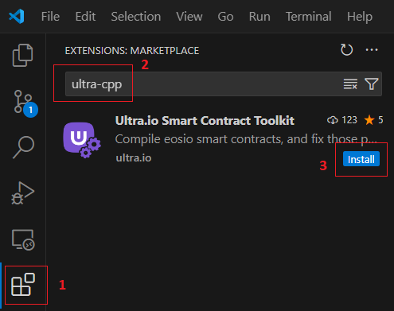
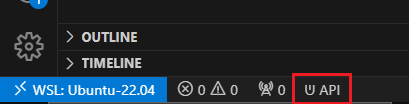
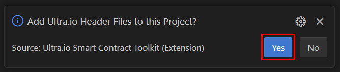
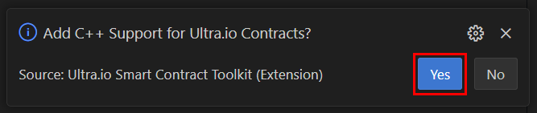

# Tutorial - Install and Setup the Ultra Smart Contract Toolkit Extension

## Prerequisites

-   Have [Docker](https://docs.docker.com/engine/install/) installed before using the extension.
-   [VS Code](https://code.visualstudio.com/)
    -   [Microsoft C++ Extension](https://marketplace.visualstudio.com/items?itemName=ms-vscode.cpptools) (optional, but recommended)

## Goal

The goal of this tutorial is to install the Ultra Smart Contract Toolkit extension and getting started with writing smart contracts.

## Installation

You can download the extension from [VS Code Market Place](https://marketplace.visualstudio.com/items?itemName=ultraio.ultra-cpp), or you can manually install it via VS Code.

To install the extension via VSCode, follow these steps:

1. Open up your VS Code and click on the `Extensions` tab, or press `Ctrl + Shift + X`
2. Under the `Extensions` tab, search for `ultra-cpp`
3. Click on the `Install` button



You have now successfully installed the Ultra Smart Contract Toolkit Extension. To verify the installation, make sure you have `ᕫ API` item in the VS Code status bar.



## Scaffolding

Depending on where you want to start your project. Always start with a workspace folder and open it in VSCode.


Once you have the Ultra Smart Contract Toolkit extension installed, you can easily create a starting template.

Access the `Command Palette` in VS Code with `F1` on the keyboard.


### Command Palette Command

```
Ultra: Create Smart Contract
```

It will prompt you for a folder to put the source code under. It is recommended to use `src` if it's a single contract.

## Header Setup

After creating the contract, you will need to **install headers** to remove some of the errors you will get from VSCode about the code.

There are currently **two ways** to install headers.

-   First way is to open your `.cpp` file that was generated, and follow the prompts
-   The second way is to open the the `Command Palette (F1)` and search for `Ultra: Add C++ Header Files for EOSIO`

Make sure you agree to both prompts (`Add Ultra.io Header Files` and `Add C++ Support`):





After installation, and following the prompts, the VS Code window will restart itself.

Wait for intellisense to finish updating to ensure everything is working correctly.


Any other prompts from VS Code can be ignored (including prompts related to Docker or CMake Tools if you have those installed)

## What's next?

The next tutorial will cover compiling smart contracts using the VS Code extension. See [Smart Contract Compiling](./compile.md) for more information.
