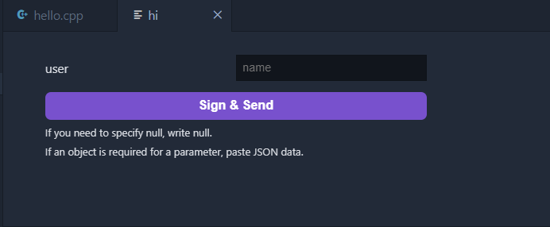
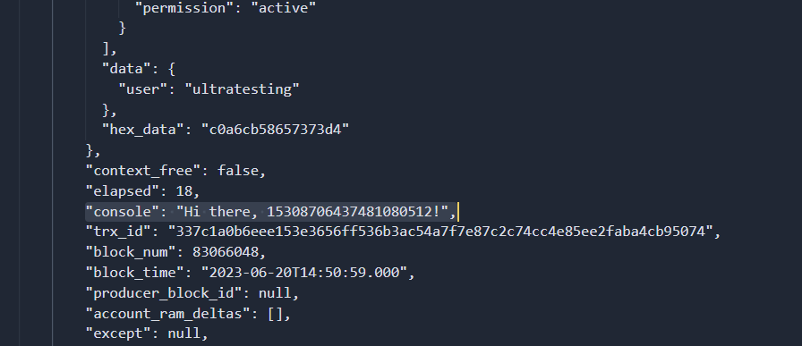

# Create a Transaction

After you have deployed your smart contract you can use [Ultra.io Smart Contract Toolkit](https://marketplace.visualstudio.com/items?itemName=ultraio.ultra-cpp), or use the [Ultra Wallet Extension](../../products/ultra-wallet/index.md) to transact.

In this guide we'll use the toolkit to keep it brief.

Using the Command Palette (F1), type `Ultra: Create Transaction`.

Select the correct you used earlier.

Type in the name of the account which the contract was deployed under.

You will see a list of available transactions if deployed correctly.

The signer should be the account you have access to. You should have created an account earlier in this guide with keys in your wallet.

Fill out your transaction, and execute it.

## Successful Transaction!

