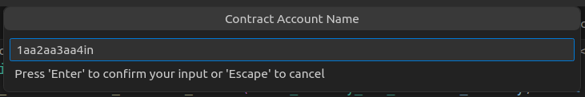

# Tutorial - Interact with Smart Contracts using the Ultra Smart Contract Toolkit Extension

Once you have deployed your contract, you are ready for interacting with your contract.

## Goal

The goal of this tutorial is to demonstrate how to interact with deployed smart contracts using the Ultra Smart Contract Toolkit Extension.

## Prerequisites

-   You must have deployed your smart contract. Refer to [Tutorial - Deploy Smart Contracts using the Ultra Smart Contract Toolkit Extension](./deploy.md).

::: info
The tutorial is up-to-date with version 1.4.2 of the VSCode extension
:::

## Interacting with Smart Contract

To interact with your deployed smart contract, follow these steps:

1. Use the Command Palette (F1), type `Ultra: Create Transaction`.
   

2. Select the endpoint where your smart contract is deployed.
   

3. Enter the password for the local wallet that you created in the previous tutorial.
   

4. Enter the name of the account which the contract was deployed under.
   

5. You will now see a list of available actions for your smart contract. Select the one that you want to interact with.
   

6. Enter the signer account. The signer should be the account you have access to. For the sake of this tutorial, we will use the same account where we deployed the smart contract.
   

7. You will now see a transaction form. Fill out your transaction data, and execute it by clicking on the `Sign & Send` button.
   

8. If successful, you will see the transaction response in the output window.
   

You can use the transaction id and search for the transaction on the [Ultra Testnet Block Explorer](https://explorer.testnet.ultra.io/).
