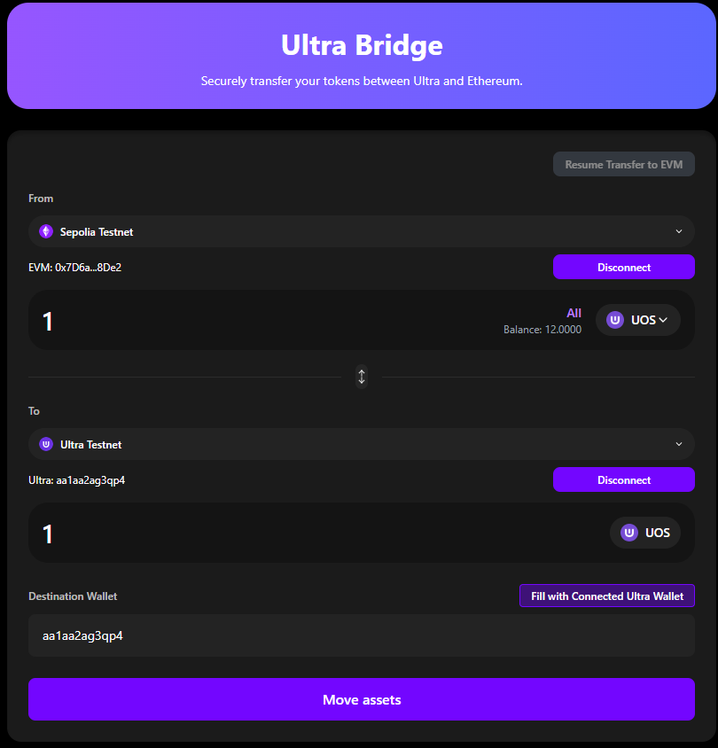
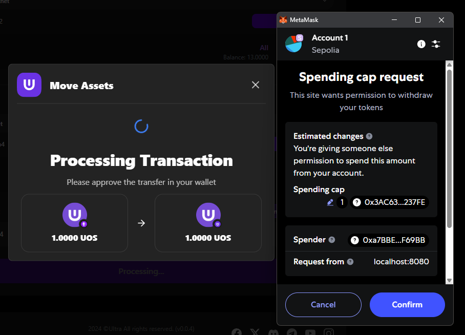
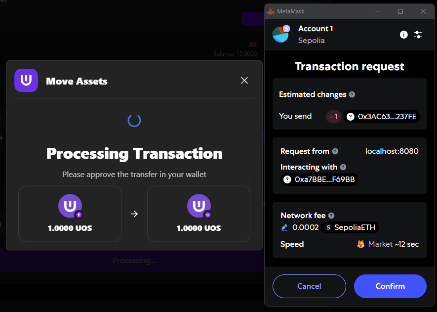
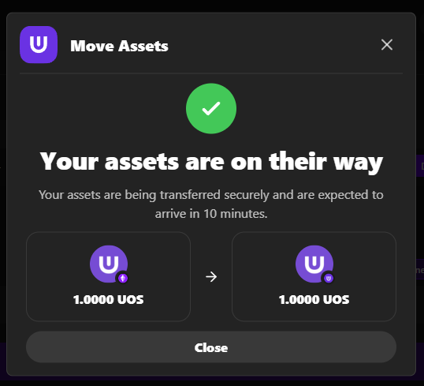

# EVM to Ultra Bridge

This guide will walk you through the complete process of transferring tokens from EVM-compatible networks (like Ethereum) to the Ultra blockchain. This process is more straightforward than Ultra to EVM transfers but still requires careful attention to detail.

**Testnet Bridge URL**: [https://bridge.testnet.ultra.io/](https://bridge.testnet.ultra.io/)

## Overview

The EVM to Ultra bridge process involves:
1. **Setup**: Configure source and destination networks
2. **Token Approval**: Approve spending cap for the token
3. **Transaction**: Submit the bridge transaction on EVM
4. **Completion**: Tokens are automatically transferred to Ultra

## Prerequisites

Before starting, ensure you have:
- ✅ EVM wallet connected to Ethereum Sepolia testnet
- ✅ Ultra wallet connected to Ultra Testnet
- ✅ Sufficient ETH balance for gas fees
- ✅ Tokens to bridge in your EVM wallet (UOS tokens on Sepolia)

## Step-by-Step Process

### Step 1: Select Source Network

1. Ensure you're connected to the Ethereum Sepolia testnet
2. Verify your EVM wallet is connected and shows the correct address
3. Confirm you have sufficient ETH for gas fees

### Step 2: Select Destination Network

1. Click on the destination network selector (Ultra side)
2. Choose Ultra Testnet (only testnet networks are available)
3. Ensure your Ultra wallet is connected to the same network

### Step 3: Select Token and Amount

1. Choose the UOS token you want to bridge from the token dropdown
2. Enter the amount you wish to transfer
3. Use the "Max" button to transfer your entire balance
4. Verify the transaction details and fees

**Note**: For EVM to Ultra transfers, you can bridge UOS tokens that were previously bridged from Ultra to EVM.

### Step 4: Enter Destination Address

1. Enter the destination Ultra wallet address manually, OR
2. Use the "Fill with Connected Ultra Wallet" button to auto-fill your connected Ultra address
3. Double-check the address is correct before proceeding

### Step 5: Execute the Transaction

1. Review all transaction details carefully
2. Click "Move Assets" button
3. **Approve the spending cap** in your EVM wallet (token approval)
4. **Confirm the transfer** in your EVM wallet (final transaction)
5. Wait for the transaction to be processed

### Step 6: Token Approval (Spending Cap)

After clicking "Move Assets", you'll first need to approve the spending cap:

1. Your EVM wallet will open for token approval
2. Review the approval details including the token and amount
3. Click "Approve" or "Confirm" in your EVM wallet
4. Wait for the approval transaction to be confirmed

### Step 7: Transfer Confirmation

After the spending cap approval, you'll need to confirm the actual transfer:

1. Your EVM wallet will open again for the transfer confirmation
2. Review the transaction details including gas fees
3. Click "Confirm" or "Approve" in your EVM wallet
4. Wait for the transaction to be processed on the EVM network

### Step 8: Transaction Success

After the transfer confirmation is approved, your transaction will be completed directly:

- Success message will be displayed
- Transaction hash will be shown
- Option to view on blockchain explorer will be available
- Your tokens will be available in your destination Ultra wallet

### Step 9: Verify Tokens in Wallet

To see your bridged UOS tokens in your Ultra wallet:

1. **Check Your Ultra Wallet**: The bridged UOS tokens should be visible in your Ultra wallet balance
2. **Verify on Explorer**: You can verify the transaction on the Ultra testnet explorer

## Troubleshooting EVM to Ultra Transfers

### Common Issues

#### Token Approval Fails

**Problem**: Spending cap approval transaction fails

**Solutions**:
- Ensure you have enough ETH for gas fees
- Check if the token contract is working properly
- Try the approval again
- Contact support if the issue persists

#### Transfer Confirmation Fails

**Problem**: Transfer confirmation transaction fails

**Solutions**:
- Ensure you have enough ETH for gas fees
- Check if the approval was successful
- Try the transfer again
- Contact support if the issue persists

#### Insufficient Balance

**Problem**: "Insufficient balance" error

**Solutions**:
- Check your EVM wallet balance
- Ensure you have enough tokens for the transfer
- Account for gas fees and bridge fees
- Consider reducing the transfer amount

#### Transaction Stuck

**Problem**: Transaction shows "Pending" for too long

**Solutions**:
- Check EVM network congestion
- Verify you have sufficient ETH for gas fees
- Wait for network confirmation
- Contact support if stuck for more than 30 minutes

## Best Practices

### Before Starting

1. **Test First**: Always test with small amounts
2. **Check Balances**: Ensure sufficient ETH for gas fees
3. **Verify Networks**: Confirm both wallets are on correct networks
4. **Check Maintenance**: Verify bridge is not in maintenance mode

### During the Process

1. **Follow Instructions**: Complete each step as instructed
2. **Be Patient**: Wait for each transaction to confirm
3. **Don't Close**: Don't close the browser during the process
4. **Monitor Gas**: Keep track of gas fees

### After Completion

1. **Verify Receipt**: Check your Ultra wallet for received tokens
2. **Save Transaction Hash**: Keep the transaction hash for reference
3. **Test Functionality**: Verify tokens work in your Ultra wallet
4. **Document Process**: Note any issues for future reference

## Gas Fee Considerations

### EVM Network Fees
- **ETH Gas**: Required for EVM network transactions
- **Approval Gas**: Gas for token approval transaction
- **Transfer Gas**: Gas for the actual bridge transfer
- **Gas Estimation**: DApp will estimate required gas

### Ultra Network Fees
- **No Additional Fees**: No additional fees on Ultra side
- **Automatic Processing**: Bridge handles Ultra side automatically

## Understanding the Two-Step Process

### Why Two Transactions?

1. **Token Approval**: First transaction approves the bridge contract to spend your tokens
2. **Bridge Transfer**: Second transaction actually transfers the tokens to the bridge

### Security Benefits

- **User Control**: You control when tokens are transferred
- **Gas Management**: You can manage gas fees for each step
- **Error Recovery**: If one step fails, you can retry without losing tokens

## Comparison: EVM to Ultra vs Ultra to EVM

| Feature | EVM to Ultra | Ultra to EVM |
|---------|--------------|--------------|
| **Steps Required** | 2 wallet confirmations | Multiple stages + manual claiming |
| **Transfer Status** | No monitoring required | Must monitor through stages |
| **Move Assets Step** | Not required | Required |
| **Resume Function** | Not available | Available |
| **Completion** | Direct to Ultra wallet | Requires EVM wallet confirmation |
| **Complexity** | Simpler | More complex |

## Next Steps

After completing your EVM to Ultra transfer:

1. **[Ultra to EVM Bridge](./ultra-to-evm.staging.md)** - Learn how to transfer tokens back to EVM
2. **[Maintenance Mode](./maintenance-mode.staging.md)** - Understanding scheduled maintenance
3. **[Troubleshooting](./troubleshooting.staging.md)** - Common issues and solutions

## Getting Help

If you encounter issues during EVM to Ultra transfers:

- **Check the [Troubleshooting](./troubleshooting.staging.md) guide**
- **Join the [Ultra Discord community](https://discord.com/invite/WfJCN6YbGk)**
- **Contact support at contact@ultra.io**
- **Review the transaction on blockchain explorers**
