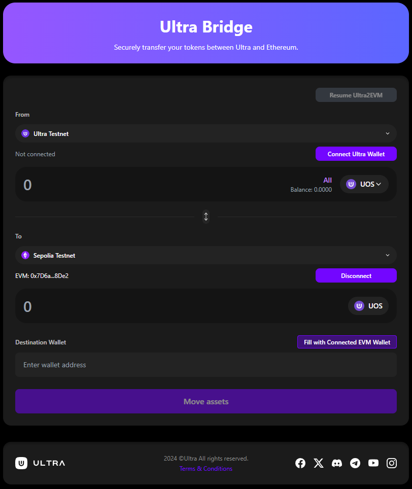

# Ultra Bridge Tutorial

**Testnet Bridge URL**: [https://bridge.testnet.ultra.io/](https://bridge.testnet.ultra.io/)

The Ultra Bridge is a decentralized application that enables seamless token transfers between the Ultra blockchain and EVM-compatible networks (like Ethereum). This bridge allows you to move your tokens across different blockchain networks while maintaining their value and utility.

## Key Features

- **Bidirectional Transfers**: Swap tokens from Ultra to EVM networks and vice versa
- **Multiple Networks**: Support for Ethereum mainnet and testnet (Sepolia)
- **Wallet Integration**: Connect with Ultra Wallet extension, Ultra Web wallet, and EVM wallets (MetaMask, etc.)
- **Transaction Monitoring**: Real-time tracking of your bridge transactions
- **Resume Functionality**: Continue interrupted transactions
- **Maintenance Awareness**: Clear notifications about scheduled maintenance

## Tutorial Sections

- [Getting Started with Ultra Bridge](./getting-started.staging.md) - Learn the basics and prerequisites
- [Connecting Your Wallets](./connecting-wallets.staging.md) - How to connect Ultra and EVM wallets
- [Ultra to EVM Bridge](./ultra-to-evm.staging.md) - Complete guide for transferring from Ultra to EVM
- [EVM to Ultra Bridge](./evm-to-ultra.staging.md) - Complete guide for transferring from EVM to Ultra
- [Resuming Transactions](./resuming-transactions.staging.md) - How to resume interrupted Ultra to EVM transactions
- [Maintenance Mode](./maintenance-mode.staging.md) - Understanding scheduled maintenance
- [Troubleshooting](./troubleshooting.staging.md) - Common issues and solutions

## Prerequisites

Before starting this tutorial, ensure you have:

- **Ultra Wallet**: Ultra Wallet extension or Ultra Web wallet for Ultra blockchain transactions
- **EVM Wallet**: MetaMask, WalletConnect, or other EVM-compatible wallet
- **Network Access**: Ensure you have access to the networks you want to bridge between

## Supported Networks (Testnet Only)

This staging tutorial covers the testnet environment only. The testnet bridge is available at [https://bridge.testnet.ultra.io/](https://bridge.testnet.ultra.io/)

- **Ultra Testnet**: For testing purposes (free tokens available via [faucet](https://faucet.testnet.app.ultra.io/))
- **Ethereum Sepolia**: Testnet for Ethereum

**Test UOS Token on Sepolia**: `0x3AC63AA2c077D676Fa24a7BCE05b05A2F81237FE`

**Available Tokens for Bridging**:
- **Ultra to EVM**: UOS tokens from Ultra Testnet to Ethereum Sepolia
- **EVM to Ultra**: UOS tokens from Ethereum Sepolia back to Ultra Testnet

**Note**: The bridge DApp is built per environment, so the testnet version will only display Ultra Testnet and Ethereum Sepolia networks. Mainnet networks are not available in the testnet environment.
