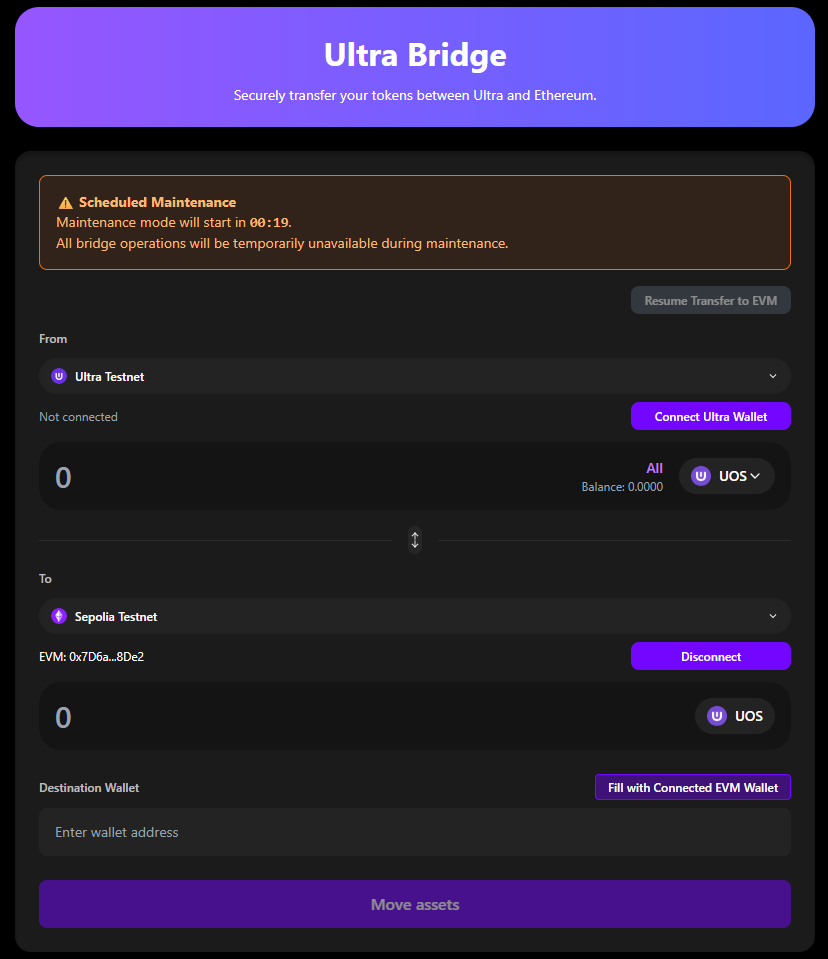
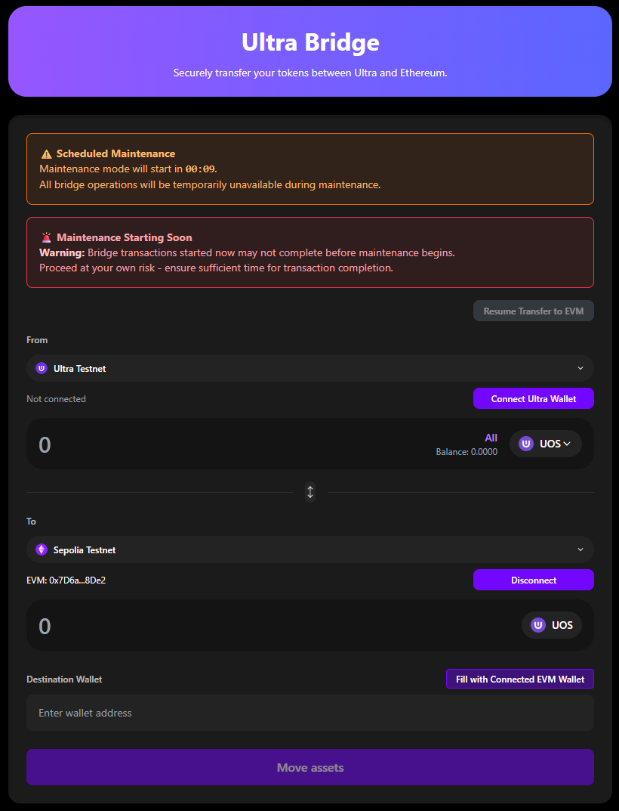
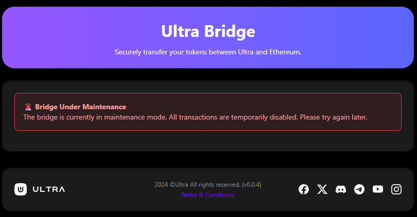

# Maintenance Mode

The Ultra Bridge has scheduled maintenance periods to ensure optimal performance and security. This guide explains the different maintenance states and how they affect your bridge usage.

**Testnet Bridge URL**: [https://bridge.testnet.ultra.io/](https://bridge.testnet.ultra.io/)

## Overview

Maintenance mode is a planned feature that allows the Ultra Bridge team to perform necessary updates, security patches, and system optimizations. During maintenance, the bridge may be temporarily unavailable or have limited functionality.

## Maintenance States

The bridge operates in different maintenance states, each with specific characteristics and user actions required.

### 1. Scheduled Maintenance

**When**: Maintenance is planned and announced in advance

**Indicator**: Countdown timer showing time until maintenance

**User Action**: Complete any pending transactions before maintenance starts

**Duration**: Usually announced in advance with specific timeframes

**What You Should Do**:
- Complete any pending transactions
- Avoid starting new transactions close to maintenance time
- Monitor the countdown timer
- Plan your bridge usage around the maintenance window

### 2. Imminent Maintenance

**When**: Maintenance is about to start (usually 30 minutes or less)

**Indicator**: Warning message with short countdown

**User Action**: Avoid starting new transactions

**Duration**: Short period before maintenance begins

**What You Should Do**:
- **Do not start new transactions**
- Complete any in-progress transactions quickly
- Monitor the countdown timer
- Wait for maintenance to complete before starting new transactions

### 3. Active Maintenance

**When**: Maintenance is currently in progress

**Indicator**: Clear maintenance message

**User Action**: Bridge is temporarily unavailable

**Duration**: Varies based on maintenance requirements

**What You Should Do**:
- **Do not attempt new transactions**
- Wait for maintenance to complete
- Monitor for completion announcements
- Check the bridge status periodically

## During Maintenance

### What Happens to Your Transactions

#### Existing Transactions
- **In Progress**: May be delayed until maintenance completes
- **Completed**: Should remain unaffected
- **Pending**: May need to be resumed after maintenance

#### New Transactions
- **Cannot be initiated** during active maintenance
- **Will be rejected** if attempted
- **Should wait** until maintenance completes

### Resume Function During Maintenance

- **May still work** for transactions that were already processed
- **Depends on maintenance type** and scope
- **Check availability** when maintenance is active
- **Contact support** if resume function is needed during maintenance

## After Maintenance

### When Maintenance Completes

1. **Check Status**: Verify the bridge is operational
2. **Test Functionality**: Try a small test transaction
3. **Resume Transactions**: Use the resume function if needed
4. **Monitor Performance**: Watch for any issues

### Post-Maintenance Actions

#### For Users with Pending Transactions
1. **Check Resume Function**: Look for any transactions that need attention
2. **Complete Claims**: If you have "Ready to Claim" transactions, complete them
3. **Verify Balances**: Check your wallet balances
4. **Test Small Amount**: Consider testing with a small amount first

#### For New Users
1. **Start Small**: Begin with small test transactions
2. **Monitor Network**: Watch for any post-maintenance issues
3. **Check Announcements**: Look for any post-maintenance updates
4. **Report Issues**: Contact support if you encounter problems

## Maintenance Notifications

### How You'll Be Notified

1. **In-App Notifications**: The bridge interface will show maintenance status
2. **Countdown Timers**: Visual countdowns for scheduled maintenance
3. **Status Messages**: Clear messages about maintenance state
4. **Community Updates**: Announcements on Discord and other channels

### Staying Informed

- **Follow Official Channels**: Join the Ultra Discord community
- **Check Bridge Status**: Monitor the bridge interface regularly
- **Read Announcements**: Pay attention to maintenance announcements
- **Plan Ahead**: Schedule your bridge usage around maintenance windows

## Best Practices During Maintenance

### Before Maintenance

1. **Complete Transactions**: Finish any pending transactions
2. **Plan Ahead**: Schedule bridge usage around maintenance windows
3. **Monitor Announcements**: Stay informed about upcoming maintenance
4. **Save Information**: Keep transaction hashes and details

### During Maintenance

1. **Don't Start New Transactions**: Wait until maintenance completes
2. **Monitor Status**: Check bridge status periodically
3. **Be Patient**: Maintenance is necessary for security and performance
4. **Stay Informed**: Follow official channels for updates

### After Maintenance

1. **Test First**: Start with small test transactions
2. **Check Resume Function**: Look for any pending transactions
3. **Verify Functionality**: Ensure everything works as expected
4. **Report Issues**: Contact support if you encounter problems

## Understanding Maintenance Types

### Regular Maintenance

**Purpose**: Routine updates and optimizations
**Frequency**: Scheduled regularly
**Duration**: Usually short (minutes to hours)
**Impact**: Minimal disruption

### Security Updates

**Purpose**: Critical security patches
**Frequency**: As needed
**Duration**: Varies based on complexity
**Impact**: May require longer maintenance windows

### System Upgrades

**Purpose**: Major feature updates or system improvements
**Frequency**: Less frequent
**Duration**: Longer periods
**Impact**: More significant disruption

## Troubleshooting During Maintenance

### Common Issues

#### Bridge Shows "Unavailable"

**Problem**: Bridge interface shows maintenance mode

**Solution**: Wait for maintenance to complete and try again

#### Transaction Stuck During Maintenance

**Problem**: Transaction was in progress when maintenance started

**Solutions**:
- Wait for maintenance to complete
- Use resume function after maintenance
- Contact support if transaction is still stuck

#### Resume Function Not Working

**Problem**: Resume function unavailable during maintenance

**Solutions**:
- Wait for maintenance to complete
- Check if resume function becomes available after maintenance
- Contact support if needed

## Maintenance Schedule

### Typical Maintenance Windows

- **Regular Updates**: Usually during low-usage periods
- **Security Patches**: As needed, may be urgent
- **System Upgrades**: Announced well in advance
- **Emergency Maintenance**: Rare, announced immediately

### Planning Around Maintenance

1. **Check Schedule**: Look for announced maintenance windows
2. **Plan Transactions**: Schedule important transactions outside maintenance
3. **Monitor Updates**: Stay informed about maintenance status
4. **Have Backup Plans**: Consider alternative timing for critical transfers

## Getting Help During Maintenance

### When to Contact Support

- **Emergency Issues**: Critical transactions that cannot wait
- **Stuck Transactions**: Transactions that remain stuck after maintenance
- **Balance Issues**: Missing tokens after maintenance
- **Resume Problems**: Issues with resume function after maintenance

### How to Contact Support

- **Discord**: Join the Ultra Discord community
- **Email**: contact@ultra.io
- **Documentation**: Check troubleshooting guides
- **Community**: Ask other users for help

## Next Steps

After understanding maintenance mode:

1. **[Troubleshooting](./troubleshooting.staging.md)** - Common issues and solutions
2. **[Ultra to EVM Bridge](./ultra-to-evm.staging.md)** - Complete Ultra to EVM guide
3. **[EVM to Ultra Bridge](./evm-to-ultra.staging.md)** - Complete EVM to Ultra guide

## Getting Help

If you have questions about maintenance mode:

- **Check the [Troubleshooting](./troubleshooting.staging.md) guide**
- **Join the [Ultra Discord community](https://discord.com/invite/WfJCN6YbGk)**
- **Contact support at contact@ultra.io**
- **Monitor official announcements**
