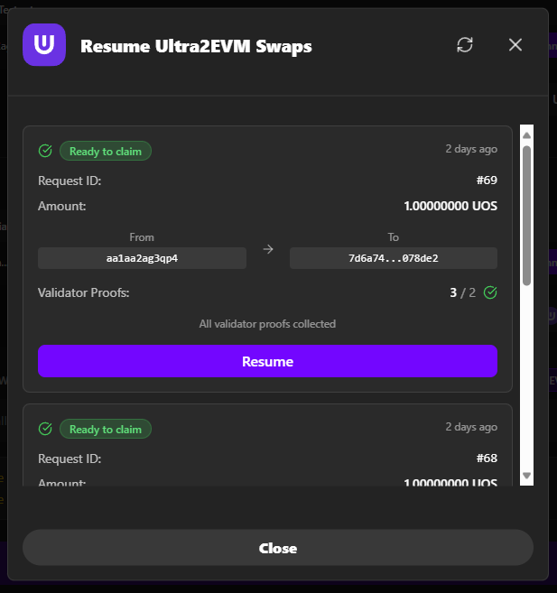
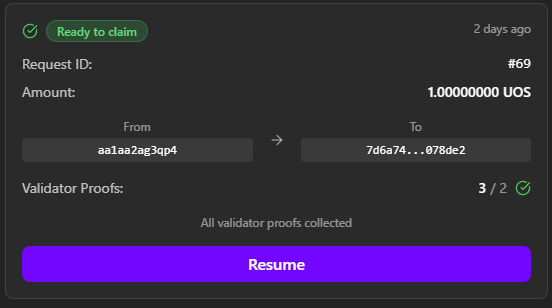
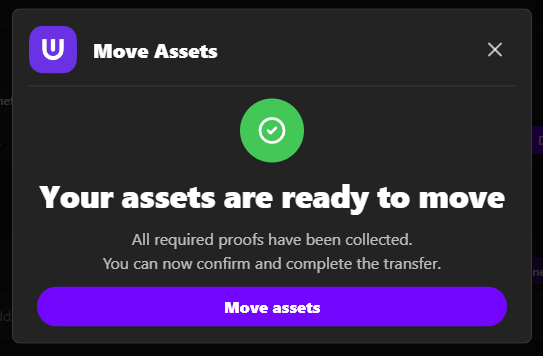

# Resuming Transactions

This guide explains how to resume interrupted Ultra to EVM transactions using the Ultra Bridge DApp. The resume functionality is only available for Ultra to EVM transfers, not for EVM to Ultra transfers.

**Testnet Bridge URL**: [https://bridge.testnet.ultra.io/](https://bridge.testnet.ultra.io/)

## Overview

Sometimes Ultra to EVM transactions may be interrupted or need manual claiming. The DApp provides a resume functionality to handle these cases and ensure your tokens are properly transferred.

## When to Use Resume Function

### Common Scenarios

- Your Ultra to EVM transaction was interrupted
- The transaction shows "Ready to Claim" but you haven't claimed yet
- You need to manually claim tokens on the EVM network
- The "Move Assets" step was not completed
- You closed the browser before completing the transfer

### Important Notes

- **Ultra to EVM Only**: Resume functionality is only available for Ultra to EVM transfers
- **EVM to Ultra**: Resume functionality is not available for EVM to Ultra transfers
- **Time Limits**: Some transactions may have time limits for claiming
- **Gas Requirements**: You'll need ETH in your EVM wallet for gas fees

## Accessing the Resume Function

### Step 1: Check for Resume Card

1. Open the Ultra Bridge DApp
2. Look for a "Resume" button or card on the main interface
3. The card will show if you have pending Ultra to EVM requests

### Step 2: Open Resume Dialog

1. Click on the "Resume" button or card
2. The resume dialog will open showing all your pending Ultra to EVM requests
3. Each request will display relevant information

## Understanding the Resume Dialog

### Information Displayed

The resume dialog shows all your Ultra to EVM requests that need attention:

- **Transaction Counter**: Unique identifier for the transaction
- **Amount and Token**: How much and what token is being transferred
- **Sender and Receiver Addresses**: Source and destination addresses
- **Proof Count and Threshold**: Validation information
- **Timestamp**: When the transaction was initiated

### Request Status

Each request will show its current status:
- **Ready to Claim**: Transaction is ready to be claimed
- **Processing**: Transaction is still being processed
- **Failed**: Transaction failed and may need attention

## Resuming a Transaction

### Step 1: Select Transaction

1. Review the list of pending requests in the resume dialog
2. Click on the specific transaction you want to resume
3. The DApp will fetch the current status of the transaction

### Step 2: Check Status

1. The DApp will display the current status of the selected transaction
2. If the transaction is ready to claim, you'll see a "Claim" button
3. If the transaction is still processing, you may need to wait

### Step 3: Execute Claim

1. If the transaction shows "Ready to Claim", click the "Claim" button
2. Your EVM wallet will open for transaction approval
3. Review the transaction details and gas fees
4. Approve the claim transaction in your EVM wallet

### Step 4: Complete the Claim

1. Wait for the claim transaction to be confirmed on the EVM network
2. Your tokens will be available in your EVM wallet
3. The transaction will be marked as completed in the resume dialog

### Step 5: Verify Tokens in Wallet

To see your claimed UOS tokens in your EVM wallet:

1. **Add the Test UOS Token** to your wallet if not already added:
   - **Contract Address**: `0x3AC63AA2c077D676Fa24a7BCE05b05A2F81237FE`
   - **Token Symbol**: UOS
   - **Decimals**: 4

2. **Check Your Balance**: The claimed UOS tokens should now be visible in your wallet

## Troubleshooting Resume Issues

### Common Issues

#### No Resume Card Visible

**Problem**: You don't see a resume card on the main interface

**Solutions**:
- Ensure you have pending Ultra to EVM transactions
- Check if you're connected to the correct networks
- Refresh the page and check again
- Contact support if you believe you should have pending transactions

#### Claim Button Not Available

**Problem**: Transaction is selected but no claim button appears

**Solutions**:
- Check if the transaction is actually ready to claim
- Ensure you're connected to the correct EVM network
- Verify your EVM wallet has sufficient ETH for gas
- Try refreshing the dialog

#### Claim Transaction Fails

**Problem**: EVM claim transaction fails

**Solutions**:
- Ensure you have enough ETH for gas fees
- Check if the transaction is still valid
- Try the claim again
- Contact support if the issue persists

#### Transaction Not Found

**Problem**: Expected transaction doesn't appear in the resume dialog

**Solutions**:
- Check if you're connected to the correct networks
- Verify the transaction was actually submitted
- Check the transaction hash on blockchain explorers
- Contact support with the transaction details

## Best Practices for Resume Function

### Before Using Resume

1. **Check Network Connections**: Ensure both wallets are connected to correct networks
2. **Verify Balances**: Ensure your EVM wallet has sufficient ETH for gas
3. **Review Transaction Details**: Double-check the transaction information
4. **Check Time Limits**: Some transactions may have time limits

### During Resume Process

1. **Follow Instructions**: Complete each step as instructed
2. **Be Patient**: Wait for each transaction to confirm
3. **Monitor Gas**: Keep track of gas fees
4. **Don't Close**: Don't close the browser during the process

### After Resume

1. **Verify Receipt**: Check your EVM wallet for received tokens
2. **Save Transaction Hash**: Keep the transaction hash for reference
3. **Test Functionality**: Verify tokens work in your EVM wallet
4. **Document Process**: Note any issues for future reference

## Understanding Transaction States

### Transaction Lifecycle

1. **Submitted**: Transaction submitted to Ultra network
2. **Processing**: Bridge is processing the request
3. **Ready to Claim**: Transaction is ready to be claimed on EVM
4. **Claiming**: User is claiming tokens on EVM network
5. **Completed**: Transaction successfully completed

### When Resume is Needed

- **Interrupted at "Ready to Claim"**: User didn't complete the claim step
- **Browser Closed**: User closed browser before completing transfer
- **Network Issues**: Network problems prevented completion
- **Gas Issues**: Insufficient gas prevented EVM transaction

## Security Considerations

### Resume Security

- **Verify Transaction**: Double-check transaction details before claiming
- **Check Addresses**: Ensure destination address is correct
- **Monitor Gas**: Be aware of gas fees for claim transactions
- **Time Limits**: Be aware of any time limits for claiming

### Best Practices

- **Test First**: Always test with small amounts
- **Verify Sources**: Ensure you're using the official bridge
- **Keep Records**: Save transaction hashes and details
- **Monitor Status**: Check transaction status regularly

## Comparison: Resume vs Normal Flow

| Aspect | Normal Flow | Resume Function |
|--------|-------------|-----------------|
| **When Used** | New transactions | Interrupted transactions |
| **Steps** | Complete flow | Claim step only |
| **Gas Fees** | Ultra gas + EVM gas | EVM gas only |
| **Time Required** | Full process time | Claim time only |
| **Complexity** | Multiple steps | Single claim step |

## Next Steps

After successfully resuming a transaction:

1. **[Ultra to EVM Bridge](./ultra-to-evm.staging.md)** - Learn the complete Ultra to EVM process
2. **[EVM to Ultra Bridge](./evm-to-ultra.staging.md)** - Learn how to transfer tokens back to Ultra
3. **[Troubleshooting](./troubleshooting.staging.md)** - Common issues and solutions

## Getting Help

If you encounter issues with the resume function:

- **Check the [Troubleshooting](./troubleshooting.staging.md) guide**
- **Join the [Ultra Discord community](https://discord.com/invite/WfJCN6YbGk)**
- **Contact support at contact@ultra.io**
- **Provide transaction details when seeking help**
