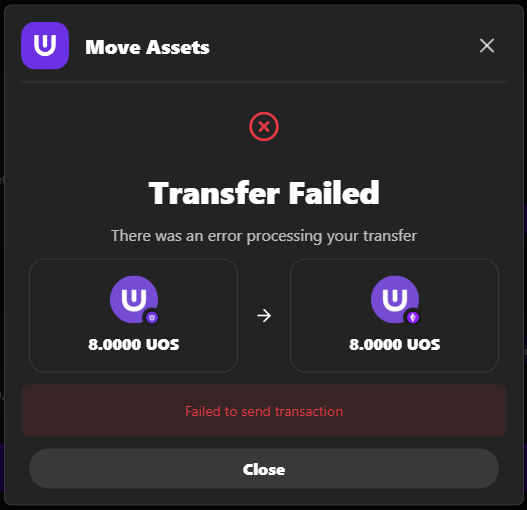

# Troubleshooting

This guide provides solutions for common issues you may encounter while using the Ultra Bridge. If you don't find your specific issue here, please contact support.

**Testnet Bridge URL**: [https://bridge.testnet.ultra.io/](https://bridge.testnet.ultra.io/)

## Common Issues

### Wallet Connection Problems

#### Wallet Won't Connect

**Problem**: Wallet extension doesn't respond or connection fails

**Symptoms**:
- Clicking "Connect Wallet" doesn't work
- Wallet popup doesn't appear
- Connection times out

**Solutions**:
1. **Refresh the page** and try again
2. **Ensure your wallet extension is installed** and unlocked
3. **Check if you're on the correct network**
4. **Clear browser cache and cookies**
5. **Try a different browser**
6. **Restart your browser**
7. **Check wallet extension permissions**

#### Wrong Network Connected

**Problem**: Connected to wrong testnet network

**Symptoms**:
- Network mismatch warning appears
- Transaction fails due to wrong network
- Wallet shows different network than expected

**Solutions**:
1. **Use the network switch dialog** if available
2. **Manually switch networks** in your wallet
3. **Ensure both wallets are on the correct networks**
4. **Check the network selector** in the bridge interface
5. **Disconnect and reconnect** wallets

#### Connection Timeout

**Problem**: Connection request times out

**Symptoms**:
- Connection request hangs
- No response from wallet
- Timeout error message

**Solutions**:
1. **Check your internet connection**
2. **Try refreshing the page**
3. **Ensure wallet extensions are responsive**
4. **Try disconnecting and reconnecting**
5. **Check if wallet extension is working properly**

#### Address Not Displayed

**Problem**: Wallet connects but address doesn't show

**Symptoms**:
- Wallet shows as connected
- No address displayed
- Cannot proceed with transaction

**Solutions**:
1. **Check if the wallet is properly unlocked**
2. **Try disconnecting and reconnecting**
3. **Ensure you have the correct permissions**
4. **Check browser console for errors**
5. **Try a different wallet**

### Transaction Issues

#### Transaction Stuck

**Problem**: Transaction shows "Pending" for too long

**Symptoms**:
- Transaction remains in "Pending" state
- No progress for extended period
- No confirmation received

**Solutions**:
1. **Check network congestion**
2. **Verify you have sufficient gas fees**
3. **Wait for network confirmation** (can take several minutes)
4. **Use the resume function** if available
5. **Contact support** if stuck for more than 30 minutes

#### Transaction Failed

**Problem**: Transaction fails during processing

**Symptoms**:
- Transaction fails with error message
- Gas fees deducted but transaction fails
- Error dialog appears

**Solutions**:
1. **Check the error message** for specific details
2. **Verify you have sufficient gas fees**
3. **Try the transaction again**
4. **Check network conditions**
5. **Contact support** if the issue persists

#### Insufficient Balance

**Problem**: "Insufficient balance" error

**Symptoms**:
- Error message about insufficient balance
- Cannot complete transaction
- Balance shows but transaction fails

**Solutions**:
1. **Check your wallet balance**
2. **Ensure you have enough tokens for the transfer**
3. **Account for gas fees and bridge fees**
4. **Consider reducing the transfer amount**
5. **Check if you have the correct token selected**

#### Tokens Not Visible in Wallet

**Problem**: Bridged tokens don't appear in wallet

**Symptoms**:
- Transaction completed successfully
- Tokens not visible in wallet
- Balance doesn't update

**Solutions**:
1. **Add the Test UOS Token** to your EVM wallet:
   - **Contract Address**: `0x3AC63AA2c077D676Fa24a7BCE05b05A2F81237FE`
   - **Token Symbol**: UOS
   - **Decimals**: 4
2. **Refresh your wallet** after adding the token
3. **Check the transaction hash** on blockchain explorer
4. **Wait a few minutes** for the wallet to sync

#### Network Mismatch

**Problem**: Wrong network connected

**Symptoms**:
- Network mismatch warning
- Cannot proceed with transaction
- Wrong network displayed

**Solutions**:
1. **Use the network switch dialog** if available
2. **Manually switch networks** in your wallet
3. **Ensure both wallets are on the correct networks**
4. **Check network selectors** in the bridge interface

### Ultra to EVM Specific Issues

#### "Move Assets" Button Not Appearing

**Problem**: Transfer status completes but "Move Assets" button doesn't show

**Symptoms**:
- Transfer status shows completion
- No "Move Assets" button visible
- Cannot complete the transfer

**Solutions**:
1. **Refresh the page** and check again
2. **Look for the button in the transfer status dialog**
3. **Try the resume function** if available
4. **Contact support** if the issue persists

#### EVM Wallet Confirmation Fails

**Problem**: EVM wallet confirmation transaction fails

**Symptoms**:
- EVM wallet confirmation fails
- Gas fees deducted but confirmation fails
- Cannot complete the transfer

**Solutions**:
1. **Ensure you have enough ETH for gas fees**
2. **Check if the transaction is still valid**
3. **Try the confirmation again**
4. **Use the resume function** if needed
5. **Check EVM network conditions**

#### Transaction Shows "Ready to Claim" But No Claim Button

**Problem**: Transaction is ready but you can't claim

**Symptoms**:
- Transaction shows "Ready to Claim"
- No claim button available
- Cannot access claim function

**Solutions**:
1. **Use the resume function** to access the claim
2. **Check if you're connected to the correct EVM network**
3. **Ensure your EVM wallet has sufficient ETH for gas**
4. **Contact support** if the issue persists

### EVM to Ultra Specific Issues

#### Token Approval Fails

**Problem**: Spending cap approval transaction fails

**Symptoms**:
- Token approval fails
- Cannot proceed with transfer
- Gas fees deducted but approval fails

**Solutions**:
1. **Ensure you have enough ETH for gas fees**
2. **Check if the token contract is working properly**
3. **Try the approval again**
4. **Contact support** if the issue persists

#### Transfer Confirmation Fails

**Problem**: Transfer confirmation transaction fails

**Symptoms**:
- Transfer confirmation fails
- Approval successful but transfer fails
- Cannot complete the transfer

**Solutions**:
1. **Ensure you have enough ETH for gas fees**
2. **Check if the approval was successful**
3. **Try the transfer again**
4. **Contact support** if the issue persists

### Resume Function Issues

#### No Resume Card Visible

**Problem**: You don't see a resume card on the main interface

**Symptoms**:
- No resume card or button visible
- Expected pending transactions not shown

**Solutions**:
1. **Ensure you have pending Ultra to EVM transactions**
2. **Check if you're connected to the correct networks**
3. **Refresh the page** and check again
4. **Contact support** if you believe you should have pending transactions

#### Claim Button Not Available

**Problem**: Transaction is selected but no claim button appears

**Symptoms**:
- Transaction selected in resume dialog
- No claim button visible
- Cannot proceed with claim

**Solutions**:
1. **Check if the transaction is actually ready to claim**
2. **Ensure you're connected to the correct EVM network**
3. **Verify your EVM wallet has sufficient ETH for gas**
4. **Try refreshing the dialog**

#### Claim Transaction Fails

**Problem**: EVM claim transaction fails

**Symptoms**:
- Claim transaction fails
- Gas fees deducted but claim fails
- Cannot complete the claim

**Solutions**:
1. **Ensure you have enough ETH for gas fees**
2. **Check if the transaction is still valid**
3. **Try the claim again**
4. **Contact support** if the issue persists

### Maintenance Mode Issues

#### Bridge Shows "Unavailable"

**Problem**: Bridge interface shows maintenance mode

**Symptoms**:
- Bridge shows maintenance message
- Cannot start new transactions
- Maintenance countdown or status displayed

**Solutions**:
1. **Wait for maintenance to complete**
2. **Check maintenance announcements**
3. **Monitor bridge status**
4. **Try again after maintenance completes**

#### Transaction Stuck During Maintenance

**Problem**: Transaction was in progress when maintenance started

**Symptoms**:
- Transaction stuck during maintenance
- Cannot complete or resume transaction
- Maintenance started during transfer

**Solutions**:
1. **Wait for maintenance to complete**
2. **Use resume function after maintenance**
3. **Contact support** if transaction is still stuck

## Getting Help

### When to Contact Support

Contact support if you encounter:
- **Critical issues** that prevent bridge usage
- **Lost funds** or missing tokens
- **Security concerns** or suspicious activity
- **Persistent errors** not resolved by troubleshooting
- **Maintenance issues** that persist after maintenance completes

### How to Contact Support

#### Before Contacting Support

1. **Document the Issue**:
   - Take screenshots of error messages
   - Note transaction hashes
   - Record wallet addresses (without private keys)
   - Document steps that led to the issue

2. **Check Common Solutions**:
   - Review this troubleshooting guide
   - Check if the issue is network-related
   - Verify wallet connections and balances
   - Try basic troubleshooting steps

3. **Gather Information**:
   - Browser type and version
   - Wallet extensions and versions
   - Network connections
   - Error messages and timestamps

#### Contact Methods

- **Discord**: Join the [Ultra Discord community](https://discord.com/invite/WfJCN6YbGk)
- **Email**: contact@ultra.io
- **Documentation**: Check the [Ultra documentation](https://developers.ultra.io/)
- **Community**: Ask other users for help

### Information to Provide

When contacting support, include:
- **Detailed description** of the issue
- **Steps to reproduce** the problem
- **Screenshots** of error messages
- **Transaction hashes** if applicable
- **Wallet addresses** (without private keys)
- **Browser and wallet information**
- **Network and connection details**

## Best Practices

### Prevention

1. **Test First**: Always test with small amounts
2. **Check Balances**: Ensure sufficient funds for gas fees
3. **Verify Networks**: Confirm correct network connections
4. **Monitor Maintenance**: Check for scheduled maintenance
5. **Keep Software Updated**: Update wallet extensions regularly

### During Issues

1. **Don't Panic**: Most issues can be resolved
2. **Document Everything**: Keep records of transactions and errors
3. **Try Basic Steps**: Refresh, reconnect, restart
4. **Check Resources**: Review this guide and documentation
5. **Contact Support**: When basic steps don't work

### After Resolution

1. **Verify Functionality**: Test that everything works
2. **Save Information**: Keep transaction hashes and details
3. **Learn from Experience**: Note what caused the issue
4. **Share Knowledge**: Help others with similar issues

## Next Steps

After resolving your issue:

1. **[Ultra to EVM Bridge](./ultra-to-evm.staging.md)** - Complete Ultra to EVM guide
2. **[EVM to Ultra Bridge](./evm-to-ultra.staging.md)** - Complete EVM to Ultra guide
3. **[Resuming Transactions](./resuming-transactions.staging.md)** - Resume interrupted transactions
4. **[Maintenance Mode](./maintenance-mode.staging.md)** - Understanding maintenance

## Getting Help

If you need additional assistance:

- **Check this troubleshooting guide** for common solutions
- **Join the [Ultra Discord community](https://discord.com/invite/WfJCN6YbGk)**
- **Contact support at contact@ultra.io**
- **Review the [Ultra documentation](https://developers.ultra.io/)**
