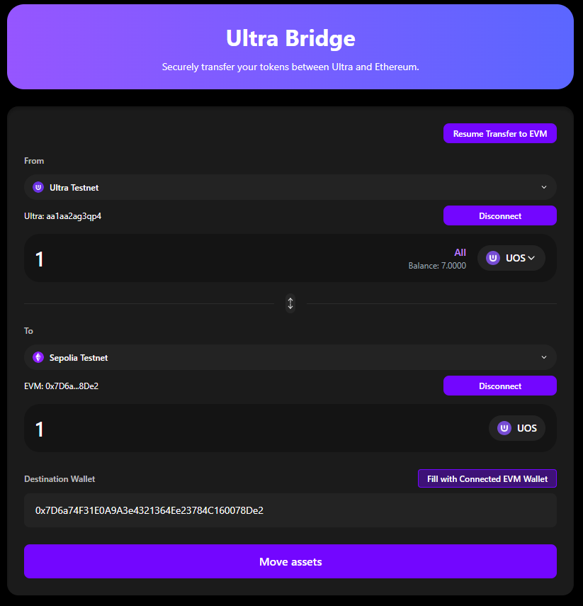
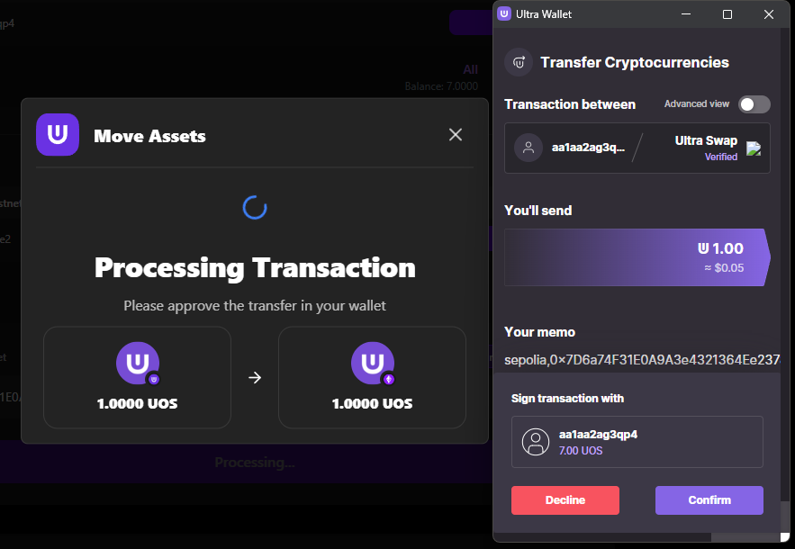
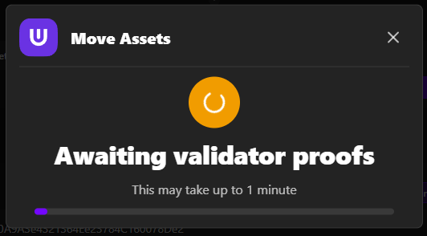
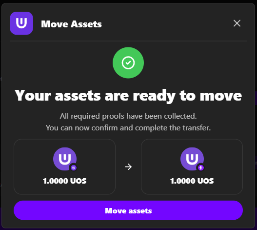
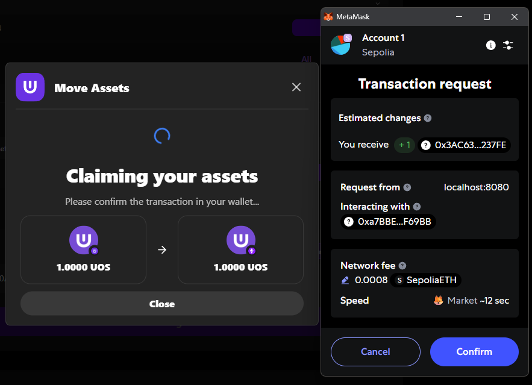
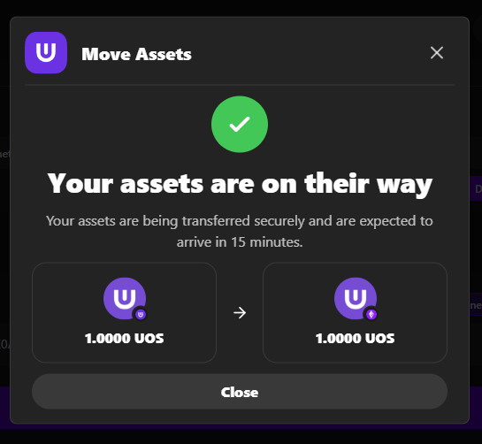

# Ultra to EVM Bridge

This guide will walk you through the complete process of transferring tokens from the Ultra blockchain to EVM-compatible networks (like Ethereum). This is a multi-step process that requires careful attention to each stage.

**Testnet Bridge URL**: [https://bridge.testnet.ultra.io/](https://bridge.testnet.ultra.io/)

## Overview

The Ultra to EVM bridge process involves several stages:
1. **Setup**: Configure source and destination networks
2. **Transaction**: Submit the bridge transaction on Ultra
3. **Processing**: Wait for validators to process the transaction
4. **Claiming**: Finalize the transaction on the EVM network

## Prerequisites

Before starting, ensure you have:
- ✅ Ultra wallet connected to Ultra Testnet
- ✅ EVM wallet connected to Ethereum Sepolia testnet
- ✅ Sufficient UOS balance for gas fees
- ✅ Tokens to bridge in your Ultra wallet

## Step-by-Step Process

### Step 1: Select Source Network

1. Ensure you're connected to the Ultra Testnet
2. Verify your Ultra wallet is connected and shows the correct address
3. Confirm you have sufficient UOS for gas fees

### Step 2: Select Destination Network

1. Click on the destination network selector (EVM side)
2. Choose Ethereum Sepolia testnet (only testnet networks are available)
3. Ensure your EVM wallet is connected to the same network

### Step 3: Select Token and Amount

1. Choose the UOS token you want to bridge from the token dropdown
2. Enter the amount you wish to transfer
3. Use the "Max" button to transfer your entire balance
4. Verify the transaction details and fees

**Note**: For Ultra to EVM transfers, you can bridge UOS tokens from your Ultra wallet to the EVM network.

### Step 4: Enter Destination Address

1. Enter the destination EVM wallet address manually, OR
2. Use the "Fill with Connected EVM Wallet" button to auto-fill your connected EVM address
3. Double-check the address is correct before proceeding

### Step 5: Execute the Transaction

1. Review all transaction details carefully
2. Click "Move Assets" button
3. Approve the transaction in your Ultra wallet
4. Wait for the transaction to be processed on the Ultra network

### Step 6: Monitor Progress

The DApp will show the transaction progress through several stages:

#### Transaction Stages

1. **Pending**: Transaction submitted to Ultra network
2. **Finding Request**: Bridge is processing your request
3. **Waiting Attestations**: Validators are confirming the transaction
4. **Ready to Claim**: Transaction is ready to be claimed on EVM
5. **Claiming**: Claiming tokens on EVM network
6. **Success**: Transaction completed successfully

### Step 7: Move Assets (Critical Step)

**⚠️ Important**: After the transfer status shows completion, you must click the "Move Assets" button to finalize the transaction:

1. Look for the "Move Assets" button in the transfer status dialog
2. Click the button to complete the asset transfer
3. Your EVM wallet will open automatically for final confirmation

### Step 8: EVM Wallet Confirmation

After clicking "Move Assets", your EVM wallet will open for final approval:

1. Your EVM wallet (MetaMask, etc.) will open automatically
2. Review the transaction details including gas fees
3. Click "Confirm" or "Approve" in your EVM wallet
4. Wait for the transaction to be processed on the EVM network

### Step 9: Transaction Success

Once the EVM wallet confirmation is completed:

- Success message will be displayed
- Transaction hash will be shown
- Option to view on blockchain explorer will be available
- Your tokens will be available in your destination EVM wallet

### Step 10: Verify Tokens in Wallet

To see your bridged UOS tokens in your EVM wallet:

1. **Add the Test UOS Token** to your wallet:
   - **Contract Address**: `0x3AC63AA2c077D676Fa24a7BCE05b05A2F81237FE`
   - **Token Symbol**: UOS
   - **Decimals**: 4

2. **Check Your Balance**: The bridged UOS tokens should now be visible in your wallet

## Troubleshooting Ultra to EVM Transfers

### Common Issues

#### Transaction Stuck at "Pending"

**Problem**: Transaction shows "Pending" for too long

**Solutions**:
- Check Ultra network congestion
- Verify you have sufficient UOS for gas fees
- Wait for network confirmation
- Contact support if stuck for more than 30 minutes

#### "Move Assets" Button Not Appearing

**Problem**: Transfer status completes but "Move Assets" button doesn't show

**Solutions**:
- Refresh the page and check again
- Look for the button in the transfer status dialog
- Try the resume function if available
- Contact support if the issue persists

#### EVM Wallet Confirmation Fails

**Problem**: EVM wallet confirmation transaction fails

**Solutions**:
- Ensure you have enough ETH for gas fees
- Check if the transaction is still valid
- Try the confirmation again
- Use the resume function if needed

#### Transaction Shows "Ready to Claim" But No Claim Button

**Problem**: Transaction is ready but you can't claim

**Solutions**:
- Use the resume function to access the claim
- Check if you're connected to the correct EVM network
- Ensure your EVM wallet has sufficient ETH for gas
- Contact support if the issue persists

## Best Practices

### Before Starting

1. **Test First**: Always test with small amounts
2. **Check Balances**: Ensure sufficient UOS for gas fees
3. **Verify Networks**: Confirm both wallets are on correct networks
4. **Check Maintenance**: Verify bridge is not in maintenance mode

### During the Process

1. **Monitor Progress**: Keep the page open during the transfer
2. **Don't Close**: Don't close the browser during the process
3. **Follow Instructions**: Complete each step as instructed
4. **Be Patient**: Some stages may take several minutes

### After Completion

1. **Verify Receipt**: Check your EVM wallet for received tokens
2. **Save Transaction Hash**: Keep the transaction hash for reference
3. **Test Functionality**: Verify tokens work in your EVM wallet
4. **Document Process**: Note any issues for future reference

## Gas Fee Considerations

### Ultra Network Fees
- **UOS Gas**: Required for Ultra network transactions
- **Bridge Fees**: Additional fees for bridge operations
- **Validator Fees**: Small fees for validator services

### EVM Network Fees
- **ETH Gas**: Required for EVM network transactions
- **Gas Estimation**: DApp will estimate required gas
- **Gas Price**: Can be adjusted based on network conditions

## Next Steps

After completing your Ultra to EVM transfer:

1. **[EVM to Ultra Bridge](./evm-to-ultra.staging.md)** - Learn how to transfer tokens back to Ultra
2. **[Resuming Transactions](./resuming-transactions.staging.md)** - Learn how to resume interrupted transfers
3. **[Troubleshooting](./troubleshooting.staging.md)** - Common issues and solutions

## Getting Help

If you encounter issues during Ultra to EVM transfers:

- **Check the [Troubleshooting](./troubleshooting.staging.md) guide**
- **Use the [Resume Function](./resuming-transactions.staging.md)** for interrupted transactions
- **Join the [Ultra Discord community](https://discord.com/invite/WfJCN6YbGk)**
- **Contact support at contact@ultra.io**
