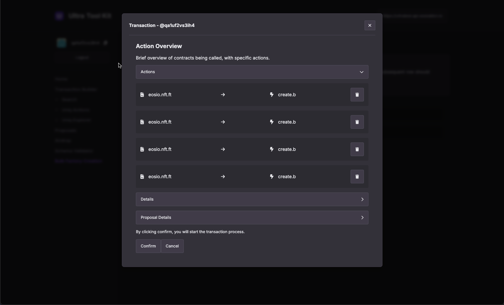

# How to create multiple Uniq Factories using the Ultra Tool Kit

## Prerequisites

-   A basic understanding of [Factory Metadata](../uniq-variants/factory-metadata.md), [Default Uniq Metadata](../uniq-variants/uniq-default-metadata.md) and [Uniq Metadata](../uniq-variants/uniq-metadata.md).
-   Ultra Toolkit Account: Ensure you are logged in and have access to the Ultra Toolkit.
-   CSV File: Prepare a CSV file containing all the necessary data for creating Uniq Factories. Each row in the file will represent a single Uniq Factory.

## Goal

The goal of this tutorial is to guide developers through the process of efficiently creating multiple Uniq Factories using the Ultra Toolkit. By following this step-by-step guide, you will learn how to prepare a CSV file that allows for the bulk creation of Uniq Factories, reducing the need for manual input and ensuring consistency across all your entries. This method is particularly useful for large-scale operations where numerous Uniq Factories need to be deployed quickly and accurately.

## Accessing the Tool Kit

To access the Ultra Tool Kit, please visit: https://toolkit.ultra.io

Once you're on the Tool Kit homepage, click on the network selection component on the top right of your screen.

Clicking on the network selection component will open up a list of available networks that you can use the toolkit on. For the sake of this tutorial, we will be using the Ultra Testnet. From the list of available networks, click on `Testnet`.

Login to the Ultra Tool Kit using Ultra Wallet. Refer to [Tutorial - Log in to the Ultra Tool Kit](../../fundamentals/tutorial-login-to-toolkit.md) for more information.

## Creating Multiple Uniq Factories

### 1. Accessing Bulk Factory Creation

Once you've logged in to the tool kit, from the tool kit home page, click on the `Bulk Factory Creation` from the sidebar, to open the creation tool.

### 2. Preparing CSV Template

The first step is to prepare your CSV file. This file will contain all the properties required to create each Uniq Factory. You can download a CSV Template from the Toolkit on the `Bulk Factory Creation` page:

Here’s an example of what your CSV file might look like:

|memo|asset_manager                |asset_creator|minimum_resell_price                         |mintable_window_start|mintable_window_end|trading_window_start|trading_window_end|recall_window_start|recall_window_end|max_mintable_tokens|lock_hash|lockup_time|stat|account_minting_limit|transfer_window_start|transfer_window_end|maximum_uos_payment|factory_uri                                                                                                                       |factory_hash                                                    |default_token_uri                                                                                                                 |default_token_hash                                              |resale_shares_1 |resale_shares_2 |resale_shares_3|resale_shares_4|resale_shares_5|conditionless_receivers_1|conditionless_receivers_2|conditionless_receivers_3|conditionless_receivers_4|conditionless_receivers_5|authorized_minters_1|authorized_minters_2|authorized_minters_3|authorized_minters_4|authorized_minters_5|
|----|-----------------------------|-------------|---------------------------------------------|---------------------|-------------------|--------------------|------------------|-------------------|-----------------|-------------------|---------|-----------|----|---------------------|---------------------|-------------------|-------------------|----------------------------------------------------------------------------------------------------------------------------------|----------------------------------------------------------------|----------------------------------------------------------------------------------------------------------------------------------|----------------------------------------------------------------|----------------|----------------|---------------|---------------|---------------|-------------------------|-------------------------|-------------------------|-------------------------|-------------------------|--------------------|--------------------|--------------------|--------------------|--------------------|
|Factory #1|vh1to2ko3wp4                 |vh1to2ko3wp4 |100.00000000 UOS                             |2021-05-31 0:00:00   |                   |2021-05-31 0:00:00  |                  |                   |                 |1000               |         |           |0   |100                  |                     |                   |                   |http://...|2d6f37d3858a8f31fca86cc73320c29e0a872050beb4704acb35dde6562af1ab|http://...|2d6f37d3858a8f31fca86cc73320c29e0a872050beb4704acb35dde6562af1ab|ultra.nft.ft:250|                |               |               |               |                         |                         |                         |                         |                         |                    |                    |                    |                    |                    |
|Factory #2|vh1to2ko3wp4                 |vh1to2ko3wp4 |1.00000000 USD                               |2021-05-31 0:00:00   |                   |2021-05-31 0:00:00  |                  |                   |                 |250                |         |           |0   |50                   |                     |                   |                   |http://...|2d6f37d3858a8f31fca86cc73320c29e0a872050beb4704acb35dde6562af1ab|http://...|2d6f37d3858a8f31fca86cc73320c29e0a872050beb4704acb35dde6562af1ab|ultra.nft.ft:250|vh1to2ko3wp4:150|               |               |               |ultra.test               |                         |                         |                         |                         |ultra.nft.ft:100    |ultra.test:1        |                    |                    |                    |
|Factory #3|vh1to2ko3wp4                 |vh1to2ko3wp4 |                                             |                     |                   |                    |                  |                   |                 |10                 |         |           |0   |1                    |                     |                   |                   |http://...|2d6f37d3858a8f31fca86cc73320c29e0a872050beb4704acb35dde6562af1ab|http://...|2d6f37d3858a8f31fca86cc73320c29e0a872050beb4704acb35dde6562af1ab|ultra.nft.ft:250|vh1to2ko3wp4:150|ultra.test:150 |               |               |ultra.test               |                         |                         |                         |                         |ultra.nft.ft:1      |ultra.test:1        |                    |                    |                    |
|Factory #4|vh1to2ko3wp4                 |vh1to2ko3wp4 |15500.00000000 UOS                           |2024-05-31 0:00:00   |                   |2021-05-31 0:00:00  |                  |                   |                 |                   |         |           |0   |100                  |                     |                   |                   |http://...|2d6f37d3858a8f31fca86cc73320c29e0a872050beb4704acb35dde6562af1ab|http://...|2d6f37d3858a8f31fca86cc73320c29e0a872050beb4704acb35dde6562af1ab|ultra.nft.ft:250|                |               |               |               |                         |                         |                         |                         |                         |                    |                    |                    |                    |                    |

**Note**: Empty cells in the CSV are treated as null fields, meaning those properties will not be set for the corresponding Uniq Factory.

Each column in your CSV corresponds to a specific parameter in the `create.b` action as described in the [create.b action documentation](../../../blockchain/contracts/nft-contract/nft-actions/create.b.md). Here's a breakdown of each field:

1. **`memo`**
   - **CSV Column**: `Memo`
   - **Description**: This column stores a string value (up to 256 bytes) that provides additional context or information about the factory creation. It corresponds directly to the `memo` parameter in the `create.b` action.

2. **`asset_creator`**
   - **CSV Column**: `Asset Creator`
   - **Description**: This column specifies the account name of the asset creator, who is required to sign the transaction. It directly maps to the `asset_creator` parameter.

3. **`asset_manager`**
   - **CSV Column**: `Asset Manager`
   - **Description**: This field identifies the account responsible for managing the factory. The `asset_manager` is also required to sign the transaction and pay for the RAM used in storing the token factory data. This maps to the `asset_manager` parameter.

4. **`minimum_resell_price`**
   - **CSV Column**: `Minimum Resell Price`
   - **Description**: This specifies the minimum price (in UOS or USD) at which the tokens from the factory can be resold. If set, tokens cannot be sold below this price. It corresponds to the `minimum_resell_price` parameter.

5. **`resale_shares_[1..5]`**
   - **CSV Column**: `Resale Shares`
   - **Description**: This field specifies the resale shares, detailing the accounts that receive a percentage of the resale price. Each share consists of a receiver and a basis point value. It corresponds to the `resale_shares` parameter.

6. **`mintable_window_start` and `mintable_window_end`**
   - **CSV Columns**: `Mintable Window Start`, `Mintable Window End`
   - **Description**: These fields define the time window during which tokens from this factory can be minted. The dates are in UTC format. They correspond to the `mintable_window_start` and `mintable_window_end` parameters.

7. **`trading_window_start` and `trading_window_end`**
   - **CSV Columns**: `Trading Window Start`, `Trading Window End`
   - **Description**: These fields specify when tokens from this factory can be traded. Similar to the minting windows, the dates are in UTC format. They map to the `trading_window_start` and `trading_window_end` parameters.

8. **`recall_window_start` and `recall_window_end`**
   - **CSV Columns**: `Recall Window Start`, `Recall Window End`
   - **Description**: These fields define when tokens can be recalled after being minted. They are represented as time intervals since minting (in seconds) or as specific dates. These map to the `recall_window_start` and `recall_window_end` parameters.

9. **`max_mintable_tokens`**
   - **CSV Column**: `Max Mintable Tokens`
   - **Description**: This column specifies the maximum number of tokens that can be minted by the factory. If left blank, the factory can mint an unlimited number of tokens. This corresponds to the `max_mintable_tokens` parameter.

10. **`lockup_time`**
    - **CSV Column**: `Lockup Time`
    - **Description**: This defines the duration (in seconds) that tokens remain locked after minting. Tokens cannot be transferred or resold during this time unless transferred to a conditionless receiver. This maps to the `lockup_time` parameter.

11. **`conditionless_receivers_[1..5]`**
    - **CSV Column**: `Conditionless Receivers`
    - **Description**: This field lists accounts that can receive tokens without adhering to transfer or lockup restrictions. It corresponds to the `conditionless_receivers` parameter.

12. **`stat`**
    - **CSV Column**: `Factory Status`
    - **Description**: This column indicates the initial status of the factory (`0` for active, `1` for inactive, `2` for shutdown). It corresponds to the `stat` parameter.

13. **`factory_uri`**
    - **CSV Column**: `Factory URI`
    - **Description**: This field contains the base URI pointing to the factory's metadata, required for the creation of the factory. It maps directly to the `factory_uri` parameter.

14. **`factory_hash`**
    - **CSV Column**: `Factory Hash`
    - **Description**: This optional field stores the SHA256 hash of the factory metadata file, ensuring data integrity. It corresponds to the `factory_hash` parameter.

15. **`authorized_minters`**
    - **CSV Column**: `Authorized Minters`
    - **Description**: This specifies accounts authorized to mint tokens from the factory, along with the quantity they can mint. It corresponds to the `authorized_minters` parameter.

16. **`account_minting_limit`**
    - **CSV Column**: `Account Minting Limit`
    - **Description**: This field limits the number of tokens that each account can mint. If left blank, there is no limit. This corresponds to the `account_minting_limit` parameter.

17. **`transfer_window_start` and `transfer_window_end`**
    - **CSV Columns**: `Transfer Window Start`, `Transfer Window End`
    - **Description**: These fields define when tokens from the factory can be transferred. They correspond to the `transfer_window_start` and `transfer_window_end` parameters.

18. **`maximum_uos_payment`**
    - **CSV Column**: `Maximum UOS Payment`
    - **Description**: This specifies the maximum amount of UOS that the factory creation transaction can cost. It corresponds to the `maximum_uos_payment` parameter.

19. **`default_token_uri`**
    - **CSV Column**: `Default Token URI`
    - **Description**: This field points to the default URI for the token metadata, used when there is no specific metadata for a token. It corresponds to the `default_token_uri` parameter.

20. **`default_token_hash`**
    - **CSV Column**: `Default Token Hash`
    - **Description**: This optional field contains the SHA256 hash of the default token URI content, ensuring its integrity. It corresponds to the `default_token_hash` parameter.

21. **`lock_hash`**
    - **CSV Column**: `Lock Hash`
    - **Description**: This boolean field indicates whether to lock the metadata hashes, preventing further changes. It corresponds to the `lock_hash` parameter.

These columns in your CSV template represent the necessary inputs to create multiple Uniq factories using Ultra's `create.b` action efficiently. Each column directly maps to a specific parameter in the smart contract, ensuring that the factories are created with all the required settings.

### 3. Uploading the CSV File

Once your CSV file is ready, you can upload it to the Ultra Toolkit for processing.

1. **Log in** to your Ultra Toolkit account.
2. **Click** on "Bulk Factory Creation"
3. **Upload** your CSV file.

After uploading, the Ultra Toolkit will parse the CSV file and begin processing each line. Each row in the CSV file is translated into a transaction on the blockchain. The `create.b` action is applied to each row, creating a new Uniq Factory

### 4. Review `create.b` Actions

Once you have uploaded, click on the `Create (x) Action` button and it will open up the transaction confirmation modal. You can click on the `Details` button to view the transaction in JSON form. Click on the `Confirm` button to submit your transaction.

Confirm and sign the transaction using the Ultra Wallet extension. This step is crucial as it authorizes the blockchain to execute the transfer under your account.

After signing the transaction, you will see a confirmation screen indicating that the transaction was successfully completed. To check the transaction on the block explorer, click on the `View in Explorer` text.

You'll find a list of actions on the block explorer transaction page. Since this is a bulk operation, a single transaction will contain multiple actions, each corresponding to the creation of a separate Uniq Factory. Look for the text that says RAM purchase for creating token factory <FACTORY_ID>. Each of these lines will display the ID for a newly created Uniq Factory. For instance, if you created multiple factories, you might see texts like RAM purchase for creating token factory 4356, RAM purchase for creating token factory 4357, and so on. The IDs are sequential and correspond to the order of entries in your CSV file. You’ll need these IDs for upcoming guides.

### 5. Verifying Factory Creation

1. To verify the successful creation of your Uniq Factory, go to the `Factory Explorer` page on the tool kit (https://toolkit.ultra.io/uniqFactory).
2. Make sure you are using the Ultra Testnet environment.
3. Use the factory ID you obtained in the previous step to search for your Uniq Factory. Simply enter the ID and click the search button. You should then be able to view the details of your Uniq Factory.

You have now successfully created your Uniq Factories using the Ultra Toolkit.

## What's next?

Once you have created your uniq factories, the next step is to mint your first uniq. Refer [How to mint a Uniq using the Ultra Tool Kit](./how-to-mint-uniq-using-toolkit.md).
