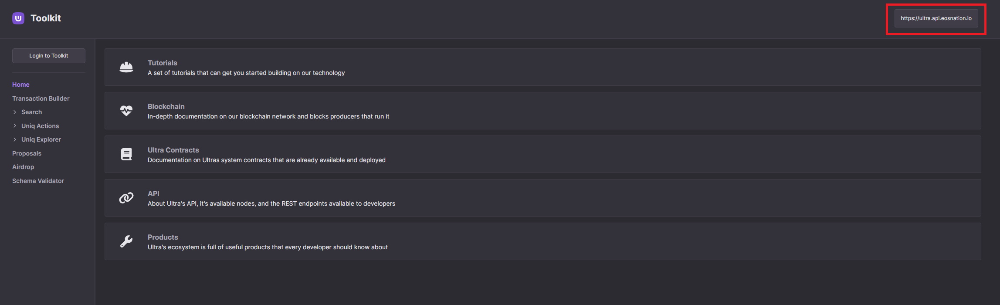
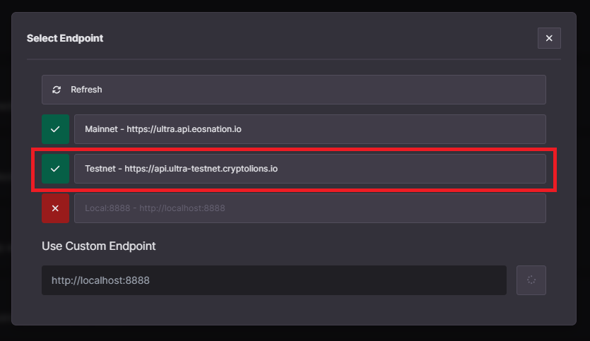
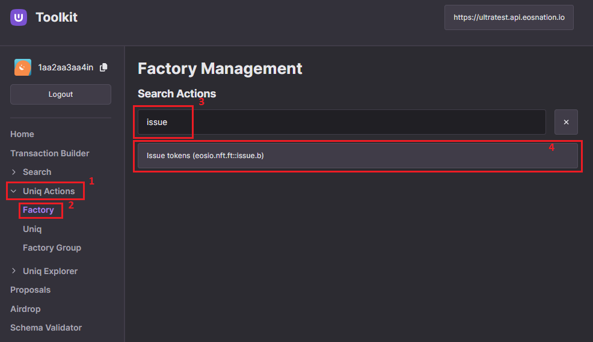
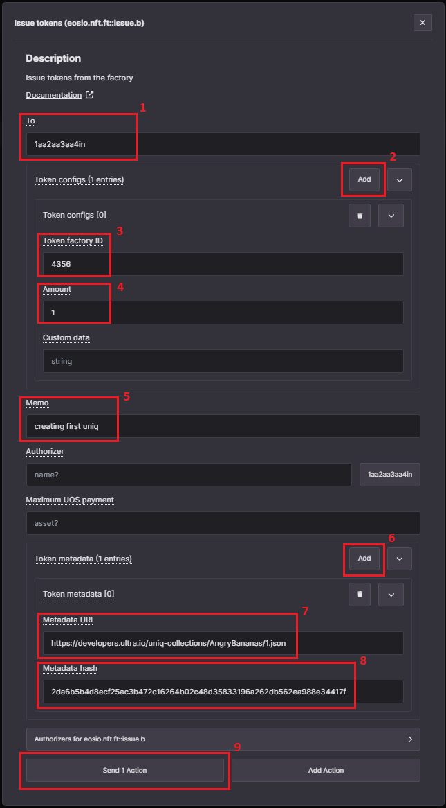
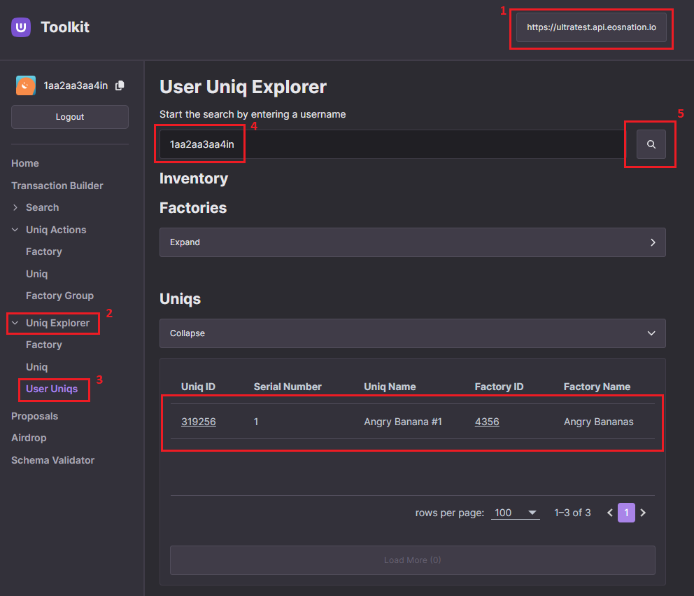

# How to mint a Uniq using the Ultra Tool Kit

## Prerequisites

-   You must have already created a uniq factory. Refer to [How to create a Uniq Factory using the Ultra Tool Kit](./how-to-create-uniq-factory-using-toolkit.md) for more information.
-   Your account must have sufficient UOS tokens for transactions and fees. Refer to [Tutorial - Using the Faucet and Buying RAM on Ultra Testnet](../../fundamentals/tutorial-obtain-token-and-purchase-ram.md#obtaining-uos-tokens-using-the-faucet) for more information.

## Goal

This guide will help you mint your first Uniq.

## Accessing the Tool Kit

To access the Ultra Tool Kit, please visit: https://toolkit.ultra.io

Once you're on the Tool Kit homepage, click on the network selection component on the top right of your screen.

Clicking on the network selection component will open up a list of available networks that you can use the tool kit on. For the sake of this tutorial, we will be using the Ultra Testnet. From the list of available networks, click on `Testnet`.

Login to the Ultra Tool Kit using Ultra Wallet. Refer to [Tutorial - Log in to the Ultra Tool Kit](../../fundamentals/tutorial-login-to-toolkit.md) for more information.

## Minting a Uniq

### 1. Accessing Factory Management Page

Once you've logged in to the tool kit, from the tool kit home page, click on the `Uniq Actions` from the sidebar, and then click on `Factory` to open the uniq factory actions page.

On the factory page, search for `issue` action in the search box, and click on the `Issue tokens (eosio.nft.ft::issue.b)` action to open up the transaction modal.

### 2. Configure `issue.b` Action

We are going to use the `issue.b` action to mint a uniq. For more information on the action, refer to [issue.b action documentation](../../../blockchain/contracts/nft-contract/nft-actions/issue.b.md).

Once you have opened the transaction modal, fill the required fields for the `issue.b` action:

-   **To**: Required, the recipient of the minted token. Input your account if you want to receive the minted uniq in your wallet.
-   **Token configs**: Click `Add` to input the `Token factory ID`, `Amount`, and `Custom data`.
    -   **Token factory ID**: Required, the ID of the factory from which the uniqs will be minted. Use the ID of the uniq factory created in the previous guide. Refer to [How to create a Uniq Factory using the Ultra Tool Kit](./how-to-create-uniq-factory-using-toolkit.md) for more information.
    -   **Amount**: Required, the number of uniqs to be minted. For the sake of this guide, we will mint `1` uniq.
    -   **Custom data**: Deprecated, leave blank.
-   **Memo**: Required, enter a text memo for your transaction. For example, `Minting my first uniq`.
-   **Authorizer**: Optional, the authorizer of the mint. Must be one of authorized minters of the factory. Leave blank to use `null`.
-   **Maximum UOS payment**: Maximum amount of UOS that is allowed to be used for the purposes of contract RAM usage. For simplicity's sake, we will Leave blank to use `null`.
-   **Token metadata**: Click `Add` to input the `Metadata URI` and `Metadata hash`.
    -   **Metadata URI**: Required, the URI of the token metadata. We are using `https://developers.ultra.io/uniq-collections/AngryBananas/1.json`, based on the metadata we created during the [How to create Uniq metadata](./how-to-create-uniq-metadata.md) guide.
    -   **Metadata hash**: Optional, hash of the token metadata. We are using `2da6b5b4d8ecf25ac3b472c16264b02c48d35833196a262db562ea988e34417f`, based on the metadata we created during previous guides.

Once you have inputted all the values, click on the `Send 1 Action` button and it will open up the transaction confirmation modal. You can click on the `Details` button to view the transaction in JSON form. Click on the `Confirm` button to submit your transaction.

Confirm and sign the transaction using the Ultra Wallet extension. This step is crucial as it authorizes the blockchain to execute the transfer under your account.

After signing the transaction, you will see a confirmation screen indicating that the transaction was successfully completed. To check the transaction on the block explorer, click on the `View in Explorer` text.

### 3. Verifying Minted Uniq

1. To verify the successful creation of your Uniq Factory, go to the `User Uniq Explorer` page on the tool kit (https://toolkit.ultra.io/user).
2. Make sure you are using the Ultra Testnet environment.
3. Input your account name and click on the search button. You should be able to view the details of your newly minted uniq under the `Uniqs` section. It may take a few seconds to sync the data, so if your uniq is not shown, please wait a few seconds and reload the page.

    

You have now successfully minted your first uniq using the Ultra Tool Kit.

## What's next?

Once you have practiced minting Uniqs from your factory, the next steps are to:

-   [How to update metadata using the Ultra Tool Kit](./how-to-update-uniq-metadata-using-toolkit.md)
-   [How to perform advanced actions with Uniqs and Factories](../factory-management/how-to-perform-advanced-actions-with-uniqs-and-factories.md)