# How to perform advanced actions with Uniqs and Factories

After you have successfully created a factory and potentially minted some tokens, you may now want to check what else can you potentially do.

This guide will cover advanced actions that apply to Uniqs and Factories using the Ultra Toolkit.

## Prerequisites

-   Created a Uniq Factory. Follow the [Factory creation guide](./how-to-create-uniq-metadata.md) for details.
-   Your account must have sufficient UOS tokens for transactions and fees. If you don't have tokens, see [how to use Faucet](./tutorial-obtain-token-and-purchase-ram.md) for Testnet or [how to buy UOS](../../guides/how-to-buy-uos.md) for Mainnet.
- A developer account on the Ultra Testnet or Mainnet and to be logged into the Ultra Toolkit. If you don't have it, please follow our previous tutorial: [Tutorial - Log in to the Ultra Toolkit](./tutorial-login-to-toolkit.md).

## Goal

The goal of this guide is to demonstrate the range of actions you can perform with your Uniqs and Factories using Ultra Toolkit. This includes the process of adding or removing a direct purchase from your Factory; transferring and burning Uniqs; adding authorized minters.

## How to add first-hand purchase to your factory

First-hand purchase is a feature of NFT contract that allows factory managers to add a purchase option so that users can directly mint Uniqs themselves while paying some UOS or USD fee, or by potentially burning or transferring Uniqs. You can also require user to own some specific Uniq in order to use the purchase option.

Navigate to [Factory management actions](https://toolkit.ultra.io/factoryManagement) and search for `setprchsreq`.

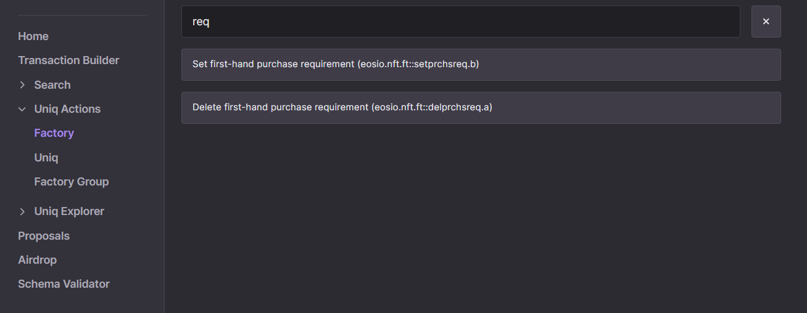

After finding select `Set first-hand purchase requirement (eosio.nft.ft::setprchsreq.b)` action.

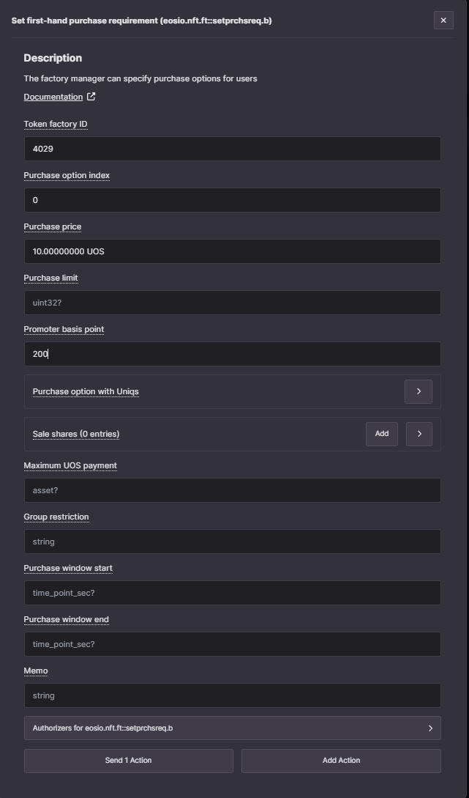

Click on `Send 1 Action`

You can now navigate to [Factory explorer](https://toolkit.ultra.io/uniqFactory), enter your Factory ID.

## How to buy a Uniq using a first-hand purchase option

Navigate to [Factory management actions](https://toolkit.ultra.io/factoryManagement).

Search for `purchase` and select `Purchase Uniqs directly (eosio.nft.ft::purchase.a)`.

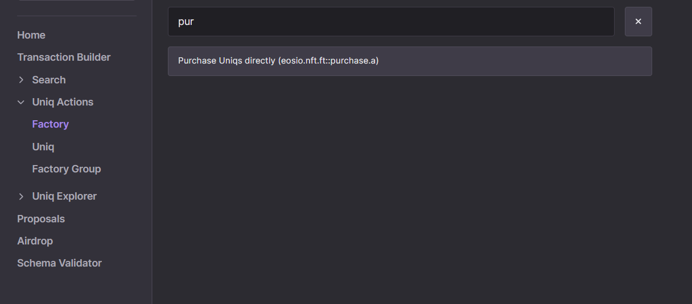

Now you need to fill the `Token factory ID`, `Index` (same as the one used when creating the purchase option), `Maximum UOS payment` (must be in UOS, even if the purchase option has price specified in UOS), `Buyer` and `Receiver`.

The `Promoter` is optional to specify. If you are building a marketplace you would want to specify you account as a promoter to receive a share of UOS from each purchase. If not specified then Ultra will be used as a promoter.

`Maximum UOS payment` must be at least equal to the current price of the purchase option converted to UOS. You can put a larger value here but you will not be charged more than the current price at the time the transaction is executed.

For more details see the [action documentation](../../../blockchain/contracts/nft-contract/nft-actions/purchase.a.md).

Send and sign the transaction.

Navigate to your inventory (either click on `Inventory` here https://toolkit.ultra.io/ or go to https://toolkit.ultra.io/user and enter you account name).

You should be able to scroll down and see the list of Uniqs the account has. Note that it may take a minute for Ultra API to update and show your Uniq.

## How to set first-hand purchase requirement with a price in Uniqs

Navigate to [Factory management actions](https://toolkit.ultra.io/factoryManagement), search again for `setprchsreq`, and select the `Set first-hand purchase requirement` action.

To specify the price in Uniqs you use the `Purchase option with Uniqs` field.

There are 3 ways you can require Uniqs within your purchase option:

- Check if account owns a Uniq from a specific factory (strategy 0)
- Burn required Uniqs (strategy 1)
- Transfer a Uniq from the owner to the account specified in `Transfer tokens receiver account` (strategy 2)

For more details see the [action documentation](../../../blockchain/contracts/nft-contract/nft-actions/setprchsreq.b.md).

In the following example a single Uniq will be burnt to mint another one. This effectively swaps user's Uniq from one to another. The price is set to 0 UOS so the only requirement is to have a Uniq from the specified factory.

If you want to try and do the same you need to have a second factory or use the same one you already have. Note that if you reuse the same factory which does not have variants then it is effectively a useless operation as you will get a Uniq identical to the one you have burned.

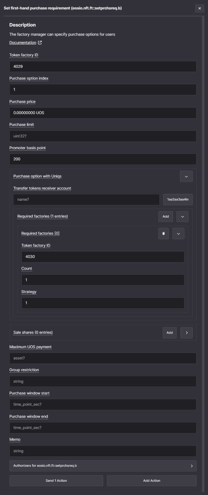

You can now navigate to [Factory explorer](https://toolkit.ultra.io/uniqFactory), enter your Factory ID.

## How to buy a Uniq using a first-hand purchase option with price in Uniqs

Navigate to [Factory management actions](https://toolkit.ultra.io/factoryManagement), and search again for `purchase` and select `Purchase Uniqs directly (eosio.nft.ft::purchase.a)`.

If the purchase option requires Uniqs from other factories then the account must have those Uniqs in its inventory. If you need to mint this Uniq then either refer to a [MINT UNIQS GUIDE](./how.md) or add add a first-hand purchase option to this factory and purchase it, as described in this tutorial.

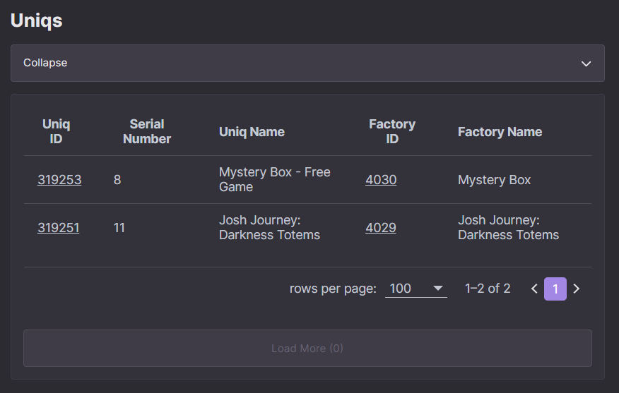

Once you have the Uniq from the factory you specified in the purchase requirement, you will need to fill the `Provided user Uniqs` field. There you must specify the Uniq ID that must be from the factory that is specified in the purchase requirement. The strategy number also must match, this ensures the fact that you agree that this Uniq will be burned.

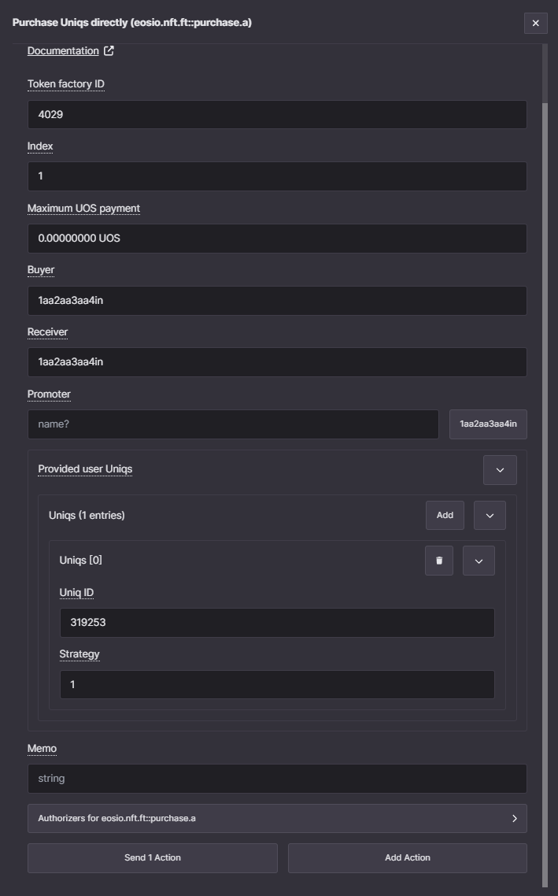

After sending and signing the transaction, you should be able to see your new Uniq in your inventory, as expected.

## How to transfer a Uniq to another account

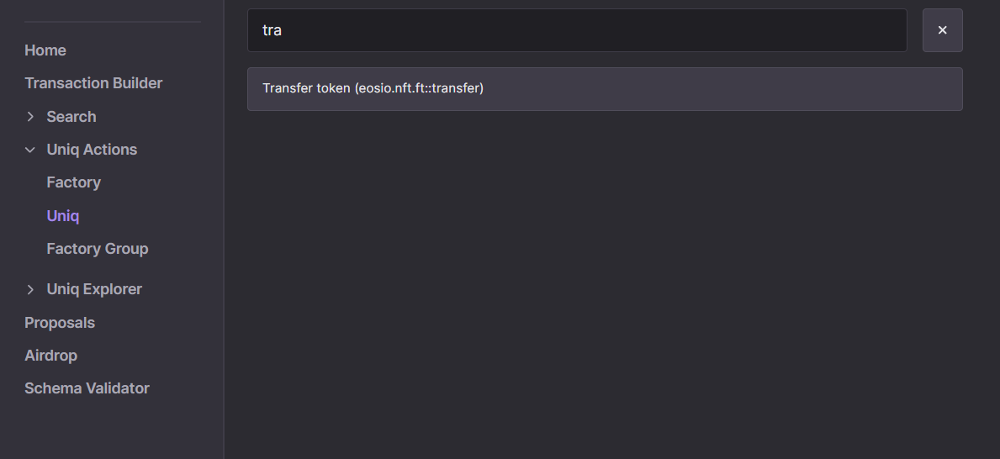

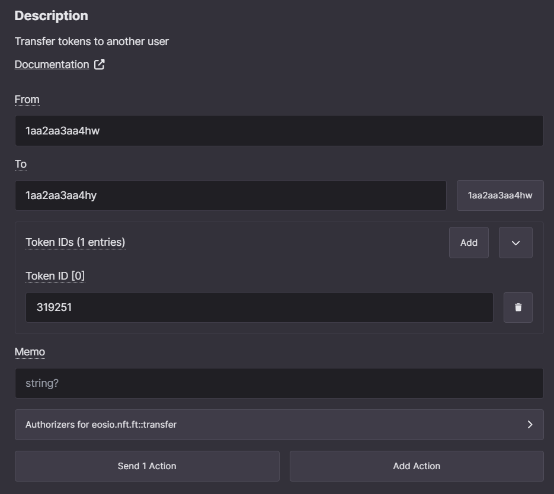

## How to burn a Uniq manually

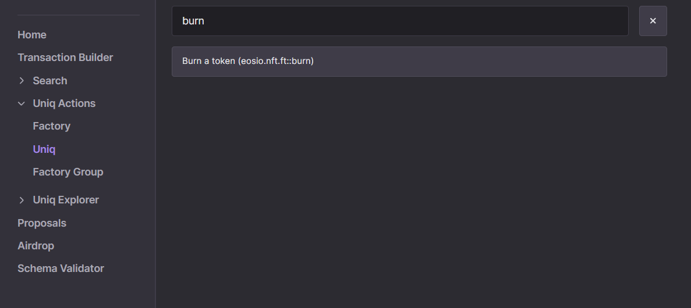

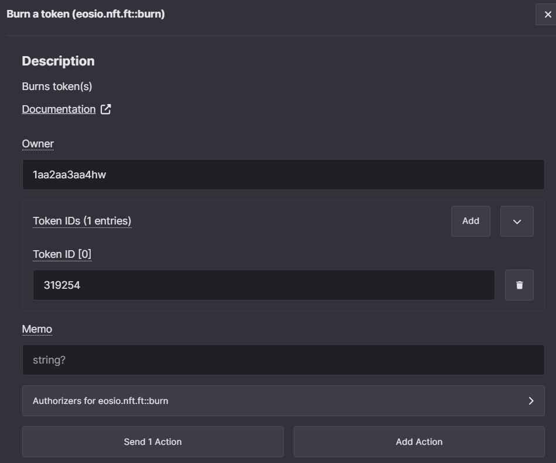

## How to add authorized minters to a factory

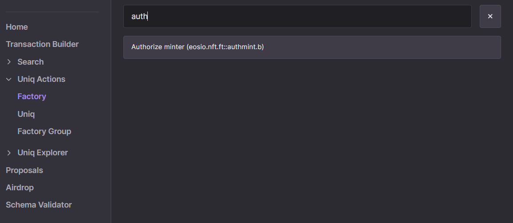

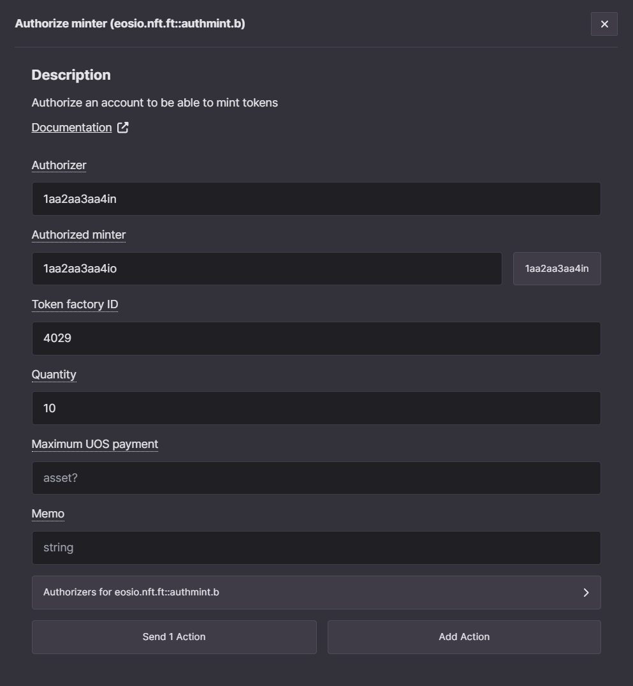

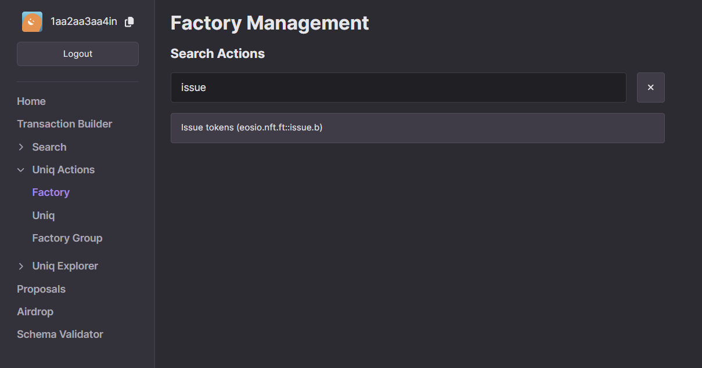

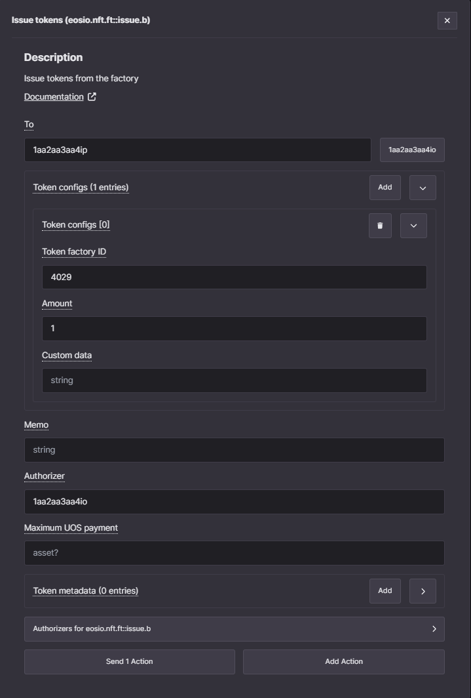

## What's next?

TBA
