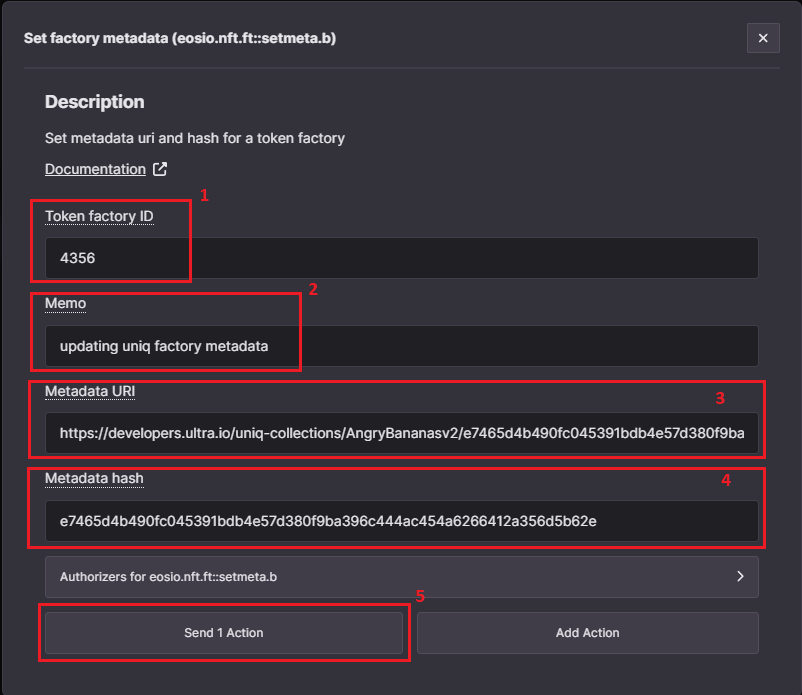
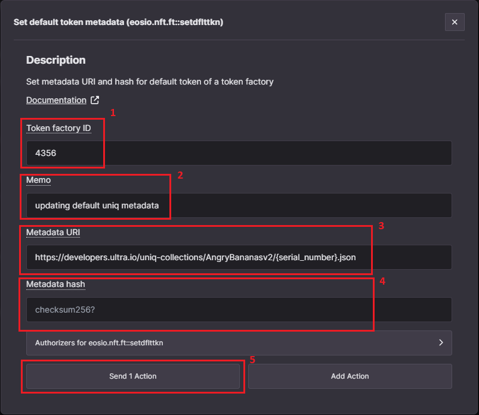
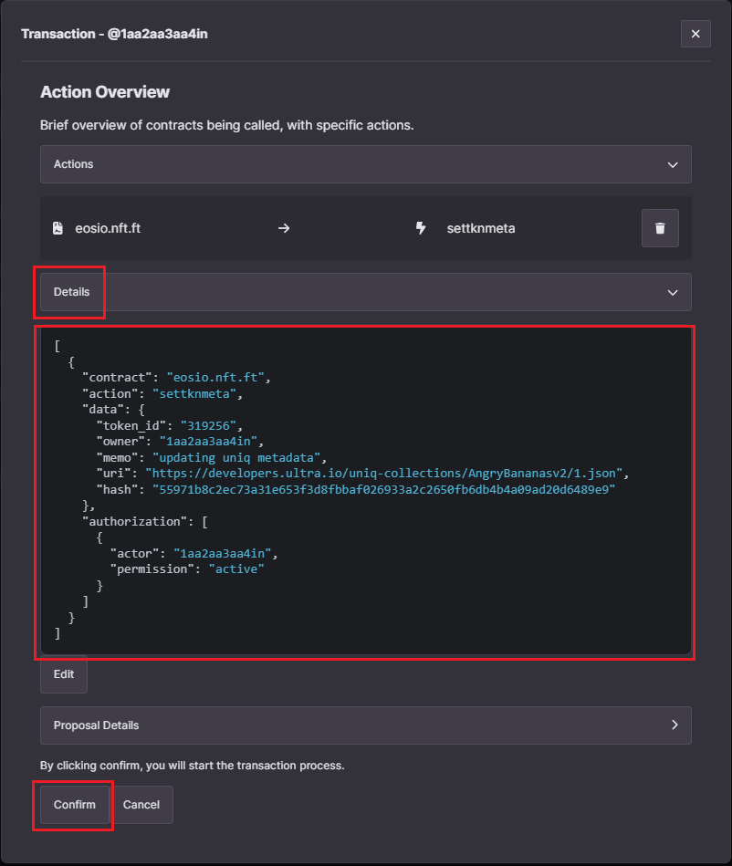
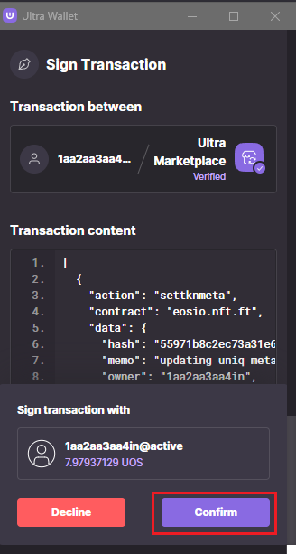

# How to update metadata using the Ultra Toolkit

An important aspect of the Ultra NFT standard is the ability to update metadata. Game publishers may want to modify a uniq's traits based on in-game events.

For this guide, we will use the uniq factory and uniq token created in the previous steps, utilizing the Ultra Testnet network.

## Prerequisites

-   You must have already created and uploaded the metadata files. Refer to [How to create Uniq Metadata](./how-to-create-uniq-metadata.md) for more information.
-   You must have already created a uniq factory. Refer to [How to create a Uniq Factory using the Ultra Toolkit](./how-to-create-uniq-factory-using-toolkit.md) for more information.
-   Your account must have sufficient UOS tokens for transactions and fees. Refer to [Tutorial - Using the Faucet and Buying RAM on Ultra Testnet](../../fundamentals/tutorial-obtain-token-and-purchase-ram.md#obtaining-uos-tokens-using-the-faucet) for more information.
-   Ensure your account is the uniq factory manager for the uniq factory whose metadata you intend to update, as only the uniq factory manager is authorized to perform metadata related updates.

## Goal

The goal of this guide is to help you understand how you can update the metadata using Ultra Toolkit. This guide is divided into three sections:

1. **Updating Uniq Factory Metadata**: Will walk you through the process of updating metadata for a uniq factory.
2. **Updating Default Uniq Metadata**: Will walk you through the process of updating metadata for the default uniq.
3. **Updating Uniq Metadata**: Will walk you through the process of updating metadata for a specific uniq.

## Updating Uniq Factory Metadata

If a content creator re-uploads a new uniq factory metadata, they can use the `setmeta.b` action to update the metadata for the uniq factory. To do so, follow these steps:

1. Login to ultra toolkit using your account.
2. Navigate to the factory management page by clicking on the `Uniq Actions` from the sidebar, and then clicking on `Factory`.
3. On the factory page, search for `setmeta` action in the search box, and click on the `Set factory metadata (eosio.nft.ft::setmeta.b)` action to open up the transaction modal.

### Configure `setmeta.b` Action

We will use the `setmeta.b` action to update the metadata for a uniq factory. For more information on the action, refer to [setmeta.b action documentation](../../../blockchain/contracts/nft-contract/nft-actions/setmeta.b.md).

Once you have opened the transaction modal, fill the required fields for the `setmeta.b` action:

1. **Token factory ID**: Required, the ID of the uniq factory for which you want to update the metadata.
2. **Memo**: Required, enter a text memo for your transaction. For example, `updating uniq factory metadata`.
3. **Metadata URI**: Required, URI of the new/updated factory metadata JSON file.
4. **Metadata hash**: Required, SHA256 hash of the new/updated metadata JSON file.

Once you have inputted all the values, click on the `Send 1 Action` button and it will open up the transaction confirmation modal. You can click on the `Details` button to view the transaction in JSON form. Click on the `Confirm` button to submit your transaction.

Confirm and sign the transaction using the Ultra Wallet extension.

After signing the transaction, you will see a confirmation screen indicating that the transaction was successfully completed.

You have now successfully updated the metadata for a uniq factory.

## Updating Default Uniq Metadata

Default uniq metadata is used as a fallback mechanism whenever there's no metadata available for a uniq. To update the default uniq metadata, follow these steps:

1. Login to ultra toolkit using your account.
2. Navigate to the factory management page by clicking on the `Uniq Actions` from the sidebar, and then clicking on `Factory`.
3. On the factory page, search for `setdflttkn` action in the search box, and click on the `Set default token metadata (eosio.nft.ft::setdflttkn)` action to open up the transaction modal.

### Configure `setdflttkn` Action

We will use the `setdflttkn` action to update the metadata for a uniq factory. For more information on the action, refer to [setdflttkn action documentation](../../../blockchain/contracts/nft-contract/nft-actions/setdflttkn.md).

Once you have opened the transaction modal, fill the required fields for the `setdflttkn` action:

1. **Token factory ID**: Required, the ID of the uniq factory for which you want to update the default uniq metadata.
2. **Memo**: Required, enter a text memo for your transaction. For example, `updating default uniq metadata`.
3. **Metadata URI**: Required, URI of the new/updated default uniq metadata JSON file.
4. **Metadata hash**: SHA256 hash of the new/updated default uniq metadata JSON file.
    - If you are using a dynamic metadata URI (e.g., https://developers.ultra.io/uniq-collections/AngryBananas/{serial_number}.json), you should leave this field blank.
    - If you are using a static metadata URI (e.g., https://developers.ultra.io/uniq-collections/AngryBananas/ffc3121613cc7d52a3525bb68c0948edc469f6f2c16bcb7b6b7fa38f7eaed3cf.json), this field is required.

Once you have inputted all the values, click on the `Send 1 Action` button and it will open up the transaction confirmation modal. You can click on the `Details` button to view the transaction in JSON form. Click on the `Confirm` button to submit your transaction.

Confirm and sign the transaction using the Ultra Wallet extension.

After signing the transaction, you will see a confirmation screen indicating that the transaction was successfully completed.

You have now successfully updated the default uniq metadata.

## Updating Uniq Metadata

To update the uniq metadata, follow these steps:

1. Login to ultra toolkit using your account.
2. Navigate to the uniq manager page by clicking on the `Uniq Actions` from the sidebar, and then clicking on `Uniq`.
3. On the uniq page, search for `settknmeta` action in the search box, and click on the `Set token metadata (eosio.nft.ft::settknmeta)` action to open up the transaction modal.

### Configure `settknmeta` Action

We will use the `settknmeta` action to update the metadata for a uniq. For more information on the action, refer to [settknmeta action documentation](../../../blockchain/contracts/nft-contract/nft-actions/settknmeta.md).

Once you have opened the transaction modal, fill the required fields for the `settknmeta` action:

1. **Token ID**: Required, the ID of the uniq for which you want to update the metadata.
2. **Owner**: Required, the account that owns this uniq.
3. **Memo**: Required, enter a text memo for your transaction. For example, `updating default uniq metadata`.
4. **Metadata URI**: Optional, URI of the new/updated uniq metadata JSON file.
5. **Metadata hash**: Optional, SHA256 hash of the new/updated uniq metadata JSON file.

Once you have inputted all the values, click on the `Send 1 Action` button and it will open up the transaction confirmation modal. You can click on the `Details` button to view the transaction in JSON form. Click on the `Confirm` button to submit your transaction.

Confirm and sign the transaction using the Ultra Wallet extension.

After signing the transaction, you will see a confirmation screen indicating that the transaction was successfully completed.

You have now successfully updated the metadata for a uniq.

## Disabling Metadata Changes

For certain use cases, it might make sense to make the uniq factory immutable. For such cases, we can use the `lckfactory` action to enable a manager to disable any metadata updates. This can be particularly useful for an NFT art gallery, as it assures users that their artwork will never change.

**Before we proceed, it is important to note that this change is irreversible**.

To disable metadata updates for a uniq factory, follow these steps:

1. Login to ultra toolkit using your account.
2. Navigate to the factory management page by clicking on the `Uniq Actions` from the sidebar, and then clicking on `Factory`.
3. On the factory page, search for `lckfactory` action in the search box, and click on the `Lock factory (eosio.nft.ft::lckfactory)` action to open up the transaction modal.

### Configure `lckfactory` Action

We will use the `lckfactory` action to update the metadata for a uniq factory. For more information on the action, refer to [lckfactory action documentation](../../../blockchain/contracts/nft-contract/nft-actions/lckfactory.md).

Once you have opened the transaction modal, fill the required fields for the `lckfactory` action:

1. **Token factory ID**: Required, the ID of the uniq factory for which you want to disable metadata updates.

Click on the `Send 1 Action` button and it will open up the transaction confirmation modal. You can click on the `Details` button to view the transaction in JSON form. Click on the `Confirm` button to submit your transaction.

Confirm and sign the transaction using the Ultra Wallet extension.

After signing the transaction, you will see a confirmation screen indicating that the transaction was successfully completed.

You have now successfully disabled metadata updates for the uniq factory. To verify that the uniq factory is locked for metadata changes, attempt to update the factory, default uniq, or uniq metadata for this factory using the aforementioned actions, and the transaction should fail.

## What's next?

TODO
