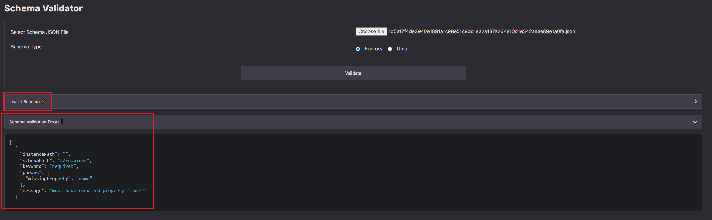

# How to validate uniq metadata using Ultra Tool Kit's Schema Validator

Schema validator is a feature of the Ultra Tool Kit that helps you to validate your uniq metadata files.

## Prerequisites

-   You must have created uniq metadata files. See [How to create Uniq Metadata](./how-to-create-uniq-metadata.md) for more information.

## Goal

The goal of this tutorial is to help validate your metadata files using Ultra Tool Kit's schema validator.

## Accessing the Tool Kit

To access the Ultra Tool Kit, please visit: https://toolkit.ultra.io

## Schema Validator

Once on the tool kit home page, click on the `Schema Validator` from the sidebar to open the schema validator page.

Schema validator allows you to validate the metadata files for both; uniq factories and uniqs.

1. To use the validator, simply select the metadata file of your choice.
2. Specify the schema type; either `Factory` (for uniq factories), or `Uniq` (for default uniq and all other uniqs).
3. Click on the `Validate` button to validate the metadata file.

If the selected metadata file adheres to the specified metadata schema, you will see a `Valid Schema ✔️` message.

If your metadata file does not comply with the specified schema, you will see an `Invalid Schema ❌` message. This will be followed by a list of errors detailing what is wrong with your metadata file. Review these errors to identify and correct the issues.

## What's next?

Once you have validated the metadata files for your collection, you can now proceed to create your first uniq factory. Refer to [How to create a Uniq Factory using the Ultra Tool Kit](./how-to-create-uniq-factory-using-toolkit.md).
