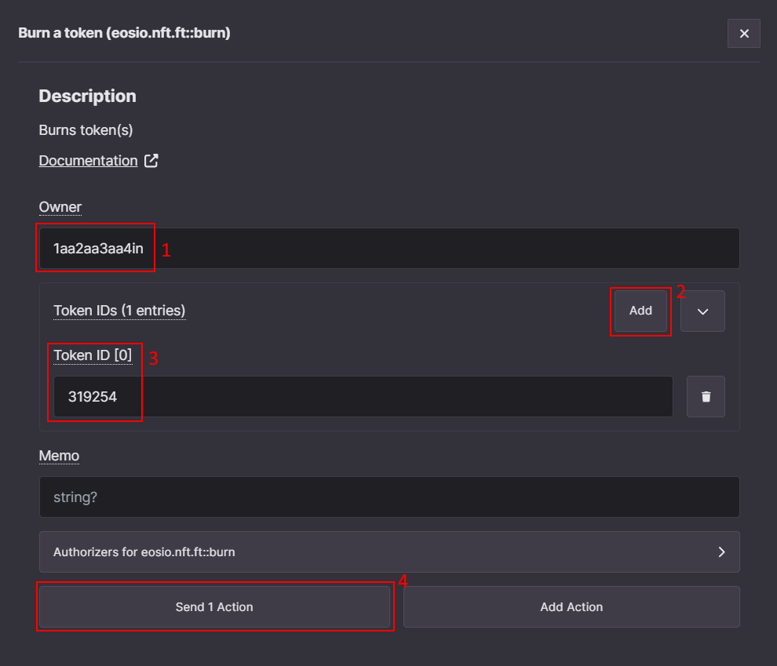
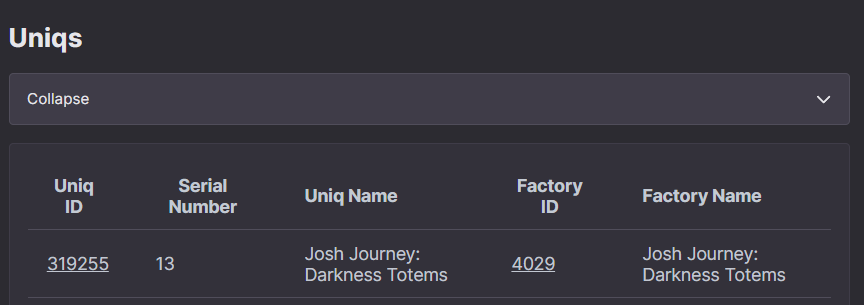

# How to perform advanced actions with Uniqs and Factories

After you have successfully created a factory and minted some Uniqs, you may now want to check what else you can do potentially.

This guide will cover some advanced actions that apply to Uniqs and Factories using the Ultra Toolkit.

## Prerequisites

-   Created a Uniq Factory and minted some Uniqs. Follow the [Factory creation guide](../creating-uniq-factories/how-to-create-uniq-metadata.md) and the [Uniq minting guide](../creating-uniq-factories/how-to-mint-uniq-using-toolkit.md) for details.
-   Your account must have sufficient UOS tokens for transactions and fees. If you don't have tokens, see [how to use Faucet](../../fundamentals/tutorial-obtain-token-and-purchase-ram.md) for Testnet or [how to buy UOS](../../guides/how-to-buy-uos.md) for Mainnet.
- A developer account on the Ultra Testnet or Mainnet and to be logged into the Ultra Toolkit. If you don't have it, please follow our previous tutorial: [Tutorial - Log in to the Ultra Toolkit](../../fundamentals/tutorial-login-to-toolkit.md).

## Goal

The goal of this guide is to demonstrate the usage of some of the actions you can perform with your Uniqs and Factories using Ultra Toolkit. This includes the transferring and burning Uniqs; adding authorized minters to a factory.

## How to transfer a Uniq to another account

For testing it may be necessary to transfer Uniqs manually and in greater quantities. You can use the toolkit to quickly assemble a transfer transaction and run it. For more details see the [action documentation](../../../blockchain/contracts/nft-contract/nft-actions/transfer.md).

First, navigate to [Uniq management actions](https://toolkit.ultra.io/uniqManagement), search `transfer`, and select the `Transfer token (eosio.nft.ft::transfer)` action.

You need to fill the following fields:

- **From** - The account that currently owns the Uniq, you have logged in with, and want to transfer the Uniq from.
- **To** - The receiver of the Uniq.
- **Token IDs** - A list of Uniqs that will be transferred, you can add multiple and send them all at once. To know the Uniq ID you can use the user [inventory page](https://toolkit.ultra.io/user).
- **Memo** - Simple text message that can be used for various purposes. Does not affect the result of the transaction. Optional, can leave it empty.

After clicking on `Send 1 Action`, reviewing the details, and confirming the transaction, you should be able to see the Uniq on the receiver account [inventory](https://toolkit.ultra.io/user).

## How to burn a Uniq manually

Burn action allows you to delete a token and get a UOS refund based on the portion of UOS that was spent to mint it. This effectively lets you get rid of Uniqs that are no longer needed. For more details see the [action documentation](../../../blockchain/contracts/nft-contract/nft-actions/burn.md).

First, navigate to [Uniq management actions](https://toolkit.ultra.io/uniqManagement), search `burn`, and select the `Burn a token (eosio.nft.ft::burn)` action.

You need to fill the following fields:

- **Owner** - The account that owns a Uniq and that you have logged in with.
- **Token IDs** - A list of Uniqs that will be burned. You can burn multiple Uniqs at a time.
- **Memo** - Simple text message that can be used for various purposes. Does not affect the result of the transaction. Optional, can leave it empty.

After clicking on `Send 1 Action`, reviewing the details, and confirming the transaction, you should no longer see the Uniq on the owner account [inventory](https://toolkit.ultra.io/user).

## How to add authorized minters to a factory

Sometimes it may be desired to allow accounts other than the factory manager to mint Uniqs from the factory. For this purpose the authorized minter feature is used. For more details see the [action documentation](../../../blockchain/contracts/nft-contract/nft-actions/authmint.b.md).

To do so, first navigate to [Factory management actions](https://toolkit.ultra.io/factoryManagement), and search again for `authmint` and select `Authorize minter (eosio.nft.ft::authmint.b)`.

You need to fill the following fields:

- **Authorizer** - The account that manages the factory or was previously authorized using authorized minter action.
- **Authorized minter** - The account that will be authorized to mint Uniqs from the factory or to delegate the minting authorization to other accounts.
- **Token factory ID** - The ID of the factory that the authorized minter will be allowed to mint from.
- **Quantity** - The maximum number of Uniqs that authorized minter will be allowed to mint. Mandatory to specify even if the factory has no limit on the number of Uniqs that can be minted.
- **Maximum UOS payment** - The maximum amount of UOS you are ok to pay to assign the authorized minter. The payment is only used to cover RAM costs and is predictable. Optional, can leave it empty.
- **Memo** - Simple text message that can be used for various purposes. Does not affect the result of the transaction. Optional, can leave it empty.

After clicking on `Send 1 Action`, reviewing the details, and confirming the transaction, the `Authorized minter` account will be allowed to mint the specific number of Uniqs from the factory.

To actually mint the Uniqs as authorized minter you need to utilize the `Authorizer` field of `issue` action. Navigate to [Factory management actions](https://toolkit.ultra.io/factoryManagement), and search for `issue` and select `Issue tokens (eosio.nft.ft::issue.b)`.

Similar to [How to mint a Uniq using the Ultra Toolkit](../creating-uniq-factories/how-to-mint-uniq-using-toolkit.md) guide you need to fill `To`, `Token factory ID` and `Amount`. But now you also need to additionally specify the `Authorizer`. The `Authorizer` must be an authorized minter assigned using the authorized minter action.

After clicking on `Send 1 Action`, reviewing the details, and confirming the transaction, you should be able to see the Uniq in the receiver account [inventory](https://toolkit.ultra.io/user).

## What's next?

-   [How to add a first-hand purchase options using Ultra Toolkit](../factory-management/how-to-add-first-hand-purchase-using-toolkit.md)
